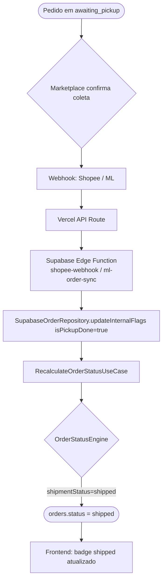

# Fluxo de Coleta de Pedidos

Este documento descreve o fluxo de coleta (pickup) de pedidos no sistema Novura, que corresponde ao sinal `isPickupDone` no motor de status e a transição para `shipped`.

## Visão Geral



## Detalhe do Webhook

### Mercado Livre (`ml-order-sync`)

1. Recebe notificação de mudança de `shipment_status` para `shipped`
2. Atualiza `marketplaceSignals.shipmentStatus = 'shipped'` em `orders`
3. Chama `RecalculateOrderStatusUseCase` com source `marketplace_webhook`
4. `ShippedRule` aplica: `shipmentStatus === 'shipped'` → `orders.status = shipped`

### Shopee (`shopee-order-sync`)

1. Recebe notificação `SHIP_ORDER_DONE`
2. Define `isPrintedLabel=false`, `isPickupDone=true`, `marketplaceStatus=SHIPPED`
3. Chama `RecalculateOrderStatusUseCase`
4. `ShippedRule` tem prioridade sobre `AwaitingPickupRule` por estar na posição 5 da chain

## Regra `ShippedRule` (posição 5 na chain)

```typescript
appliesTo(signals: MarketplaceSignals): boolean {
  return signals.shipmentStatus === "shipped"
    || signals.shipmentStatus === "delivered";
}
```

Esta regra está posicionada **antes** de `AwaitingPickupRule` e `InvoicePendingRule`, garantindo que pedidos com `shipmentStatus=shipped` sempre resultam em `orders.status=shipped`, independente de `isPrintedLabel` ou `hasInvoice`.

## Prioridade da Chain

```
pos 1: CancelledRule
pos 2: ReturnedRule
pos 3: FulfillmentRule
pos 4: UnlinkedRule
pos 5: ShippedRule        ← coleta confirmada
pos 6: AwaitingPickupRule ← aguardando coleta
pos 7: InvoicePendingRule
pos 8: ReadyToPrintRule
pos 9: PendingRule
```

## Status do Ciclo de Coleta

| EN Slug | Fase |
|---|---|
| `invoice_pending` | NFe ainda não emitida |
| `ready_to_print` | NFe emitida, etiqueta não impressa |
| `awaiting_pickup` | Etiqueta impressa, aguardando transportadora |
| `shipped` | Coleta confirmada pelo marketplace |
