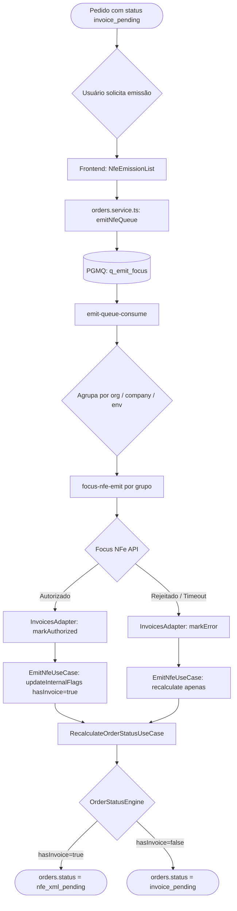

# Fluxo de Emissão de NF-e

Este documento descreve o fluxo completo de emissão de Nota Fiscal Eletrônica (NFe) no sistema Novura, desde a identificação de pedidos elegíveis até a atualização de status no motor de status (`orders.status`).

## Visão Geral



## Detalhes dos Componentes

### 1. Frontend — `NfeEmissionList`

- Filtra pedidos com `status = 'invoice_pending'` (EN slug, canonical)
- Badge counts usam helpers `isNfeEmitirStatus`, `isNfeFailStatus`, `isNfeXmlPendingStatus`
- Ao clicar em "Emitir": chama `emitNfeQueue()` → enfileira na `q_emit_focus`

### 2. Queue Consumer — `emit-queue-consume`

- Lê mensagens da `q_emit_focus` via PGMQ
- **Dead-letter**: mensagens com `read_ct > 5` são deletadas sem retry
- **Agrupamento**: mensagens são agrupadas por `(organizationId, companyId, environment)`
- Uma chamada `focus-nfe-emit` por grupo
- **Deleção seletiva**: apenas mensagens com todos os `orderId` bem-sucedidos são deletadas

### 3. Edge Function — `focus-nfe-emit`

- Decomposed into 4 modules: `index.ts`, `emit-single-order.ts`, `build-nfe-payload.ts`, `nfe-sequence.ts`
- Reads order data from `orders` + `order_items` + `order_shipping`
- Builds NFe payload with company tax data and buyer info
- Calls Focus NFe API
- Uses dynamic `apiBase` (homologacao or producao)
- Persists results in `invoices` table via `InvoicesAdapter`
- After each result: calls `EmitNfeUseCase.execute()` for side effects

### 4. Use Case — `EmitNfeUseCase`

Post-emission responsibilities:
1. Validates the order exists in `orders`
2. Updates invoice status via `InvoicesPort.markAuthorized()` or `InvoicesPort.markError()`
3. If authorized: `IOrderRepository.updateInternalFlags({ hasInvoice: true })`
4. Calls `RecalculateOrderStatusUseCase` → engine recalculates status with `hasInvoice=true`

### 5. Focus Webhook — `focus-webhook`

- Receives Focus NFe status callbacks (authorized, canceled, rejected)
- Finds existing invoice via `InvoicesPort.findByNfeKey()` or `InvoicesPort.findByFocusId()`
- Updates invoice status via `InvoicesAdapter` methods
- Triggers `EmitNfeUseCase` for order side-effects

### 6. Motor de Status

Com `hasInvoice=true`, a `InvoicePendingRule` não se aplica mais. O status é recalculado para o próximo estado elegível (ex: `nfe_xml_pending` quando a NF está autorizada mas o XML ainda não foi submetido ao marketplace).

## Estados NFe no `orders.status`

| EN Slug | Significado |
|---|---|
| `invoice_pending` | Aguardando emissão de NFe |
| `nfe_xml_pending` | NFe autorizada, XML pendente de envio ao marketplace |
| `nfe_error` | Falha na emissão da NFe |

## Invoice Status Lifecycle (`invoices.status`)

```
pending → queued → processing → authorized
                              → rejected
                              → canceled
                → error (retry até retry_count = 5)
```

## Key Interfaces

| Interface | Location | Purpose |
|---|---|---|
| `InvoicesPort` | `_shared/ports/invoices-port.ts` | Port interface for invoice persistence |
| `InvoicesAdapter` | `_shared/adapters/invoices/invoices-adapter.ts` | Concrete implementation against `invoices` table |
| `EmitNfeUseCase` | `_shared/application/orders/EmitNfeUseCase.ts` | Orchestrates post-emission side effects |

## Regras de Prioridade no Engine

```
CancelledRule → ReturnedRule → FulfillmentRule → UnlinkedRule
→ ShippedRule → AwaitingPickupRule → InvoicePendingRule → ReadyToPrintRule → PendingRule
```

`InvoicePendingRule` só aplica **depois** de `ShippedRule` e `AwaitingPickupRule`, garantindo que pedidos já enviados ou aguardando coleta não retrocedam para emissão.
