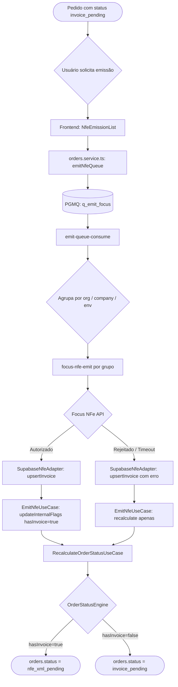

# Fluxo de Emissão de NF-e

Este documento descreve o fluxo completo de emissão de Nota Fiscal Eletrônica (NFe) no sistema Novura, desde a identificação de pedidos elegíveis até a atualização de status no motor de status (`orders.status`).

## Visão Geral



## Detalhes dos Componentes

### 1. Frontend — `NfeEmissionList`

- Filtra pedidos com `status = 'invoice_pending'` (EN slug, canonical)
- Badge counts usam helpers `isNfeEmitirStatus`, `isNfeFailStatus`, `isNfeXmlPendingStatus`
- Ao clicar em "Emitir": chama `emitNfeQueue()` → enfileira na `q_emit_focus`

### 2. Queue Consumer — `emit-queue-consume`

- Lê mensagens da `q_emit_focus` via PGMQ
- **Dead-letter**: mensagens com `read_ct > 5` são deletadas sem retry
- **Agrupamento**: mensagens são agrupadas por `(organizationId, companyId, environment)`
- Uma chamada `focus-nfe-emit` por grupo
- **Deleção seletiva**: apenas mensagens com todos os `orderId` bem-sucedidos são deletadas

### 3. Edge Function — `focus-nfe-emit`

- Lê dados do pedido de `orders` + `order_items` + `order_shipping` (NÃO mais de `marketplace_orders_presented_new`)
- Constrói payload NFe com dados fiscais da empresa e do destinatário
- Chama a API Focus NFe
- URL de polling usa `apiBase` dinâmico (homologação ou produção)
- Persiste resultado em `notas_fiscais`
- Após cada resultado: chama `EmitNfeUseCase.execute()` para side effects

### 4. Use Case — `EmitNfeUseCase`

Responsabilidades pós-emissão:
1. Valida que o pedido existe em `orders`
2. Persiste invoice via `INfePort.upsertInvoice()`
3. Se autorizado: `IOrderRepository.updateInternalFlags({ hasInvoice: true })`
4. Chama `RecalculateOrderStatusUseCase` → motor recalcula status com `hasInvoice=true`

### 5. Motor de Status

Com `hasInvoice=true`, a `InvoicePendingRule` não se aplica mais. O status é recalculado para o próximo estado elegível (ex: `nfe_xml_pending` quando a NF está autorizada mas o XML ainda não foi submetido ao marketplace).

## Estados NFe no `orders.status`

| EN Slug | Significado |
|---|---|
| `invoice_pending` | Aguardando emissão de NFe |
| `nfe_xml_pending` | NFe autorizada, XML pendente de envio ao marketplace |
| `nfe_error` | Falha na emissão da NFe |

## Regras de Prioridade no Engine

```
CancelledRule → ReturnedRule → FulfillmentRule → UnlinkedRule
→ ShippedRule → AwaitingPickupRule → InvoicePendingRule → ReadyToPrintRule → PendingRule
```

`InvoicePendingRule` só aplica **depois** de `ShippedRule` e `AwaitingPickupRule`, garantindo que pedidos já enviados ou aguardando coleta não retrocedam para emissão.
