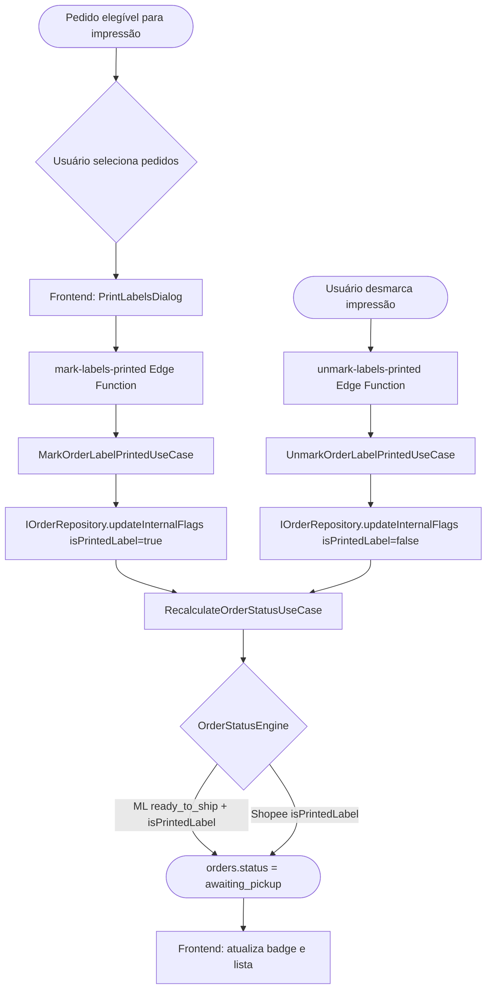

# Fluxo de Impressão de Etiquetas

Este documento descreve o fluxo de impressão de etiquetas de pedidos no sistema Novura, com a sinalização `isPrintedLabel` que alimenta o motor de status.

## Visão Geral



## Fluxo de Marcação

### `mark-labels-printed`

POST `/mark-labels-printed`
```json
{ "orderIds": ["uuid1", "uuid2"], "organizationId": "org-uuid" }
```

1. `MarkOrderLabelPrintedUseCase.execute()`:
   - Chama `updateInternalFlags({ isPrintedLabel: true })` para cada ordem
   - Chama `RecalculateOrderStatusUseCase` → `OrderStatusEngine` para cada ordem
2. Retorna `statusChanges` com o novo status calculado para cada ordem

### `unmark-labels-printed`

POST `/unmark-labels-printed`
```json
{ "orderIds": ["uuid1"], "organizationId": "org-uuid" }
```

1. `UnmarkOrderLabelPrintedUseCase.execute()`:
   - Chama `updateInternalFlags({ isPrintedLabel: false })` para cada ordem
   - Chama `RecalculateOrderStatusUseCase` → motor recalcula sem `isPrintedLabel`
2. Pedidos retrocedem de `awaiting_pickup` para `ready_to_print` (ou outro estado elegível)

## Regras na `AwaitingPickupRule`

```typescript
appliesTo(signals: MarketplaceSignals): boolean {
  if (signals.isFulfillment) return false;              // Fulfillment: sempre ignorar

  if (signals.marketplace === "mercado_livre") {
    return signals.isPrintedLabel                       // Etiqueta impressa
      && signals.shipmentStatus === "ready_to_ship";   // E status pronto para envio
  }

  if (signals.marketplace === "shopee") {
    const isRetryShip = signals.marketplaceStatus?.toLowerCase() === "retry_ship";
    return signals.isPrintedLabel || isRetryShip;      // Etiqueta impressa OU retry
  }

  return false;
}
```

## Transições de Status

| Condição | Status Calculado |
|---|---|
| `isPrintedLabel=true` + ML `ready_to_ship` | `awaiting_pickup` |
| `isPrintedLabel=true` + Shopee | `awaiting_pickup` |
| `isPrintedLabel=false` + invoice presente | `ready_to_print` |
| `isPrintedLabel=false` + sem invoice | `invoice_pending` |
