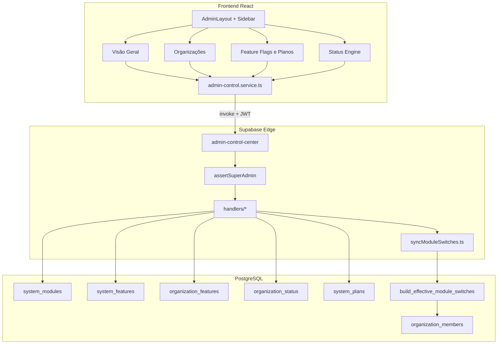

# PRD — Novura Admin Console (Console Interno)

| Campo | Valor |
|-------|--------|
| **Versão** | 1.0 |
| **Data** | 2026-05-22 |
| **Status** | Implementado (MVP operacional) |
| **Rota base** | `/novura-admin` |
| **Público** | Usuários com `app_metadata.role = super_admin` |
| **Idioma UI** | pt-BR |

---

## 1. Visão e objetivos

### 1.1 Problema

Operações internas da Novura (bloqueio de tenants, liberação de módulos, planos, auditoria global de pedidos) não podiam ficar misturadas ao ERP do lojista. Switches de módulo no admin não propagavam de forma confiável para `organization_members`, e a UI misturava controles globais e por tenant.

### 1.2 Objetivo

Entregar um **console administrativo isolado** com quatro áreas operacionais, API única via Edge Function, modelo de dados dedicado (features, planos, status de org) e propagação automática de acesso para todos os usuários do tenant.

### 1.3 Fora de escopo (MVP)

- Gateway de pagamento / faturamento recorrente
- Edição de `features_template` por plano na UI (somente leitura)
- CRUD de usuários super admin na UI
- Histórico financeiro por tenant

### 1.4 Critérios de sucesso

| # | Critério |
|---|----------|
| 1 | Super admin acessa apenas `/novura-admin` após login (redirecionamento automático) |
| 2 | Sidebar/header do ERP **não** aparecem em rotas `/novura-admin/*` |
| 3 | Toggle global em `system_modules` reflete em todos os tenants em segundos |
| 4 | Toggle por org em `organization_features` atualiza sidebar do ERP para membros do tenant |
| 5 | Org bloqueada não recebe permissões operacionais |
| 6 | API admin rejeita JWT sem `super_admin` (401/403) |

---

## 2. Arquitetura



### 2.1 Camadas

| Camada | Responsabilidade |
|--------|------------------|
| **UI** | Páginas em `src/pages/admin/`, componentes em `src/components/admin/` |
| **Hooks** | React Query em `src/hooks/admin/*` |
| **Serviço** | `src/services/admin-control.service.ts` → `supabase.functions.invoke('admin-control-center')` |
| **Edge** | Gateway `admin-control-center` com roteamento por `action` |
| **Domínio compartilhado** | `supabase/functions/_shared/domain/admin/`, `application/admin/` |
| **Persistência** | Tabelas admin + RPCs de sync + tabelas legadas (`system_modules`, `organizations`, pedidos) |

### 2.2 Autenticação super admin

- **Fonte da verdade:** `auth.users.raw_app_meta_data.role = 'super_admin'` (JWT `app_metadata.role`).
- **SQL:** `public.is_super_admin()` lê o JWT.
- **Edge:** `assertSuperAdmin.ts` valida token via `createAdminClient().auth.getUser()`.
- **Frontend:** `ProtectedRoute` redireciona super admin do ERP operacional para `/novura-admin`.
- **Deprecado:** coluna/papel `nv_superadmin` substituído por JWT (migration `20260521_000010`).

---

## 3. Produto — áreas do console

### 3.1 Navegação (`AdminSidebar`)

| Rota | Tela | Função |
|------|------|--------|
| `/novura-admin` | Visão Geral | Métricas: tenants, bloqueados, usuários plataforma, pedidos |
| `/novura-admin/organizacoes` | Organizações | Listar, bloquear/desbloquear, arquivar tenants |
| `/novura-admin/flags-planos` | Feature Flags & Planos | Aba **Plataforma** (global) + **Por organização** |
| `/novura-admin/status-engine` | Status Engine | Pedidos globais + resumo por status |

**Redirects legados:** `/novura-admin/pedidos` → `status-engine`; `features`, `modulos`, `planos` → `flags-planos`.

### 3.2 Feature Flags & Planos (UX v1)

#### Aba Plataforma (`?tab=plataforma`)

- **Liberação global:** lista de módulos (`GlobalModuleRow`) — apenas switch “ativo na plataforma” (`system_modules.active`).
- **Planos do sistema:** catálogo read-only (`PlansCatalogPanel`) — Trial, Standard, Enterprise.

#### Aba Por organização (`?tab=organizacoes&org=<uuid>`)

- **Seletor:** `OrgTenantPicker` — nome + status + plano (**sem exibir UUID**).
- **Plano do tenant:** `Select` + métricas (plano atual, `max_users_allowed`).
- **Módulos do tenant:** `OrgModuleAccessCard` — switch “Liberar para este tenant” + capacidades em collapsible.

#### Regra de visibilidade no ERP

```
effective_active =
  system_modules.active
  AND system_features.is_globally_enabled (se existir catálogo)
  AND organization_features.is_enabled (override tenant)
```

Badge na UI: **Visível no ERP** / **Oculto**.

### 3.3 Módulos em desenvolvimento (grupo separado na UI)

`recursos_seller`, `novura_academy`, `comunidade` — seed em `20260522_000012`.

### 3.4 Isolamento da casca ERP

- `AppSidebar` / `GlobalHeader` retornam `null` se `isAdminConsolePath(pathname)`.
- `AdminGlobalHeader` + `AdminSidebar` dedicados.
- Lazy routes em `App.tsx` com `RestrictedRoute module="novura_admin"`.

---

## 4. Modelo de dados

### 4.1 Tabelas novas (migration `20260521_000009`)

#### `public.system_features`

Catálogo global de features (alinhado a `system_modules.name`).

| Coluna | Tipo | Descrição |
|--------|------|-----------|
| `id` | uuid PK | |
| `key` | text UNIQUE | Ex.: `pedidos`, `anuncios` |
| `name` | text | Nome exibição |
| `badge_status` | text | `stable` \| `beta` \| `new` |
| `is_globally_enabled` | boolean | Flag global no catálogo |
| `created_at`, `updated_at` | timestamptz | |

**RLS:** apenas `is_super_admin()`.

#### `public.organization_features`

Override por tenant.

| Coluna | Tipo | Descrição |
|--------|------|-----------|
| `organization_id` | uuid FK → organizations | |
| `feature_key` | text FK → system_features.key | |
| `is_enabled` | boolean | Liberado para o tenant |
| `capabilities` | jsonb | `can_view`, `can_create`, `can_edit`, `can_delete`, `max_limit` |
| UNIQUE | (organization_id, feature_key) | |

**Índices:** `idx_org_features_org_id`, `idx_org_features_key`.

#### `public.system_plans`

Templates de plano.

| Coluna | Tipo | Descrição |
|--------|------|-----------|
| `sku` | text UNIQUE | `plan_trial`, `plan_standard`, `plan_enterprise` |
| `name` | text | |
| `price_cents` | integer | |
| `max_users` | integer | Cota de usuários |
| `features_template` | jsonb | MVP: `{"max_users": N}` |

**Seeds:** Trial (3 users), Standard (15), Enterprise (100).

#### `public.organization_status`

Telemetria + bloqueio + plano por tenant.

| Coluna | Tipo | Descrição |
|--------|------|-----------|
| `organization_id` | uuid PK FK | |
| `status` | text | `active` \| `blocked` |
| `active_users_count` | integer | |
| `max_users_allowed` | integer | Do plano |
| `plan_sku` | text FK → system_plans.sku | |
| `blocked_reason`, `blocked_at` | text, timestamptz | |
| `deleted_at` | timestamptz | Arquivamento soft |

### 4.2 Tabelas legadas utilizadas

| Tabela | Uso no admin |
|--------|----------------|
| `organizations` | Listagem tenants |
| `system_modules` | Switch global `active` por `name` |
| `organization_members` | Destino de `module_switches` + `permissions` após sync |
| `marketplace_orders_presented_new` | Status Engine / métricas |
| `user_profiles` | Contexto RPC display_name |

### 4.3 Funções SQL

| Função | Migration | Descrição |
|--------|-----------|-----------|
| `is_super_admin()` | 000009 | JWT `app_metadata.role = super_admin` |
| `is_org_active(uuid)` | 000009 | Tenant ativo e não deletado |
| `build_effective_module_switches(org_id, member_switches)` | 000011 | Merge `system_modules` + `system_features` + `organization_features` |
| `sync_org_module_switches(org_id)` | 000011, fix 000014 | Persiste switches em todos os membros |
| `sync_all_orgs_module_switches()` | 000011 | Backfill plataforma inteira |
| `rpc_get_user_access_context` | 000010, 000011 | Retorna switches **computados** + `org_blocked` |
| `bulk_set_module_view` | (existente) | Propaga `permissions.<modulo>.view` |

#### Correção crítica (`20260523_000014`)

`sync_org_module_switches` passa `'{}'::jsonb` como overrides de membro, evitando que `global.<modulo>.active` obsoleto no JSON do membro **sobrescreva** liberação feita no admin via `organization_features`.

### 4.4 Lista de migrations (ordem de aplicação)

| Arquivo | Conteúdo |
|---------|----------|
| `20260521_000009_admin_and_billing_controls.sql` | Tabelas admin, RLS, seeds planos/features, backfill `organization_status`, `is_org_active` |
| `20260521_000010_deprecate_nv_superadmin.sql` | RLS `system_modules` via `is_super_admin()`; RPC context com `org_blocked` |
| `20260522_000011_sync_module_switches_from_admin.sql` | `build_effective_*`, sync functions, RPC switches computados |
| `20260522_000012_seed_dev_module_features.sql` | Features para módulos beta/novos + resync global |
| `20260523_000013_propagate_org_module_access.sql` | Backfill `bulk_set_module_view` + `sync_all_orgs` |
| `20260523_000014_fix_sync_clear_stale_global_overrides.sql` | Fix sync sem overrides obsoletos |

> **Proibido em ambientes compartilhados:** `supabase db reset` (regra do projeto).

---

## 5. Edge Function `admin-control-center`

### 5.1 Deploy

```bash
supabase functions deploy admin-control-center
```

Arquivo de entrada: `supabase/functions/admin-control-center/index.ts`  
Bundle alternativo: `bundle-index.ts` (deploy MCP).

### 5.2 Contrato HTTP

- **Método:** POST (OPTIONS para CORS)
- **Header:** `Authorization: Bearer <access_token>`
- **Body:** `{ "action": "<nome>", ...params }`

### 5.3 Actions (API completa)

| action | Handler | Parâmetros | Resposta |
|--------|---------|------------|----------|
| `overview_metrics` | `metrics.ts` | — | `{ metrics: AdminOverviewMetrics }` |
| `list_organizations` | `organizations.ts` | `page`, `pageSize`, `search`, `status` | `{ organizations: [] }` |
| `get_organization` | `organizations.ts` | `organizationId` | `{ organization, features }` |
| `block_organization` | `organizations.ts` | `organizationId`, `reason` | `{ success }` |
| `unblock_organization` | `organizations.ts` | `organizationId` | `{ success }` |
| `archive_organization` | `organizations.ts` | `organizationId`, `reason?` | `{ success }` |
| `list_system_features` | `features.ts` | — | `{ features: [] }` |
| `list_organization_features` | `features.ts` | `organizationId` | `{ features, modules }` |
| `update_organization_features` | `features.ts` | `organizationId`, `featureKey`, `is_enabled`, `capabilities` | `{ success }` + **propagação** |
| `list_organization_modules` | `modules.ts` | `organizationId` | `{ modules: OrgModuleCatalogItem[] }` |
| `update_system_module` | `modules.ts` | `moduleName`, `active` | `{ success }` + `sync_all_orgs` |
| `list_system_plans` | `modules.ts` | — | `{ plans: [] }` |
| `update_organization_plan` | `modules.ts` | `organizationId`, `planSku` | `{ success }` |
| `list_global_orders` | `orders.ts` | filtros paginação | `{ orders: [] }` |
| `orders_status_summary` | `orders.ts` | `organizationId?` | `{ summary, total }` |
| `list_global_users` | `orders.ts` | `search`, `organizationId`, `role`, `page`, `pageSize` | `{ users: [] }` |

**Códigos de erro:** `UNAUTHORIZED`, `FORBIDDEN`, `BAD_REQUEST`, `NOT_FOUND`, `DB_ERROR`, `SYNC_ERROR`, `INTERNAL_ERROR`.

### 5.4 Propagação pós-escrita

```typescript
// update_organization_features →
propagateOrgModuleAccess(admin, orgId, featureKey, enabled)
  → sync_org_module_switches(orgId)
  → bulk_set_module_view(orgId, module, enabled)

// update_system_module →
sync_all_orgs_module_switches()
```

Implementação: `supabase/functions/_shared/adapters/admin/syncModuleSwitches.ts`.

### 5.5 Catálogo unificado de módulos

`handlers/moduleCatalog.ts` — `fetchOrgModuleCatalog()`:

- JOIN lógico `system_modules` + `system_features` + `organization_features`
- Campos: `global_module_active`, `is_enabled`, `effective_active`, `capabilities`, `has_feature_catalog`

### 5.6 Shared / domínio

| Caminho | Função |
|---------|--------|
| `_shared/domain/admin/AdminContracts.ts` | Tipos de contrato |
| `_shared/application/admin/HasCapabilityUseCase.ts` | Regra de capacidade |
| `_shared/adapters/admin/SupabaseAdminRepository.ts` | Repositório |
| `_shared/adapters/infra/assertOrgActive.ts` | Guard org ativa em outras functions |
| `_shared/adapters/infra/supabase-client.ts` | `createAdminClient()` service role |

### 5.7 Testes Edge

- `HasCapabilityUseCase.test.ts`

---

## 6. Frontend — inventário de arquivos

### 6.1 Páginas (`src/pages/admin/`)

| Arquivo | Descrição |
|---------|-----------|
| `AdminLayout.tsx` | Shell com `Outlet`, sidebar, header admin |
| `AdminOverview.tsx` | Métricas overview |
| `AdminOrganizations.tsx` | Gestão tenants |
| `AdminFeatureFlagsPlans.tsx` | Tabs Plataforma / Por organização |
| `AdminOrders.tsx` | Status Engine |
| `AdminPlans.tsx` | (legado; conteúdo absorvido em flags-planos) |
| `AdminConsole.tsx`, `AdminUsers.tsx`, etc. | Rotas auxiliares / legado conforme branch |

### 6.2 Componentes (`src/components/admin/`)

| Pasta | Componentes |
|-------|-------------|
| `shell/` | `AdminSidebar`, `AdminGlobalHeader`, `AdminDataTable`, `AdminMetricCard`, `AdminPageError`, `AdminFilterBar`, `AdminEmptyState`, `AdminLoadingShell` |
| `modules/` | `GlobalModuleRow`, `OrgModuleAccessCard`, `ModuleAccessEditor` (legado) |
| `organizations/` | `OrgTenantPicker`, `OrganizationStatusBadge`, `BlockOrgDialog` |
| `plans/` | `PlansCatalogPanel` |
| `features/` | `FeatureCapabilityEditor` |
| `orders/` | `GlobalOrderStatusCards` |

### 6.3 Hooks (`src/hooks/admin/`)

| Hook | Serviço |
|------|---------|
| `useAdminOverview` | `getOverviewMetrics` |
| `useAdminOrganizations` | `listOrganizations`, block/unblock |
| `useAdminModules` | `listOrganizationModules`, mutations global/org |
| `useAdminFeatures` | `updateOrganizationPlan`, features |
| `useAdminOrders` | pedidos globais |
| `useAdminUsers` | usuários globais |

### 6.4 Lib e tipos

| Arquivo | Função |
|---------|--------|
| `src/lib/adminConsole.ts` | `isAdminConsolePath()` |
| `src/lib/adminModules.ts` | `DEV_MODULE_KEYS`, `sortAdminModules()` |
| `src/lib/moduleAccess.ts` | Regra sidebar: switch on → baseline view |
| `src/lib/accessContext.ts` | Cache 30s + chaves sessionStorage |
| `src/types/admin.ts` | Tipos espelho do contrato API |
| `src/services/admin-normalize.ts` | Normalização snake_case → frontend |

### 6.5 Alterações no ERP tenant

| Arquivo | Mudança |
|---------|---------|
| `usePermissions.tsx` | Respeita `module_switches` + permissões granulares |
| `useAuth.tsx` | Realtime/poll 30s em tabelas de acesso; rebuild switches |
| `auth.service.ts` | `fetchAccessContext` com `build_effective_module_switches` |
| `ProtectedRoute.tsx` | Super admin → `/novura-admin` |
| `Auth.tsx`, `Login.tsx` | Redirect pós-login super admin |
| `RestrictedRoute.tsx` | Integração módulo `novura_admin` |

---

## 7. Fluxos operacionais

### 7.1 Desligar módulo para toda a plataforma

1. Admin → Flags & Planos → **Plataforma**
2. Desliga switch do módulo → `update_system_module` → `system_modules.active = false`
3. Edge chama `sync_all_orgs_module_switches()`
4. Membros: `module_switches.global.<mod>.active = false` → sidebar ERP oculta módulo

### 7.2 Liberar módulo para um tenant

1. Admin → **Por organização** → seleciona tenant pelo nome
2. Liga “Liberar para este tenant” → `update_organization_features`
3. `propagateOrgModuleAccess` → sync + `bulk_set_module_view(..., true)`
4. Realtime/poll em `useAuth` atualiza sessão em ~30s

### 7.3 Bloquear organização

1. Organizações → Bloquear → `organization_status.status = blocked`
2. `rpc_get_user_access_context` zera `permissions` se `org_blocked`

### 7.4 Alterar plano

1. Por organização → Select plano → `update_organization_plan`
2. Atualiza `organization_status.plan_sku` e `max_users_allowed`

---

## 8. Segurança

| Controle | Implementação |
|----------|----------------|
| Autenticação API admin | JWT obrigatório |
| Autorização | `role === super_admin` na Edge e RLS nas tabelas admin |
| Tenant isolation no ERP | RLS existente por `organization_id` (inalterado para dados operacionais) |
| Service role | Apenas Edge `createAdminClient()` para escritas admin |
| Dados sensíveis na UI | UUID de org **não** exibido na lista principal de flags |

---

## 9. Observabilidade e deploy

### 9.1 Logs Edge

JSON estruturado: `{ scope: "admin-control-center", action, error }`.

### 9.2 Checklist de deploy

1. Aplicar migrations `20260521_000009` … `20260523_000014` no projeto Supabase remoto
2. `supabase functions deploy admin-control-center`
3. Garantir usuário interno com `app_metadata.role = super_admin`
4. `npm run build` no frontend
5. Smoke: login super admin → `/novura-admin` → toggle global + toggle org → verificar sidebar tenant

### 9.3 Variáveis

Edge usa secrets padrão Supabase (`SUPABASE_URL`, `SUPABASE_SERVICE_ROLE_KEY`). Sem env adicional documentado para MVP.

---

## 10. Testes automatizados

| Arquivo | Escopo |
|---------|--------|
| `src/hooks/__tests__/usePermissions.test.ts` | Switch + permissões |
| `src/lib/__tests__/moduleAccess.test.ts` | Baseline de acesso por módulo |
| `src/services/__tests__/auth.service.test.ts` | Contexto de acesso |
| `supabase/functions/_shared/application/admin/HasCapabilityUseCase.test.ts` | Capacidades |

---

## 11. Roadmap (pós-MVP)

| Prioridade | Item |
|------------|------|
| P1 | Editar `features_template` por plano na aba Plataforma (módulos default por SKU) |
| P1 | Endpoint `list_global_modules` sem `organizationId` |
| P2 | Página dedicada de usuários globais na sidebar |
| P2 | Auditoria de alterações admin (`admin_audit_log`) |
| P3 | Billing / Stripe integrado a `system_plans` |

---

## 12. Referência rápida — comandos

```bash
# Dev frontend
npm run dev

# Build
npm run build

# Deploy Edge
supabase functions deploy admin-control-center

# Testes
npm run test -- --run src/hooks/__tests__/usePermissions.test.ts
```

---

## 13. Glossário

| Termo | Significado |
|-------|-------------|
| **Tenant** | `organizations` — lojista multi-tenant |
| **Módulo** | Linha em `system_modules` (nome = chave ERP, ex. `pedidos`) |
| **Feature** | Linha em `system_features` (catálogo admin, mesma chave que módulo quando alinhado) |
| **Switch global** | `system_modules.active` |
| **Override org** | `organization_features.is_enabled` + `capabilities` |
| **effective_active** | Estado final visível no ERP |

---

*Documento gerado a partir do estado do repositório na branch `feat/novura-admin-console`.*
