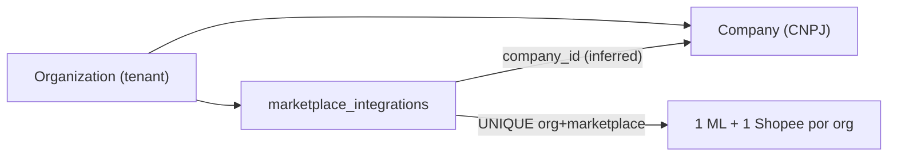
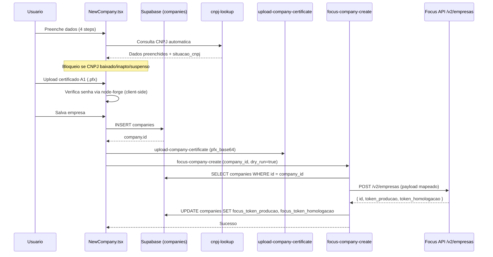
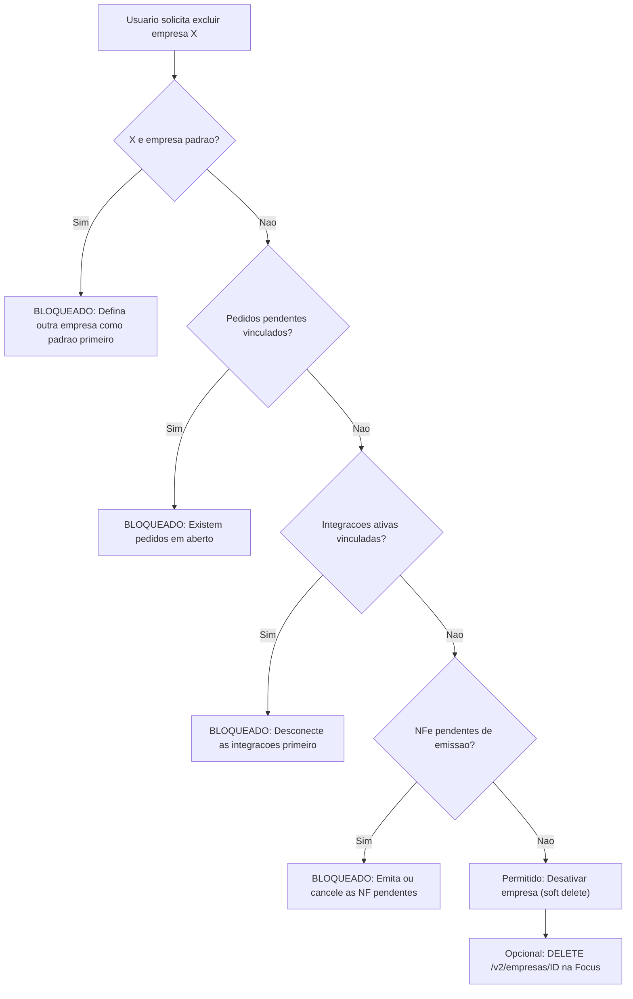
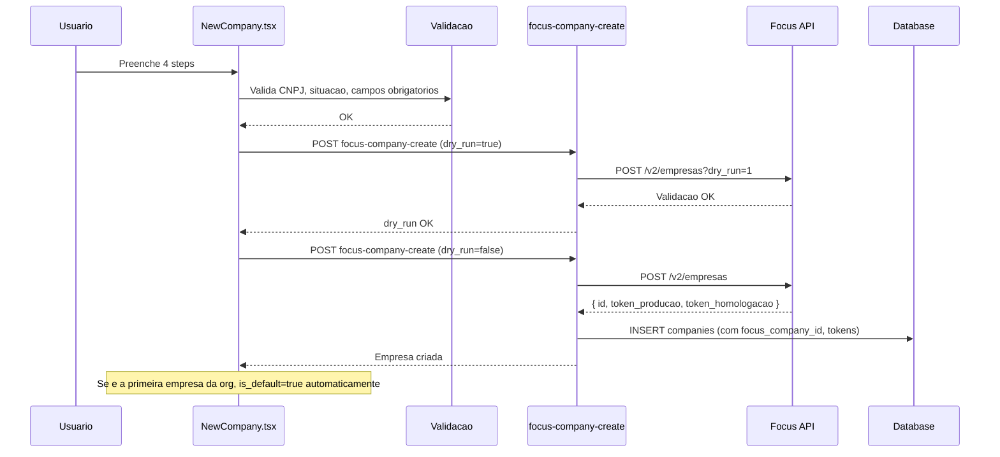
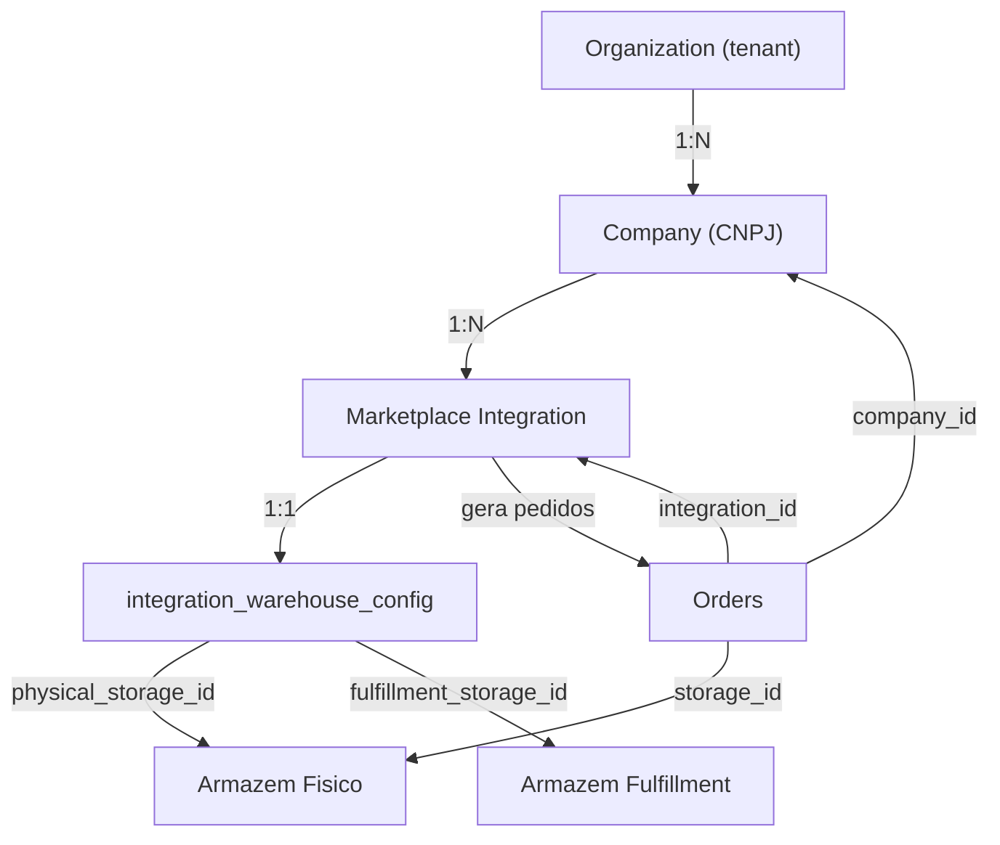
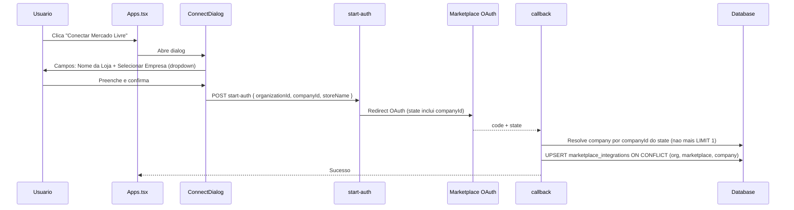
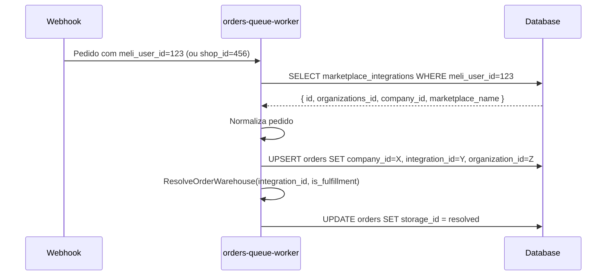
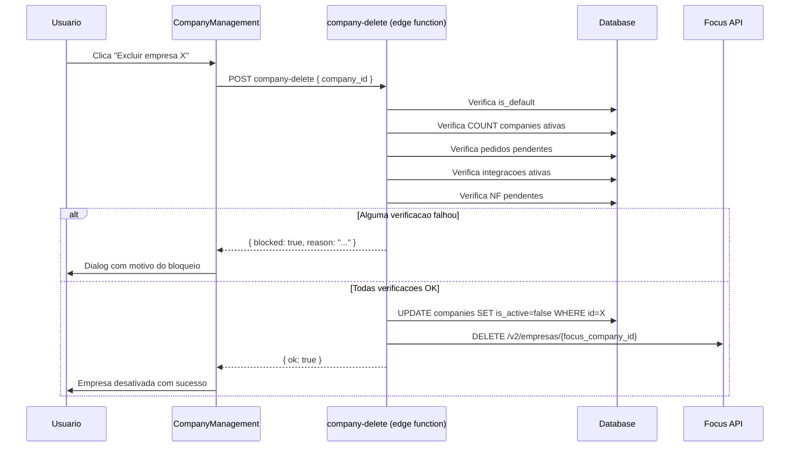
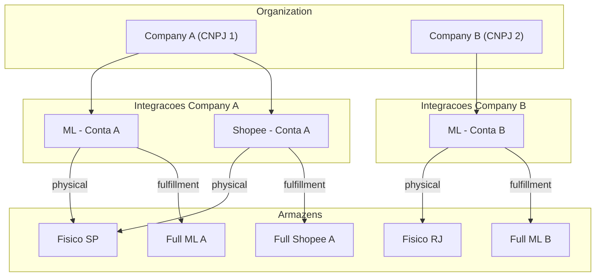
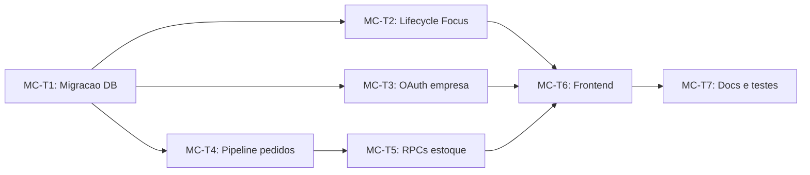

# PRD — Arquitetura Multi-Company (Multi-CNPJ)

**Ciclo:** MULTI-COMPANY

**Status:** Implementado

**Depende de:** Cycle 0 (tabelas `orders`, `companies`, `marketplace_integrations`), WAREHOUSE-T1 (schema de armazens)

**Bloqueia:** WAREHOUSE-T3..T9 (adapters e frontend de armazens dependem do vinculo integration-company)

**Relacionado:** [WAREHOUSE PRD](PRD_Warehouse_Architecture) — Company -> Integracao -> Armazem

---

## 1. Diagnostico do estado atual

### O que existe

- **`companies`**: Tabela com CNPJ, dados fiscais, tokens Focus, certificados. FK `organization_id` para `organizations`. Nenhuma restricao impede multiplas empresas por org.
- **`marketplace_integrations`**: FK `company_id` para `companies`. UNIQUE `(organizations_id, marketplace_name)` — **impede mais de uma integracao do mesmo marketplace por org**.
- **Resolucao de empresa**: Em todos os pontos do sistema, `company_id` e inferido como "primeira empresa ativa da org" (`ORDER BY is_active DESC, created_at LIMIT 1`).
- **OAuth**: O callback ML/Shopee resolve empresa com `limit(1)` a partir da org, sem o usuario escolher.
- **UI**: Nao ha seletor de empresa. `ConnectDialog.tsx` so pede "Nome da Loja".

### Cadeia de dependencias atual



### Problemas

| ID | Problema | Impacto |
| --- | --- | --- |
| MC-P1 | UNIQUE `(organizations_id, marketplace_name)` permite apenas 1 integracao ML e 1 Shopee por org | Vendedor com 2 CNPJs nao consegue conectar 2 contas ML |
| MC-P2 | OAuth nao permite escolher empresa — infere `limit(1)` | Empresa errada vinculada na integracao |
| MC-P3 | `orders-queue-worker` nao grava `company_id` no pedido | Pedidos ficam sem vinculo com CNPJ para NFe |
| MC-P4 | RPCs de estoque resolvem empresa com `LIMIT 1` | Reserva pode usar `products_stock` da empresa errada |
| MC-P5 | Nao ha UI para gerenciar multiplas empresas como contexto | Usuario nao consegue operar com mais de um CNPJ |
| MC-P6 | `getCompanyIdForOrg` retorna sempre a mesma empresa | Toda logica que depende de `company_id` e single-tenant |

---

## 2. Ciclo de vida da empresa (Company Lifecycle)

### 2.1 Fluxo de criacao com Focus API

A criacao de empresa no Novura ja integra com a API da Focus NFe via `focus-company-create`. O fluxo atual e:



**Problemas atuais no fluxo:**
- `focus-company-create` sempre usa `dry_run=true` (nunca cria de verdade na Focus em producao)
- Se a Focus retorna erro, a empresa ja foi inserida no banco local (inconsistencia)
- Nao existe `focus_nfe_id` na tabela `companies` para rastrear o ID da empresa na Focus
- Atualizacao de empresa (`PUT /v2/empresas/ID`) nao e chamada ao editar

**Melhorias propostas:**
1. Adicionar coluna `focus_company_id` em `companies` para armazenar o ID retornado pela Focus
2. Adicionar coluna `focus_status` em `companies` (`pending`, `synced`, `error`)
3. Na criacao: primeiro fazer `dry_run=1`, se ok, fazer a criacao real (sem dry_run); se erro, nao inserir no banco
4. Na edicao: chamar `PUT /v2/empresas/{focus_company_id}` para sincronizar alteracoes
5. Salvar `token_producao` e `token_homologacao` retornados pela Focus

### 2.2 Conceito de empresa padrao

**Regra:** A organizacao deve ter exatamente **uma** empresa padrao (`is_default = true`).

- A primeira empresa criada e automaticamente a padrao
- O usuario pode trocar a empresa padrao via UI
- A empresa padrao e usada como fallback em todos os pontos que precisam de `company_id` sem contexto explicito (backward compat)
- Implementacao: nova coluna `is_default boolean NOT NULL DEFAULT false` em `companies`, com constraint parcial:

```sql
ALTER TABLE public.companies
  ADD COLUMN IF NOT EXISTS is_default boolean NOT NULL DEFAULT false;

CREATE UNIQUE INDEX IF NOT EXISTS uq_companies_default_per_org
  ON public.companies(organization_id)
  WHERE is_default = true;
```

Isso garante que no maximo uma empresa por org pode ser `is_default = true`.

### 2.3 Regras de exclusao e desativacao

**Empresa padrao NAO pode ser excluida.** O usuario precisa primeiro definir outra empresa como padrao, e depois excluir a anterior.

**Empresa com dependencias ativas NAO pode ser excluida.** Verificacoes antes de permitir DELETE ou desativacao:



**Condicoes de bloqueio de exclusao:**

| Condicao | Query de verificacao | Mensagem |
| --- | --- | --- |
| Empresa padrao | `companies.is_default = true` | "Defina outra empresa como padrao antes de excluir esta" |
| Unica empresa | `COUNT(*) FROM companies WHERE organization_id = X AND is_active = true` = 1 | "Nao e possivel excluir a unica empresa ativa" |
| Pedidos pendentes | `EXISTS (SELECT 1 FROM orders WHERE company_id = X AND status NOT IN ('shipped','cancelled','returned'))` | "Existem pedidos pendentes vinculados a esta empresa" |
| Integracoes ativas | `EXISTS (SELECT 1 FROM marketplace_integrations WHERE company_id = X)` | "Desconecte as integracoes de marketplace antes de excluir" |
| NFe pendentes | `EXISTS (SELECT 1 FROM invoices WHERE company_id = X AND status NOT IN ('authorized','cancelled','error'))` | "Existem notas fiscais pendentes" |

**Soft delete vs hard delete:**
- A exclusao e sempre **soft delete** (`is_active = false`)
- Hard delete so e permitido se a empresa **nunca** emitiu pedidos ou NF (org recem-criada)
- Se a empresa tem `focus_company_id`, chamar `DELETE /v2/empresas/{id}` na Focus apos soft delete

### 2.4 Fluxo melhorado de criacao (proposta)



**Vantagem:** A empresa so e inserida no banco apos confirmacao da Focus. Se a Focus rejeitar (certificado invalido, CNPJ problematico), o usuario ve o erro antes de qualquer dado persistido.

---

## 3. Arquitetura multi-company proposta

### Cadeia de entidades (modelo alvo)



**Regra fundamental:** Sem Company nao ha Integration. Sem Integration nao ha Warehouse Config. Cada pedido herda `company_id` e `storage_id` da integracao que o originou.

### Constraint de unicidade revisada

```sql
-- ANTES (bloqueia multi-company):
UNIQUE (organizations_id, marketplace_name)

-- DEPOIS (permite multi-company):
UNIQUE (organizations_id, marketplace_name, company_id)
```

Isso permite:
- ML + Company A (CNPJ 1)
- ML + Company B (CNPJ 2)
- Shopee + Company A
- Shopee + Company B

Cada combinacao `(org, marketplace, company)` e uma integracao distinta com seus proprios tokens OAuth, `meli_user_id` / `shop_id`, e configuracoes.

---

## 4. Fluxo de conexao de integracao (novo)



### Mudancas no OAuth

**`mercado-livre-start-auth`** e **`shopee-start-auth`**:
- Recebem `companyId` no body e incluem no `state` base64

**`mercado-livre-callback`** e **`shopee-callback`**:
- Extraem `companyId` do `state` (em vez de inferir com `limit(1)`)
- Se `companyId` nao vier no state (backward compat), manteem fallback `limit(1)` com log de warning
- UPSERT com `onConflict: "organizations_id,marketplace_name,company_id"`

---

## 5. Mudancas no banco de dados

### 5.1 Novas colunas em `companies`

```sql
ALTER TABLE public.companies
  ADD COLUMN IF NOT EXISTS is_default boolean NOT NULL DEFAULT false,
  ADD COLUMN IF NOT EXISTS focus_company_id text,
  ADD COLUMN IF NOT EXISTS focus_status text NOT NULL DEFAULT 'pending'
    CHECK (focus_status IN ('pending', 'synced', 'error'));

CREATE UNIQUE INDEX IF NOT EXISTS uq_companies_default_per_org
  ON public.companies(organization_id)
  WHERE is_default = true;

CREATE INDEX IF NOT EXISTS idx_companies_focus_id
  ON public.companies(focus_company_id)
  WHERE focus_company_id IS NOT NULL;
```

Backfill: para cada org, a empresa com `is_active = true` mais antiga recebe `is_default = true`.

### 5.2 Alterar constraint em `marketplace_integrations`

```sql
ALTER TABLE public.marketplace_integrations
  DROP CONSTRAINT IF EXISTS uq_marketplace_integrations_org_marketplace;

ALTER TABLE public.marketplace_integrations
  ADD CONSTRAINT uq_marketplace_integrations_org_mkt_company
  UNIQUE (organizations_id, marketplace_name, company_id);
```

### 5.3 Garantir `company_id NOT NULL` em `marketplace_integrations`

```sql
ALTER TABLE public.marketplace_integrations
  ALTER COLUMN company_id SET NOT NULL;
```

Backfill: integracoes existentes sem `company_id` recebem a empresa principal da org.

### 5.4 Adicionar `company_id` e `integration_id` em `orders` (Cycle 0)

```sql
ALTER TABLE public.orders
  ADD COLUMN IF NOT EXISTS company_id uuid
    REFERENCES public.companies(id) ON DELETE SET NULL,
  ADD COLUMN IF NOT EXISTS integration_id uuid
    REFERENCES public.marketplace_integrations(id) ON DELETE SET NULL;

CREATE INDEX IF NOT EXISTS idx_orders_company ON public.orders(company_id);
CREATE INDEX IF NOT EXISTS idx_orders_integration ON public.orders(integration_id);
```

### 5.5 Indices de performance

```sql
CREATE INDEX IF NOT EXISTS idx_mi_org_company
  ON public.marketplace_integrations(organizations_id, company_id);

CREATE INDEX IF NOT EXISTS idx_mi_meli_user
  ON public.marketplace_integrations(meli_user_id)
  WHERE meli_user_id IS NOT NULL;
```

---

## 6. Fluxo de pedidos com multi-company



**Mudanca em `orders-queue-worker`**: Apos resolver a integracao (ja faz isso para obter `organizations_id`), tambem extrair `company_id` e `integration_id` e gravar no pedido.

**Mudanca em `OrdersUpsertAdapter.mapOrderRow`**: Incluir `company_id` e `integration_id` no objeto de insert.

---

## 7. Impacto em estoque e NFe

### Estoque

As RPCs `reserve_stock_for_order_v2`, `consume_*`, `refund_*` hoje resolvem empresa com:

```sql
SELECT c.id INTO v_company_id
FROM companies c WHERE c.organization_id = v_org_id
ORDER BY c.is_active DESC NULLS LAST, c.created_at LIMIT 1;
```

**Mudanca:** Ler `company_id` diretamente de `orders.company_id`:

```sql
SELECT o.organization_id, o.company_id, o.pack_id
INTO v_org_id, v_company_id, v_pack_id
FROM orders o WHERE o.id = p_order_id;
```

Se `o.company_id IS NULL` (pedidos antigos), manter fallback para empresa principal.

### NFe

`focus-nfe-emit` ja recebe `companyId` explicito no body — nao precisa de mudanca na edge function.

**Mudanca no frontend:** Ao emitir NFe, resolver `companyId` a partir do pedido (`order.company_id`) em vez de `getCompanyIdForOrg`:

```typescript
const companyId = order.companyId ?? await getCompanyIdForOrg(organizationId);
```

---

## 8. Frontend — gestao multi-company

### 8.1 Company Context Provider

Novo contexto React para empresa ativa (similar ao `useAuth` para organizacao):

```
src/hooks/useCompanyContext.tsx
```

- Lista empresas da org via query `companies.where(organization_id = X)`
- Armazena `activeCompanyId` em `localStorage` (com key por org)
- Fallback: primeira empresa ativa
- Exporta `{ companies, activeCompanyId, setActiveCompanyId }`

### 8.2 Company Selector

Componente no header ou sidebar (quando org tem 2+ empresas):

```
src/components/CompanySelector.tsx
```

- Dropdown com CNPJ + razao social
- Badge "Empresa ativa"
- Usado para filtrar dados no contexto (pedidos, NFe, estoque)
- Quando org tem apenas 1 empresa: nao exibe (seamless)

### 8.3 Mudancas em `ConnectDialog.tsx`

Adicionar campo de selecao de empresa:

```typescript
// Antes: so "Nome da Loja"
// Depois: "Nome da Loja" + "Empresa (CNPJ)" dropdown

<Select value={selectedCompanyId} onValueChange={setSelectedCompanyId}>
  {companies.map(c => (
    <SelectItem key={c.id} value={c.id}>
      {c.razao_social} — {formatCnpj(c.cnpj)}
    </SelectItem>
  ))}
</Select>
```

Se org tem apenas 1 empresa, pre-seleciona automaticamente (sem dropdown visivel).

### 8.4 Gestao de empresas no frontend

A gestao de empresas permanece centralizada dentro de `FiscalSettings.tsx` (sub-aba "Empresas"), sem duplicar com uma aba separada em `Settings.tsx`.

- Lista todas as empresas da org com status Focus (`synced`/`error`)
- Nao exibe badge de "Pendente Focus"
- Nao exibe botao "Definir como padrao" nesta tela
- Botao "Excluir/Desativar" com verificacoes pre-exclusao
- Botao "Adicionar Empresa" redireciona para `/configuracoes/notas-fiscais/nova-empresa`
- Botao "Atualizar empresa" abre o mesmo formulario com `?companyId=...`

**Fluxo de exclusao no frontend:**



### 8.5 Mudancas em `Apps.tsx`

- Lista de integracoes conectadas agora agrupada ou filtrada por empresa
- Cada card de integracao mostra a empresa vinculada
- Botao "Conectar" inclui `companyId` no payload

### 8.6 Mudancas em paginas que usam `getCompanyIdForOrg`

Substituir por `order.companyId` (para operacoes por pedido) ou `activeCompanyId` do contexto (para operacoes globais como listar NFes):

**Arquivos afetados:**
- [src/services/orders.service.ts](src/services/orders.service.ts) — `getCompanyIdForOrg` vira fallback
- [src/pages/Orders.tsx](src/pages/Orders.tsx) — `companyIdRef` usa contexto
- [src/services/supabase-helpers.ts](src/services/supabase-helpers.ts) — idem
- [src/hooks/useNfeStatus.ts](src/hooks/useNfeStatus.ts) — `getCompanyId` do contexto

---

## 9. Integracao com WAREHOUSE PRD

A cadeia completa fica:



**Tabela `integration_warehouse_config`** (do WAREHOUSE PRD) amarra `integration_id` -> `physical_storage_id` + `fulfillment_storage_id`. Como cada integracao agora tem `company_id` explicito, a cadeia fica completa:

```
Pedido chega → identifica integration → herda company_id → resolve warehouse → reserva estoque no armazem correto
```

---

## 10. Migracao de dados existentes

### Backfill strategy

1. **`companies.is_default`**: Para cada org, a empresa ativa mais antiga recebe `is_default = true`
2. **`companies.focus_company_id`**: Se empresa ja foi criada na Focus (tem `focus_token_producao`), fazer `GET /v2/empresas` para obter o ID, ou marcar `focus_status = 'pending'` para sync futuro
3. **`marketplace_integrations` sem `company_id`**: UPDATE com a empresa padrao da org (`is_default = true`)
4. **`orders` sem `company_id`**: UPDATE com `company_id` da integracao correspondente (via `meli_user_id` / `shop_id`); se nao resolver, usa empresa padrao
5. **`orders` sem `integration_id`**: UPDATE via match de `marketplace_order_id` + `organization_id` com dados da integracao
6. Armazens existentes: sem mudanca (ja sao `physical` por default do WAREHOUSE-T1)

### Backward compatibility

- Frontend com 1 empresa: comportamento identico ao atual (sem dropdown extra)
- OAuth sem `companyId` no state: fallback para empresa principal (com log)
- Pedidos antigos sem `company_id`: RPCs de estoque manteem fallback
- UNIQUE constraint nova e superset da anterior (org+mkt+company vs org+mkt)

---

## 11. Tasks do projeto

### MC-T1: Migracao de banco

**Objetivo:** Alterar constraints, adicionar colunas, indices, backfill.

**Entregaveis:**
- `is_default`, `focus_company_id`, `focus_status` em `companies`
- Unique partial index `uq_companies_default_per_org` (1 default por org)
- DROP + re-CREATE da UNIQUE em `marketplace_integrations`
- `company_id NOT NULL` em `marketplace_integrations` (com backfill)
- `company_id` e `integration_id` em `orders`
- Indices de performance
- Backfill: empresa mais antiga ativa por org recebe `is_default = true`
- Script de backfill (nao-destrutivo, idempotente)

---

### MC-T2: Lifecycle de company (Focus API + empresa padrao + exclusao)

**Objetivo:** Arquitetura robusta para ciclo de vida completo de empresa.

**Mudancas em `focus-company-create`:**
- Aceitar parametro `dry_run` (boolean); fluxo em 2 fases: dry_run primeiro, criacao real depois
- Salvar `focus_company_id` (campo `id` da resposta Focus) em `companies`
- Atualizar `focus_status` para `synced` (sucesso) ou `error` (falha)
- Suporte a `PUT /v2/empresas/{focus_company_id}` para edicao (nova edge function `focus-company-update` ou parametro `mode: 'update'`)

**Nova edge function `company-delete`:**
- Recebe `company_id`
- Executa verificacoes de bloqueio (is_default, unica ativa, pedidos pendentes, integracoes, NF)
- Se todas verificacoes OK: soft delete (`is_active = false`)
- Se empresa tem `focus_company_id`: `DELETE /v2/empresas/{id}` na Focus
- Retorna `{ ok, blocked, reason }` para o frontend

**Mudancas em `NewCompany.tsx` (handleSave):**
- Fluxo de criacao: dry_run primeiro → se ok, criacao real → so entao INSERT no banco
- Se Focus rejeitar: mostrar erro e nao persistir
- Se e a primeira empresa da org: `is_default = true` automaticamente
- Se editando: chamar `PUT` na Focus (em vez de `POST`)
- Permitir navegar clicando diretamente nos pontos (steps) do formulario para editar uma etapa especifica
- Incluir acao de "Fechar formulario" com popup perguntando se deseja salvar antes de sair

**Arquivos afetados:**
- [supabase/functions/focus-company-create/index.ts](supabase/functions/focus-company-create/index.ts)
- [src/pages/NewCompany.tsx](src/pages/NewCompany.tsx)
- Nova: `supabase/functions/company-delete/index.ts`

---

### MC-T3: OAuth com selecao de empresa

**Objetivo:** Usuario escolhe CNPJ ao conectar integracao.

**Mudancas:**
- `ConnectDialog.tsx`: campo de empresa (dropdown CNPJ + razao social)
- `Apps.tsx`: passa `companyId` para `startAuth`
- `mercado-livre-start-auth` / `shopee-start-auth`: `companyId` no state
- `mercado-livre-callback` / `shopee-callback`: `companyId` do state (com fallback)
- UPSERT com novo `onConflict`

---

### MC-T4: Company no pipeline de pedidos

**Objetivo:** Pedidos gravados com `company_id` e `integration_id`.

**Mudancas:**
- `orders-queue-worker`: extrair `company_id` e `integration_id` da integracao resolvida
- `OrdersUpsertAdapter.mapOrderRow`: incluir novos campos
- `marketplace-integrations-adapter.ts`: SELECT inclui `company_id`
- `NormalizedOrder` / `OrderInsertRow`: novos campos opcionais

---

### MC-T5: RPCs de estoque company-aware

**Objetivo:** Estoque opera com a empresa correta do pedido.

**Mudancas:**
- `reserve_stock_for_order_v2`: ler `company_id` de `orders` (fallback empresa padrao `is_default = true`)
- `consume_stock_for_order_v2`: idem
- `refund_stock_for_order_v2`: idem
- Testes com cenarios multi-company

---

### MC-T6: Frontend — Company Context, Selector e gestao

**Objetivo:** Contexto global de empresa ativa, seletor visual e gestao completa.

**Novos arquivos:**
- `src/hooks/useCompanyContext.tsx`
- `src/components/CompanySelector.tsx`
- `src/components/settings/CompanyManagement.tsx`

**Mudancas:**
- `Apps.tsx`: agrupar integracoes por empresa
- `Orders.tsx`: usar `order.companyId` em vez de `getCompanyIdForOrg`
- `FiscalSettings.tsx`: listar/editar por empresa selecionada
- Pagina de Configuracoes: incluir `CompanyManagement` com lista, acoes, status Focus
- Everywhere `getCompanyIdForOrg` e chamado: substituir por contexto ou campo do pedido

---

### MC-T7: Documentacao e testes

**Objetivo:** Documentar arquitetura e garantir cobertura.

**Entregaveis:**
- `docs/MULTI_COMPANY_ARCHITECTURE.md`
- Testes: lifecycle Focus (create, update, delete), OAuth com `companyId`, regras de exclusao
- Testes: upsert de pedidos, RPCs de estoque, cenarios de 2+ empresas
- Testes de backward compat: org com 1 empresa continua funcionando
- Testes de bloqueio: excluir empresa padrao, unica, com pedidos pendentes

---

## 12. Ordem de execucao



**Fase 1 (fundacao):** MC-T1 — schema + is_default + focus columns
**Fase 2 (backend paralelo):** MC-T2 (lifecycle Focus), MC-T3 (OAuth), MC-T4 (pipeline pedidos) — podem rodar em paralelo
**Fase 3 (estoque):** MC-T5 — RPCs (depende de MC-T4)
**Fase 4 (frontend):** MC-T6 — contexto, seletor, gestao de empresas (depende de MC-T2, MC-T3, MC-T5)
**Fase 5 (qualidade):** MC-T7 — docs e testes

### Integracao com WAREHOUSE

MC-T1 deve rodar **junto ou antes** de WAREHOUSE-T1 (ambos alteram `orders` e dependem de `marketplace_integrations` com `company_id`).

A sequencia completa recomendada:

```
MC-T1 → WAREHOUSE-T1 → MC-T2 + MC-T3 + MC-T4 → WAREHOUSE-T2..T5 → MC-T5 → WAREHOUSE-T6..T9 → MC-T6 → MC-T7
```

---

## 13. Definition of Done (por task)

- Backfill nao-destrutivo (dados existentes preservados)
- RLS em todas as tabelas novas/alteradas (`organization_id`)
- Empresa padrao definida automaticamente na criacao da primeira empresa
- Empresa padrao nunca pode ser excluida sem definir outra
- Empresa com pedidos/integracoes/NF pendentes nao pode ser excluida
- Empresa unica ativa nao pode ser excluida
- Soft delete como padrao (`is_active = false`), hard delete so para empresas sem historico
- `focus-company-create` sincroniza com Focus API (create/update/delete)
- `focus_company_id` e `focus_status` atualizados em todas as operacoes Focus
- Org com 1 empresa: zero mudanca visivel na UX
- Org com 2+ empresas: seletor funcional em todas as paginas criticas
- Testes unitarios e de integracao (inclusive regras de bloqueio de exclusao)
- Sem quebra de OAuth para integracoes ja conectadas
- JSDoc em ingles no backend; labels em pt-BR no frontend
