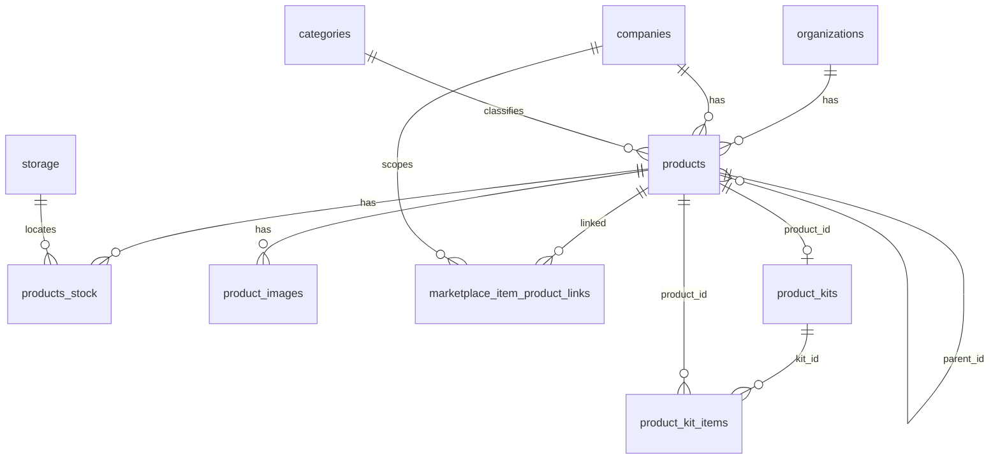

# PRD — Módulo de Produtos (Novura ERP)

> **Versão:** 1.1 · **Status:** Ativo  
> **Última auditoria ao código:** `src/pages/Products.tsx`, `src/hooks/useProducts.ts`, `useVariations.ts`, `useKits.ts`, `useProductsList.ts`, `useDuplicateProduct.ts`, `useProductSync.ts`, rotas em `src/App.tsx`  
> **Idioma da aplicação:** pt-BR

Este PRD descreve **apenas o comportamento e artefatos que existem no repositório neste momento**. Divergências históricas estão em docs de roadmap, não aqui.

---

## 1. Resumo executivo

O módulo de **Produtos** cadastra itens em `products`, estoque por depósito em `products_stock`, imagens em `product_images` (com `products.image_urls` mantido por trigger/RPC para compatibilidade), composição de kits via `product_kits` / `product_kit_items`, e vínculos com anúncios em `marketplace_item_product_links`.

---

## 2. Objetivos e fora de escopo

### 2.1 Objetivos (implementados no código)

- Três experiências de listagem (**Únicos**, **Variações**, **Kits**) sob `/produtos/*`, cada uma com hook de dados próprio.
- Wizard de criação em `/produtos/criar` com fluxos distintos por tipo (único / variação / kit).
- Telas de edição por rota: produto “raiz”, item de variação, kit.
- Upload de imagens via `ProductImageUploader` + serviço/RPC de imagens onde aplicável.
- Duplicação via RPC `duplicate_product` (diálogo na aba Únicos; duplicação inline na API nos hooks de variações/kits).
- Conversão de produto único em kit pela UI na aba Únicos (`ConvertToKitDrawer`), com coluna `converted_from_product_id` no modelo de kits quando persistido pelo fluxo.

### 2.2 Fora de escopo (neste PRD)

- Edge Functions de marketplace e regras fiscais completas de NFe.
- Validação Zod em `src/schemas/products/*.ts` — os arquivos **existem**, mas **não há imports** desses schemas em `src/` no snapshot auditado (validação permanece em lógica inline nos formulários/hooks).

---

## 3. Personas e permissões

### 3.1 Rota e módulo

Em `src/App.tsx`, a árvore `/produtos/*` está dentro de `ProtectedRoute` e `RestrictedRoute` com `module="produtos"` e `actions={["view"]}`.

### 3.2 Botão “Novo produto”

Em `src/pages/Products.tsx`, `canCreate` é verdadeiro quando:

- `(permissions as any)?.produtos?.create` é truthy, **ou**
- `userRole === "owner"` **ou** `userRole === "admin"`.

**Nota:** perfil `seller` não habilita o botão apenas por papel — depende da permissão `produtos.create`.

### 3.3 Cabeçalho das listagens

`ProdutosHeader` é renderizado em todas as sub-rotas do módulo.

### 3.4 RLS (banco)

Políticas por tabela variam por migration; o PRD consolidado não substitui o SQL. Para links de anúncios, ver `supabase/migrations/20251030120000_marketplace_item_product_links.sql`; para imagens, `20260425_000002_product_images.sql`.

---

## 4. Tipos no banco vs UI

| Conceito na UI | `products.type` | Observação no código |
|----------------|-----------------|----------------------|
| Único | `UNICO` | Aba Únicos filtra `product.type === 'UNICO'` em `SingleProducts.tsx`. |
| Variações | `VARIACAO_PAI` + `VARIACAO_ITEM` | `useVariations` carrega pais (`VARIACAO_PAI`) e filhos (`VARIACAO_ITEM` + `parent_id`). |
| Kit | `KIT` ou legado `ITEM` | `useKits` usa `.in('type', ['KIT', 'ITEM'])`. Migração DB migra `ITEM` → `KIT`; o código ainda aceita `ITEM` para linhas antigas. |

**Consulta em `useProducts`:** `.in('type', ['UNICO', 'VARIACAO_ITEM', 'KIT', 'ITEM'])` — a aba Únicos **refina no cliente** para `UNICO` apenas.

**Integridade no Postgres:** `20260425_000001_products_constraints.sql` (`CHECK` em `type`, `VARIACAO_ITEM` com `parent_id`, `UNICO` sem `parent`, SKU único por org em linhas não deletadas).

---

## 5. Fluxo de experiência (UX)

### 5.1 Rotas (`src/pages/Products.tsx`)

Export default: componente de página **default export sem nome** importado como `Products` em `App.tsx`. Imports nomeados dos filhos:

| Rota relativa (`Routes` internas) | Caminho absoluto | Componente (export nomeado) | Arquivo |
|-----------------------------------|------------------|-----------------------------|---------|
| `/` | `/produtos` | `ProdutosUnicos` | `tabs/SingleProducts.tsx` |
| `/variacoes` | `/produtos/variacoes` | `ProdutosVariacoes` | `tabs/ProductVariations.tsx` |
| `/kits` | `/produtos/kits` | `ProdutosKits` | `tabs/ProductKits.tsx` |
| `/criar` | `/produtos/criar` | `CreateProductPage` (alias `CriarProduto`) | `create/CreateProductPage.tsx` |
| `/editar/:id` | `/produtos/editar/:id` | `EditarProduto` | `EditProduct.tsx` |
| `/editar-variacao/:id` | `/produtos/editar-variacao/:id` | `EditVariationWrapper` (alias `EditarVariacao`) | `edit/EditVariationWrapper.tsx` |
| `/editar-kit/:id` | `/produtos/editar-kit/:id` | `EditKitWrapper` (alias `EditarKit`) | `edit/EditKitWrapper.tsx` |

Navegação entre abas: `CleanNavigation`, `basePath="/produtos"`, itens com `path` `""`, `"/variacoes"`, `"/kits"`.

**Ocultar cabeçalho da listagem:** `useLocation().pathname` contém `'/criar'` **ou** `'/editar'` — cobre também `editar-variacao` e `editar-kit` porque compartilham o substring `editar`.

### 5.2 Listagem — dados e UI

| Aba | Hook | Fonte / filtro | Componentes de lista |
|-----|------|----------------|----------------------|
| Únicos | `useProducts` | Supabase: tipos `UNICO`, `VARIACAO_ITEM`, `KIT`, `ITEM`; UI filtra **só `UNICO`** | `ProductTable`, `ProductFilters`, diálogos de exclusão/categorização, `CategoryTreeSelect` no fluxo de categorizar |
| Variações | `useVariations` | Pais `VARIACAO_PAI`; filhos por `parent_id` | `VariationsAccordion`, `ProductFilters`, `CategoryTreeSelect` |
| Kits | `useKits` | `KIT` + `ITEM`; itens via `product_kits` / `product_kit_items` | `KitsAccordion`, `ProductFilters`, `CategoryTreeSelect` |

- **`ProductFilters`** usa **`CategoryDropdown`** (filtro por categorias no drawer).
- **Telas de categorização em massa** nas abas usam **`CategoryTreeSelect`**.

**`useProductsList` (`src/hooks/useProductsList.ts`):** implementa React Query com `queryKey` prefixo `'products-list'`, mas **nenhum outro arquivo em `src/` importa esse hook** — as listagens usam os hooks acima com `useState`/`useEffect`, não essa paginação.

### 5.3 Atualização em tempo real (aba Únicos)

`useProducts` consome `lastUpdate` de `useProductSync`. Esse hook assina `postgres_changes` em `products` e `products_stock` e incrementa `lastUpdate`, o que **dispara novo fetch** em `useProducts`.

`useVariations` e `useKits` **não** usam `useProductSync`; refetch ocorre no mount e quando `user` / `organizationId` mudam, além de `refetch`/`duplicate*` nos próprios hooks.

### 5.4 Criação (wizard)

Passos definidos em `src/components/products/create/constants.ts` (`stepsUnico`, `stepsVariacoes`, `stepsKit`). Estado e persistência: **`useProductForm`** (não usa React Hook Form no wizard — estado React).

Componente raiz: **`CreateProductPage`**. Imagens:

- Único / trechos do fluxo: **`ProductImageUploader`** (`@/components/products/ProductImageUploader`).
- Variações: **`VariationImageUpload`** → internamente pode usar **`ImageUpload`** (`create/ImageUpload.tsx`).

### 5.5 Edição

- **`EditarProduto`** (`EditProduct.tsx`): produto único ou edição “raiz”; usa `ProductImageUploader`, `CategoryTreeSelect`, `ProductAdLinker`, etc.
- **`EditVariationWrapper`**: edição de `VARIACAO_ITEM`.
- **`EditKitWrapper`** + **`edit/kit/*`**: kit; parte do fluxo ainda usa `ImageUpload` em `EditKitAccordion`.

### 5.6 Imagens (pipeline)

Detalhe de processamento WebP, limites e Storage: **`docs/prds/PRODUCTS-IMAGES-PIPELINE.md`** (alinhado às funções em migrations `20260425_000002_*` e ajustes `20260426_000007_*`, `20260426_000008_*`).

### 5.7 Vínculo com anúncios

- Tabela: **`marketplace_item_product_links`** — migration `20251030120000_marketplace_item_product_links.sql`.
- Catálogo de anúncios para o picker: **`fetchMarketplaceItemsForAdLinking`** em **`src/services/productAdLinks.service.ts`** (views `marketplace_items_unified` + `marketplace_items_raw`).
- UI: `ProductLinkingSection`, `ProductAdLinker`, `ProductAdLinkingPanel`.

**Outro serviço:** `listingLinks.service.ts` é usado por hooks do módulo de **anúncios** (`useListingLinks`, `useListings`), não pelo picker acima.

### 5.8 Duplicação

| Contexto | Implementação |
|----------|----------------|
| Aba Únicos | `DuplicateProductDialog` + **`useDuplicateProduct`**: `supabase.rpc('duplicate_product', { p_product_id, p_with_images })`, toast, **`navigate('/produtos/editar/'+ newId)`**, `queryClient.invalidateQueries({ queryKey: ['products-list'] })`. |
| Variações / Kits | `duplicateVariationGroup` / `duplicateKit` em **`useVariations`** / **`useKits`**: RPC direto + `fetchVariations()` / `fetchKits()` sem usar `useDuplicateProduct`. |

Ingestão de novos produtos na lista da aba Únicos: insert via RPC dispara Realtime em `products` → `useProductSync` → `useProducts` atualiza.

### 5.9 Conversão para kit

**`ConvertToKitDrawer`** é importado e usado em **`SingleProducts.tsx` apenas** (não nas abas Variações/Kits). Rastreio no DB: coluna `converted_from_product_id` em `product_kits` (migration `20260425_000005_product_kits_tracking.sql`).

---

## 6. Arquitetura técnica (frontend)

### 6.1 Camada de dados (estado atual auditado)

| Área | Implementação real |
|------|---------------------|
| Listagem Únicos | `useProducts`: `useState` + `useEffect`, dependências `[user, lastUpdate]` |
| Listagem Variações | `useVariations`: `[user, organizationId]` |
| Listagem Kits | `useKits`: `[user, organizationId]` |
| Lista paginada T08 | `useProductsList`: React Query — **sem uso em telas** |
| Criação | `useProductForm` + `useCreateProduct` / inserts em `useProductForm` |
| Imagens | `useProductImages`, `productImages.service.ts` |
| Sincronização | `useProductSync` + invalidação `inventoryKeys` / `productKeys` no trigger manual |

Regra do repositório (CLAUDE.md) prefere serviços sem `supabase.from` nas páginas; **vários hooks de produto ainda chamam Supabase diretamente** — o PRD documenta o estado atual.

### 6.2 Mapa de arquivos (síntese fiel)

| Responsabilidade | Local |
|------------------|--------|
| Página | `src/pages/Products.tsx` |
| Abas | `tabs/SingleProducts.tsx`, `ProductVariations.tsx`, `ProductKits.tsx` |
| Tabela só na aba Únicos | `ProductTable.tsx` |
| Criação | `create/CreateProductPage.tsx`, `useProductForm.ts` |
| Edição | `EditProduct.tsx`, `edit/EditVariationWrapper.tsx`, `edit/EditKitWrapper.tsx` |
| Filtros | `ProductFilters.tsx` + `CategoryDropdown.tsx` |
| Árvore (forms / categorizar) | `CategoryTreeSelect.tsx` |
| Imagens UI | `ProductImageUploader.tsx`, `ProductCoverImage.tsx` |
| Vínculos | `ProductAdLinker.tsx`, `ProductLinkingSection.tsx`, `productAdLinks.service.ts` |
| Duplicar (diálogo) | `DuplicateProductDialog.tsx`, `useDuplicateProduct.ts` |
| Converter kit | `ConvertToKitDrawer.tsx` |
| Schemas Zod (arquivos) | `src/schemas/products/base.schema.ts`, `single.schema.ts`, `variation.schema.ts`, `kit.schema.ts` — **sem wire-up nos componentes auditados** |

---

## 7. Modelo de dados e fluxo no banco

### 7.1 Relacionamentos (visão lógica)

*(O modelo físico exato de FKs está nas migrations; kits são resolvidos em `useKits` via `product_kits` ligado ao produto kit.)*

### 7.2 `products`

Campos de negócio e derivados: ver tipos gerados e migrations. **`stock_qnt`** é atualizado pelo trigger em `products_stock` (`20260425_000003_products_stock_improvements.sql`). **`image_urls`** sincronizado a partir de `product_images` (`sync_product_image_urls`, triggers na mesma família de migrations que `register_product_image`).

### 7.3 `products_stock`

Trigger **`trg_sync_product_stock_qnt`** em `20260425_000003_products_stock_improvements.sql`.

### 7.4 `product_images`

RPC **`register_product_image`**, **`reorder_product_images`**, função **`sync_product_image_urls`**, trigger **`trg_sync_product_image_urls`** — baseline `20260425_000002_product_images.sql`; correções `20260426_000007_product_images_storage_rls_fix.sql`, `20260426_000008_fix_reorder_product_images_conflict.sql`.

### 7.5 Categorias

`path`, `level`, trigger `trg_categories_path`, RPC `get_categories_tree` — `20260425_000004_categories_path.sql`.

### 7.6 Kits

`converted_from_product_id`, unicidade e `quantity` em itens — `20260425_000005_product_kits_tracking.sql`. RPC **`duplicate_product`** definida/alterada nesta linha de migrations e refinamentos `20260426_000009_duplicate_product_unified_signature.sql`, `20260426_000010_duplicate_product_image_urls_not_null_fix.sql`, `20260426_000011_duplicate_product_parent_id_fix.sql`, `20260503224057_products_parent_id_default_fix.sql`.

### 7.7 `marketplace_item_product_links`

Ver §5.7 e migration `20251030120000_marketplace_item_product_links.sql`.

### 7.8 Legado `products_variantes`

Migration `20260425_000006_legacy_variantes_deprecation.sql`: revoga policies, desabilita RLS, comenta tabela; **rename físico não aplicado** neste arquivo (nota no SQL). Fluxo ativo de variações: **`products`** com `VARIACAO_PAI` / `VARIACAO_ITEM` e `parent_id`.

---

## 8. Índice de migrations citadas pelo módulo

| Arquivo | Tema |
|---------|------|
| `20260425_000001_products_constraints.sql` | Constraints `products` |
| `20260425_000002_product_images.sql` | Imagens + RPCs + triggers `image_urls` |
| `20260425_000003_products_stock_improvements.sql` | `min_stock`/`max_stock`, trigger `stock_qnt` |
| `20260425_000004_categories_path.sql` | Árvore de categorias |
| `20260425_000005_product_kits_tracking.sql` | Kits + peça inicial `duplicate_product` |
| `20260425_000006_legacy_variantes_deprecation.sql` | Deprecação `products_variantes` |
| `20260426_000007_product_images_storage_rls_fix.sql` | Storage RLS imagens |
| `20260426_000008_fix_reorder_product_images_conflict.sql` | Reorder imagens |
| `20260426_000009_duplicate_product_unified_signature.sql` | Assinatura RPC duplicar |
| `20260426_000010_duplicate_product_image_urls_not_null_fix.sql` | Duplicar + `image_urls` |
| `20260426_000011_duplicate_product_parent_id_fix.sql` | Duplicar + `parent_id` |
| `20260503224057_products_parent_id_default_fix.sql` | Default `parent_id` |
| `20251030120000_marketplace_item_product_links.sql` | Links produto ↔ anúncio |

---

## 9. Referências internas

| Documento | Uso |
|-----------|-----|
| `docs/prds/PRODUCTS-MODULE-ARCHITECTURE.md` | Diagrama e modelo alvo (complementar; preferir este PRD para “o que o código faz”) |
| `docs/prds/PRODUCTS-UX-AND-OPERATIONS-ROADMAP.md` | Roadmap T01–T14 |
| `docs/prds/PRODUCTS-IMAGES-PIPELINE.md` | Pipeline de imagens |
| `CLAUDE.md` | Convenções do monorepo |

---

## 10. Histórico de versões

| Versão | Notas |
|--------|--------|
| 1.0 | Versão inicial consolidada |
| 1.1 | Auditoria linha a linha contra `src/` e migrations — hooks, rotas, serviços, uso/não uso de `useProductsList` e schemas Zod |
