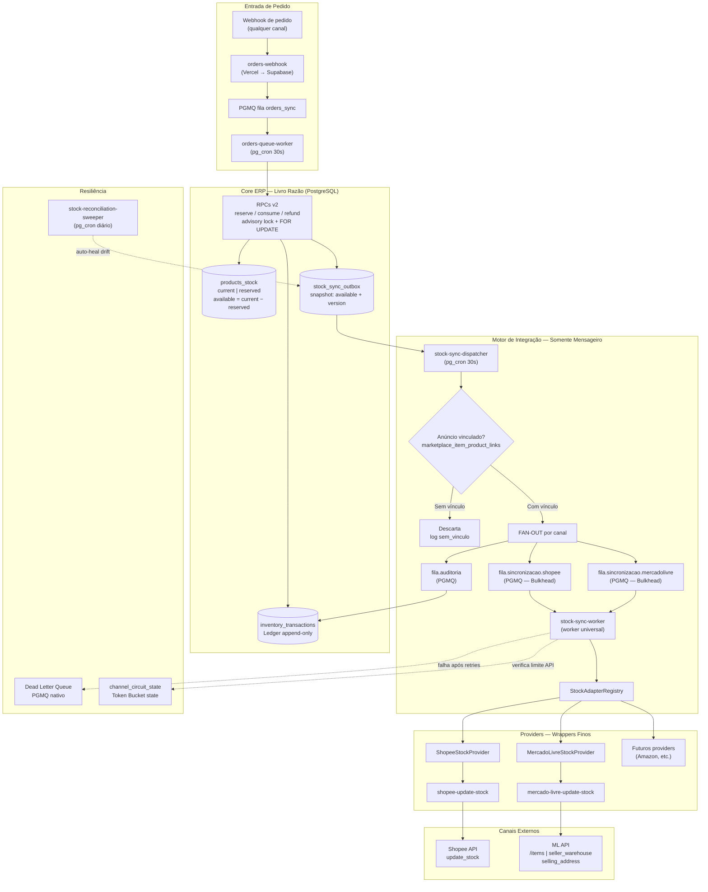

# PRD — Motor Universal de Sincronização de Estoque nos Canais

**Documento:** `PRD-SINCRONIZACAO-UNIVERSAL-ESTOQUE`  
**Versão:** 1.0  
**Data:** Junho/2026  
**Status:** Aprovado para Planejamento  
**Autores:** Engenharia de Produto — Novura  

---

## Sumário Executivo

Este documento define a arquitetura e os requisitos de produto do **Motor Universal de Sincronização de Estoque** do Novura — o sistema responsável por garantir que o saldo de estoque disponível calculado internamente pelo ERP chegue, de forma idempotente, resiliente e auditável, a cada canal de vendas onde o lojista possui anúncios ativos.

O ponto de partida é a eliminação de um gap crítico: hoje, quando um pedido chega pela Shopee e o ERP consome unidades do estoque físico, esse desconto **não é propagado automaticamente** ao Mercado Livre nem a nenhum outro canal concorrente. Cada canal conhece apenas seu próprio movimento. O resultado é exposição sistemática ao overselling.

A solução deste PRD resolve esse problema introduzindo uma arquitetura orientada a eventos com isolamento total por canal (Bulkhead), entrega garantida (Transactional Outbox), idempotência por versionamento monotônico e extensibilidade por design (Motor Universal de Adaptadores).

---

## Índice

1. [Visão Geral da Arquitetura](#1-visão-geral-da-arquitetura)
2. [Modelagem de Dados e Controle de Concorrência](#2-modelagem-de-dados-e-controle-de-concorrência)
3. [Design de Mensageria e Payload dos Eventos](#3-design-de-mensageria-e-payload-dos-eventos)
4. [Motor Universal de Adaptadores de Estoque](#4-motor-universal-de-adaptadores-de-estoque)
5. [Resiliência, Tolerância a Falhas e Circuit Breaker](#5-resiliência-tolerância-a-falhas-e-circuit-breaker)
6. [Considerações de Performance e Trade-offs](#6-considerações-de-performance-e-trade-offs)

---

## 1. Visão Geral da Arquitetura

### 1.1 Fronteira de Responsabilidade: Core ERP vs. Motor de Integração

Esta distinção é a decisão de design mais importante deste documento e deve ser preservada em todas as implementações futuras.

#### Fluxo Interno — Core do ERP (Livro Razão)

O Core do ERP é o **único guardião da verdade do estoque**. Ele é responsável por:

- Processar entradas de compras e fornecedores.
- Registrar inventários físicos e conferências de expedição.
- Executar operações de **Reserva**, **Baixa** e **Estorno** de estoque por pedido.
- Manter o Ledger de movimentações (`inventory_transactions`).
- Calcular e persistir a **Tríade de Estado** em `products_stock`.

O Core opera estritamente dentro do PostgreSQL, através das RPCs v2 (`reserve_stock_for_order_v2`, `consume_stock_for_order_v2`, `refund_stock_for_order_v2`) e da tabela `products_stock`. Nenhum componente externo altera essa tabela.

#### Fluxo Externo — Motor Universal de Integração (Mensageiro)

O Motor de Integração é um **consumidor passivo** do Core. Ele:

- **Não calcula** estoque.
- **Não reserva**, **não baixa** e **não estorna** unidades.
- **Não reinterpreta** regras de negócio internas.
- **Não escreve** em `products_stock`.

Sua única responsabilidade é ler o valor já calculado de `products_stock.available` — o **Estoque Disponível** — e garantir a entrega idempotente e resiliente desse número a cada canal externo vinculado.

**Contrato inegociável:** os marketplaces recebem exclusivamente o campo `available`. Nenhum provider pode utilizar `current`, `reserved`, quantidade vendida ou qualquer heurística local para derivar saldo.

---

### 1.2 A Tríade de Estado do Estoque

```
Estoque Físico (current)      — unidades físicas em posse do lojista
Estoque Reservado (reserved)  — unidades bloqueadas por pedidos não expedidos
─────────────────────────────────────────────────────────────────────────────
Estoque Disponível (available) = current − reserved
                              → ÚNICO valor propagado aos marketplaces
```

Mapeamento na tabela `products_stock`:

| Conceito | Coluna | Quem escreve |
|---|---|---|
| Estoque Físico | `current` | RPCs v2 do Core ERP |
| Estoque Reservado | `reserved` | RPCs v2 do Core ERP |
| Estoque Disponível | `available` (GENERATED STORED) | Calculado automaticamente pelo banco |

A coluna `available` é uma **coluna gerada persistida**: `current - COALESCE(reserved, 0)`. O Motor de Integração lê apenas esse campo; nunca recalcula a fórmula.

---

### 1.3 Ciclo de Vida Ponta a Ponta

O fluxo completo, desde a chegada de um webhook de pedido em um canal até a propagação assíncrona do novo saldo aos demais canais concorrentes:

```
1. Marketplace A → Webhook de pedido → orders-webhook (Vercel)
2. orders-webhook → PGMQ fila orders_sync (enfileira, responde 200 imediatamente)
3. pg_cron (30s) → orders-queue-worker → busca lote da fila
4. orders-queue-worker:
   a. Normaliza o pedido via adapter do marketplace
   b. Upsert em `orders` + `order_items`
   c. Resolve armazém (integration_warehouse_config → fallback storage físico)
   d. RecalculateOrderStatusUseCase → HandleStockSideEffectsUseCase
      → RPC v2 (advisory lock + SELECT FOR UPDATE em products_stock)
      → UPDATE products_stock SET current/reserved = ...
      → INSERT INTO inventory_transactions (ledger)
      → INSERT INTO stock_sync_outbox (snapshot de available + version)
         [mesma transação ACID — Transactional Outbox]
5. pg_cron (30s) → stock-sync-dispatcher lê stock_sync_outbox
   → Resolve marketplace_item_product_links (gate de vínculo)
   → Se sem vínculo: descarta, registra 'sem_vinculo' no ledger
   → Se com vínculo: FAN-OUT para filas PGMQ por canal
6. Filas PGMQ isoladas por canal (Bulkhead):
   → fila.sincronizacao.shopee
   → fila.sincronizacao.mercadolivre
   → fila.auditoria
7. stock-sync-worker (worker universal):
   → Resolve adapter via StockAdapterRegistry
   → Aplica Token Bucket + Circuit Breaker + Exponential Backoff
   → Executa pushStock(availableQty, version, ...)
8. Provider por canal:
   → ShopeeStockProvider  → Edge function shopee-update-stock  → Shopee API
   → MercadoLivreStockProvider → Edge function mercado-livre-update-stock → ML API
9. Resultado persistido no ledger de auditoria
```

---

### 1.4 Diagrama Arquitetural



---

### 1.5 Bulkhead Pattern — Isolamento por Canal

O Bulkhead Pattern é a garantia de que a degradação de performance ou instabilidade de uma API externa **não se propaga** para os demais canais.

**Problema sem Bulkhead:**
- Mercado Livre sofre degradação prolongada (timeout de 15s por request).
- Um worker único processa sequencialmente: Shopee espera ML completar.
- Todos os pedidos ficam com estoque desatualizado na Shopee por causa de um problema no ML.

**Solução com Bulkhead (filas PGMQ isoladas por canal):**
- `fila.sincronizacao.shopee` é consumida exclusivamente pelo contexto Shopee do `stock-sync-worker`.
- `fila.sincronizacao.mercadolivre` é consumida exclusivamente pelo contexto ML.
- O Circuit Breaker do ML pode estar `OPEN` enquanto o Shopee opera normalmente em `CLOSED`.
- Backpressure de ML não afeta latência de Shopee.
- Taxa de erro da Amazon não contamina métricas da Shopee.

Cada fila é um **domínio de falha isolado**. O lojista pode ter a Shopee sincronizando perfeitamente enquanto o ML está em recuperação — sem nenhuma degradação cruzada.

---

## 2. Modelagem de Dados e Controle de Concorrência

### 2.1 Tabela `products_stock` — Contrato do Core ERP

Esta tabela é o estado canônico do estoque. Apenas o Core ERP escreve nela.

```sql
-- Estado atual (documentado para referência)
-- Migration: 20260425_000003_products_stock_improvements.sql

-- Estrutura com evolução proposta para este PRD:
ALTER TABLE public.products_stock
  -- Versão monotônica para idempotência do Motor de Integração
  ADD COLUMN IF NOT EXISTS version bigint NOT NULL DEFAULT 0,
  -- Controle de min/max (existente)
  ADD COLUMN IF NOT EXISTS min_stock int NOT NULL DEFAULT 0,
  ADD COLUMN IF NOT EXISTS max_stock int NULL;

-- Gerada já existente:
-- available GENERATED ALWAYS AS (current - COALESCE(reserved, 0)) STORED

-- Check constraint crítico: impede estoque disponível negativo no banco
ALTER TABLE public.products_stock
  ADD CONSTRAINT chk_products_stock_no_negative_available
    CHECK (current >= COALESCE(reserved, 0));

-- Índice de consulta eficiente pelo Motor de Integração
CREATE INDEX IF NOT EXISTS idx_products_stock_product_storage
  ON public.products_stock (product_id, storage_id)
  WHERE available > 0;
```

**Incremento de `version`:** cada operação bem-sucedida das RPCs v2 deve executar `version = version + 1`. Esse campo é o vetor de controle de ordem para o Motor de Integração.

---

### 2.2 Pessimistic Locking — Escrita Atômica com Proteção de Negatividade

Todas as RPCs v2 do Core seguem este padrão, sem exceção:

```sql
-- Exemplo simplificado de consume_stock_for_order_v2
-- (corpo completo em: 20260414_000007_stock_rpcs_company_aware.sql)

BEGIN;

-- 1. Advisory lock por produto: garante serialização por SKU
--    Equivalente ao Redlock, mas nativo PostgreSQL
PERFORM pg_advisory_xact_lock(hashtext(p_product_id::text));

-- 2. Pessimistic lock na linha de estoque: bloqueia concorrentes
SELECT id, current, reserved, version
  INTO v_row
  FROM products_stock
 WHERE product_id = p_product_id
   AND storage_id = p_storage_id
   FOR UPDATE;          -- bloqueia até transação liberar

-- 3. Validação de disponibilidade (check constraint fará o mesmo no banco)
IF v_row.current - v_row.reserved < p_qty THEN
  RAISE EXCEPTION 'estoque_insuficiente: disponivel=%, solicitado=%',
    v_row.current - v_row.reserved, p_qty;
END IF;

-- 4. Escrita atômica: decremento + incremento de versão
UPDATE products_stock
   SET current  = current  - p_qty,
       version  = version  + 1,
       updated_at = now()
 WHERE id = v_row.id;

-- 5. Ledger append-only (inventory_transactions)
INSERT INTO inventory_transactions (
  organizations_id, product_id, storage_id, order_id,
  movement_type, quantity_change, source_ref, integration_id
) VALUES (
  p_org_id, p_product_id, p_storage_id, p_order_id,
  'SAIDA', -p_qty, 'PEDIDO[' || p_order_id || ']', p_integration_id
);

-- 6. Outbox: snapshot para o Motor de Integração (mesma transação)
INSERT INTO stock_sync_outbox (
  product_id, storage_id, available_snapshot, version, organization_id, created_at
) VALUES (
  p_product_id, p_storage_id,
  (SELECT available FROM products_stock WHERE id = v_row.id),
  (SELECT version  FROM products_stock WHERE id = v_row.id),
  p_org_id, now()
)
ON CONFLICT (product_id, storage_id) DO UPDATE
  SET available_snapshot = EXCLUDED.available_snapshot,
      version            = EXCLUDED.version,
      processed          = false,
      updated_at         = now();

COMMIT;
```

**Garantias desta abordagem:**
- O advisory lock serializa operações por SKU/produto sem bloquear outros SKUs.
- O `SELECT ... FOR UPDATE` impede que dois workers paralelos leiam o mesmo saldo simultaneamente.
- O `CHECK CONSTRAINT` no banco é a última linha de defesa contra estoque negativo, mesmo que a validação aplicacional falhe.
- O insert no `stock_sync_outbox` na **mesma transação** garante que o evento de sincronização nunca é perdido (resolve o problema do Dual-Write).

---

### 2.3 Tabela `stock_sync_outbox` — Transactional Outbox

```sql
CREATE TABLE IF NOT EXISTS public.stock_sync_outbox (
  id                 uuid        PRIMARY KEY DEFAULT gen_random_uuid(),
  organization_id    uuid        NOT NULL REFERENCES public.organizations(id),
  product_id         uuid        NOT NULL REFERENCES public.products(id),
  storage_id         uuid        NOT NULL REFERENCES public.storage(id),
  available_snapshot numeric     NOT NULL,
  version            bigint      NOT NULL,
  processed          boolean     NOT NULL DEFAULT false,
  processing_at      timestamptz,
  created_at         timestamptz NOT NULL DEFAULT now(),
  updated_at         timestamptz NOT NULL DEFAULT now(),
  UNIQUE (product_id, storage_id)  -- apenas o estado mais recente por produto/armazém
);

-- Índice para o dispatcher: eventos não processados por ordem de criação
CREATE INDEX idx_stock_sync_outbox_pending
  ON public.stock_sync_outbox (created_at)
  WHERE processed = false;
```

**Semântica UPSERT do Outbox:** quando múltiplas mutações ocorrem rapidamente no mesmo produto/armazém (ex.: 10 pedidos chegando em sequência), o `ON CONFLICT DO UPDATE` garante que apenas o snapshot mais recente (`available` + `version`) permanece no outbox. O dispatcher sempre propaga o estado atual, não uma fila de estados intermediários — o que é correto para estoque (o canal precisa saber o saldo atual, não o histórico de deltas).

---

### 2.4 Ledger de Auditoria — `inventory_transactions`

O ledger existente (`inventory_transactions`) é reaproveitado como o Event Sourcing leve da plataforma. Cada linha é **imutável e append-only** — o permissão `DELETE` é revogada para `authenticated`.

O Motor de Integração também registra neste ledger:

| `movement_type` | `entity_type` | Origem | Significado |
|---|---|---|---|
| `SAIDA` | `order` | Core ERP | Baixa por venda |
| `RESERVA` | `order` | Core ERP | Reserva por pedido |
| `CANCELAMENTO_RESERVA` | `order` | Core ERP | Estorno de reserva |
| `ENTRADA` | `manual` | Core ERP | Entrada manual / compra |
| — | `system` | Motor Integração | `reason_code = sem_vinculo` (evento descartado) |
| — | `system` | Motor Integração | `reason_code = sync_ok` (push bem-sucedido) |
| — | `system` | Motor Integração | `reason_code = sync_failed_dlq` (enviado para DLQ) |

Esta estrutura garante **rastreabilidade completa** para o lojista: ele pode reconstruir o histórico de cada unidade — quando foi vendida, por qual pedido, se foi propagada ao canal, e se houve falhas.

---

### 2.5 Vínculo Anúncio ↔ Produto (`marketplace_item_product_links`)

A tabela `marketplace_item_product_links` é a **chave de roteamento e pré-condição** de toda propagação de estoque. Sem vínculo, o Motor de Integração não tem como saber para qual anúncio de qual canal enviar o saldo.

```sql
-- Estrutura existente (marketplace_item_product_links)
-- Campos utilizados pelo Motor de Integração:
--   organization_id   → tenant
--   marketplace_name  → 'Shopee' | 'Mercado Livre'
--   marketplace_item_id → item_id (Shopee) | MLB... (ML)
--   variation_id      → model_id (Shopee) | variation.id (ML) | '' para sem variação
--   product_id        → FK para products — chave de resolução
--   integration_id    → qual conta do marketplace (para multi-loja)
```

**Regra de negócio crítica:**

1. O dispatcher consulta `marketplace_item_product_links` usando `product_id` + `storage_id` do outbox.
2. Se **nenhum vínculo existe**: o evento é descartado com `reason_code = sem_vinculo`, o anúncio é marcado como "A Vincular" na UI, e nenhuma chamada de API é feita.
3. Se **vínculo existe**: uma mensagem é enfileirada por canal/anúncio/variação.
4. O mesmo vínculo é a chave usada pelo Core ERP para resolver `product_id` na ingestão de pedidos. Portanto, ausência de vínculo bloqueia simultaneamente:
   - A reserva/baixa de estoque pelo Core (pedido vai para estado "A Vincular").
   - A propagação de estoque pelo Motor de Integração (evento descartado).

Esta regra garante que **o ERP nunca opera sobre produto desconhecido** — qualquer operação de estoque, seja interna ou externa, pressupõe mapeamento explícito.

---

### 2.6 Tabelas de Estado de Resiliência

```sql
-- Circuit Breaker: estado por canal
CREATE TABLE IF NOT EXISTS public.channel_circuit_state (
  channel          text        PRIMARY KEY,  -- 'shopee' | 'mercado_livre'
  state            text        NOT NULL DEFAULT 'closed'
                               CHECK (state IN ('closed', 'open', 'half_open')),
  failure_count    integer     NOT NULL DEFAULT 0,
  last_failure_at  timestamptz,
  opens_until      timestamptz,
  updated_at       timestamptz NOT NULL DEFAULT now()
);

-- Token Bucket: controle de rate limit por canal
CREATE TABLE IF NOT EXISTS public.channel_rate_buckets (
  channel          text        PRIMARY KEY,
  tokens           numeric     NOT NULL DEFAULT 100,
  max_tokens       numeric     NOT NULL DEFAULT 100,
  refill_rate      numeric     NOT NULL DEFAULT 10,  -- tokens/segundo
  last_refill_at   timestamptz NOT NULL DEFAULT now()
);
```

---

## 3. Design de Mensageria e Payload dos Eventos

### 3.1 Topologia de Mensageria

```
stock_sync_outbox (PostgreSQL — Transactional Outbox)
        │
        ▼
stock-sync-dispatcher (pg_cron, 30s)
        │
        ├── Resolve marketplace_item_product_links
        │   └── [GATE] Sem vínculo → descarta + audita 'sem_vinculo'
        │
        ├── fila.sincronizacao.shopee       (PGMQ — Bulkhead canal Shopee)
        ├── fila.sincronizacao.mercadolivre (PGMQ — Bulkhead canal ML)
        └── fila.auditoria                  (PGMQ — log de toda propagação)
                │
                ▼
        stock-sync-worker (worker universal)
                │
                ├── ShopeeStockProvider     → shopee-update-stock
                ├── MercadoLivreStockProvider → mercado-livre-update-stock
                └── [futuros providers]
```

**Propriedades das filas PGMQ:**

| Fila | Visibilidade | Retenção DLQ | Finalidade |
|---|---|---|---|
| `fila.sincronizacao.shopee` | 60s | 7 dias | Push de estoque para Shopee |
| `fila.sincronizacao.mercadolivre` | 60s | 7 dias | Push de estoque para ML |
| `fila.auditoria` | 10s | 30 dias | Log completo para rastreabilidade |

---

### 3.2 Schema do Evento `estoque.atualizado.v1`

```json
{
  "$schema": "https://json-schema.org/draft/2020-12/schema",
  "$id": "https://novuraerp.com.br/events/estoque.atualizado.v1",
  "title": "estoque.atualizado.v1",
  "description": "Evento emitido pelo Motor de Integração para sincronizar estoque disponível em um canal externo. O campo 'available' é sempre originado de products_stock.available, nunca recalculado pelo emitter.",
  "type": "object",
  "required": [
    "event_id", "event_type", "schema_version",
    "organization_id", "product_id", "storage_id",
    "marketplace_name", "marketplace_item_id", "variation_id",
    "integration_id", "available", "version",
    "emitted_at"
  ],
  "properties": {
    "event_id": {
      "type": "string",
      "format": "uuid",
      "description": "Identificador único do evento. Chave de idempotência no provider."
    },
    "event_type": {
      "type": "string",
      "const": "estoque.atualizado.v1"
    },
    "schema_version": {
      "type": "integer",
      "const": 1
    },
    "organization_id": {
      "type": "string",
      "format": "uuid"
    },
    "product_id": {
      "type": "string",
      "format": "uuid",
      "description": "ID interno do produto no Novura."
    },
    "storage_id": {
      "type": "string",
      "format": "uuid",
      "description": "Armazém de origem do saldo."
    },
    "marketplace_name": {
      "type": "string",
      "enum": ["Shopee", "Mercado Livre", "Amazon"],
      "description": "Canal de destino do evento."
    },
    "marketplace_item_id": {
      "type": "string",
      "description": "ID do anúncio no marketplace (item_id Shopee | MLB... ML)."
    },
    "variation_id": {
      "type": "string",
      "description": "ID da variação (model_id Shopee | variation.id ML). String vazia para anúncios sem variação."
    },
    "integration_id": {
      "type": "string",
      "format": "uuid",
      "description": "ID da integração (conta do marketplace) de origem do vínculo."
    },
    "available": {
      "type": "integer",
      "minimum": 0,
      "description": "Estoque disponível a ser propagado. SEMPRE originado de products_stock.available. Nunca recalculado pelo emitter ou provider."
    },
    "version": {
      "type": "integer",
      "minimum": 1,
      "description": "Versão monotônica do estado de estoque. Providers DEVEM rejeitar eventos com version menor ou igual ao último processado para o mesmo marketplace_item_id + variation_id."
    },
    "logistic_hints": {
      "type": "object",
      "description": "Dicas de logística para roteamento do provider ML. Preenchido pelo dispatcher a partir de marketplace_stock_distribution.",
      "properties": {
        "logistic_type": {
          "type": "string",
          "enum": ["fulfillment", "cross_docking", "xd_drop_off", "self_service", "drop_off", "default"],
          "description": "Tipo logístico do anúncio ML. Determina qual endpoint usar."
        },
        "has_warehouse_management": {
          "type": "boolean",
          "description": "Seller tem tag warehouse_management (multi-origem)."
        },
        "user_product_id": {
          "type": "string",
          "description": "user_product_id do ML para endpoints /user-products/..."
        },
        "seller_warehouse_locations": {
          "type": "array",
          "items": {
            "type": "object",
            "properties": {
              "store_id": { "type": "string" },
              "network_node_id": { "type": "string" }
            }
          }
        }
      }
    },
    "emitted_at": {
      "type": "string",
      "format": "date-time",
      "description": "Timestamp ISO-8601 de emissão pelo dispatcher."
    },
    "source_outbox_id": {
      "type": "string",
      "format": "uuid",
      "description": "ID do registro em stock_sync_outbox que originou este evento. Para rastreabilidade."
    }
  }
}
```

**Semântica de `version` e idempotência:**

O campo `version` é o mecanismo central de proteção contra gravações fora de ordem. Cada provider deve manter o último `version` processado com sucesso por `(marketplace_item_id, variation_id)` e **rejeitar silenciosamente** (sem erro, sem DLQ) eventos com `version` igual ou inferior. Isso garante que, em cenários de reprocessamento ou entrega duplicada, o canal não receba uma quantidade desatualizada que sobrescreva uma atualização mais recente.

---

## 4. Motor Universal de Adaptadores de Estoque

### 4.1 Design: Porta + Registry + Providers

O Motor Universal segue o **mesmo padrão arquitetural** já estabelecido pelo módulo de OAuth (`_shared/adapters/oauth/registry.ts` + `providers/<canal>.ts`). Adicionar um novo canal de vendas ao Motor de Estoque segue o mesmo processo que adicionar um novo marketplace ao OAuth.

```
_shared/domain/stock/ports/
  IStockChannelAdapter.ts     ← contrato (porta hexagonal)

_shared/adapters/stock/
  registry.ts                 ← StockAdapterRegistry (mapeia providerKey → provider)
  providers/
    shopee.ts                 ← ShopeeStockProvider (refatoração de shopee-update-stock)
    mercado-livre.ts          ← MercadoLivreStockProvider (nova implementação crítica)
    _template.ts              ← guia para Amazon e futuros canais

supabase/functions/
  shopee-update-stock/        ← Edge function fina: wrapper HTTP → ShopeeStockProvider
  mercado-livre-update-stock/ ← Edge function fina: wrapper HTTP → MercadoLivreStockProvider
  stock-sync-dispatcher/      ← Dispatcher: lê outbox, valida vínculo, enfileira FAN-OUT
  stock-sync-worker/          ← Worker universal: consome filas, aplica resiliência, executa pushStock
  stock-reconciliation-sweeper/ ← Sweeper: detecta e auto-corrige drifts
```

---

### 4.2 Contrato `IStockChannelAdapter`

```typescript
// _shared/domain/stock/ports/IStockChannelAdapter.ts

export interface StockPushContext {
  readonly organizationId: string;
  readonly productId: string;
  readonly availableQty: number;   // SEMPRE de products_stock.available
  readonly version: number;        // versão monotônica de products_stock.version
  readonly marketplaceItemId: string;
  readonly variationId: string;
  readonly integrationId: string;
  readonly logisticHints?: StockLogisticHints;
  readonly eventId: string;        // UUID do evento — chave de idempotência
}

export interface StockLogisticHints {
  readonly logisticType?: string;
  readonly hasWarehouseManagement?: boolean;
  readonly userProductId?: string;
  readonly sellerWarehouseLocations?: ReadonlyArray<{
    readonly storeId: string;
    readonly networkNodeId: string;
  }>;
}

export interface StockPushResult {
  readonly ok: boolean;
  readonly channelItemId: string;
  readonly variationId: string;
  readonly appliedQty: number;
  readonly warnings: string[];
  readonly retryable: boolean;     // false = DLQ imediato; true = backoff retry
  readonly rawResponse?: unknown;
}

export interface IStockChannelAdapter {
  readonly providerKey: string;    // 'shopee' | 'mercado_livre' | 'amazon'
  pushStock(ctx: StockPushContext): Promise<StockPushResult>;
}
```

**Invariante crítica:** `StockPushContext.availableQty` é sempre fornecido pelo Core ERP via o payload do evento. Nenhum provider implementa cálculo de saldo — a interface não expõe `current` nem `reserved` intencionalmente.

---

### 4.3 StockAdapterRegistry

```typescript
// _shared/adapters/stock/registry.ts

import { ShopeeStockProvider }       from './providers/shopee.ts';
import { MercadoLivreStockProvider } from './providers/mercado-livre.ts';
import type { IStockChannelAdapter } from '../../domain/stock/ports/IStockChannelAdapter.ts';

const REGISTRY = new Map<string, IStockChannelAdapter>([
  ['Shopee',         new ShopeeStockProvider()],
  ['Mercado Livre',  new MercadoLivreStockProvider()],
  // Amazon: ['Amazon', new AmazonStockProvider()],  ← adicionar aqui
]);

export function getStockAdapter(marketplaceName: string): IStockChannelAdapter {
  const adapter = REGISTRY.get(marketplaceName);
  if (!adapter) {
    throw new Error(`StockAdapterRegistry: provider não registrado para '${marketplaceName}'`);
  }
  return adapter;
}
```

---

### 4.4 Provider Shopee (`ShopeeStockProvider`)

Refatoração da lógica existente em `shopee-update-stock/index.ts` para um provider reutilizável.

```typescript
// _shared/adapters/stock/providers/shopee.ts

export class ShopeeStockProvider implements IStockChannelAdapter {
  readonly providerKey = 'Shopee';

  async pushStock(ctx: StockPushContext): Promise<StockPushResult> {
    const { accessToken, shopId } = await resolveShopeeCredentials(ctx.integrationId);
    const stockList = buildShopeeStockList(ctx.marketplaceItemId, ctx.variationId, ctx.availableQty);
    const response  = await callShopeeUpdateStock(accessToken, shopId, stockList);
    return mapShopeeResponse(response, ctx);
  }
}

// Helpers de responsabilidade única (< 30 linhas cada):
// buildShopeeStockList → normaliza para { model_id, seller_stock: [{ location_id: "BRZ", stock }] }
// callShopeeUpdateStock → HMAC sign + POST /api/v2/product/update_stock
// resolveShopeeCredentials → busca integração, descriptografa token, refresh se necessário
// mapShopeeResponse → StockPushResult
```

**Mapa de erros Shopee → ação:**

| Condição | Ação |
|---|---|
| HTTP 200 + `error: null` | `ok: true` |
| `error_sign` | Re-sign + retry imediato (1x) |
| HTTP 401/403 ou `invalid_access_token` | Refresh token + retry (1x) |
| HTTP 429 | `retryable: true` → Exponential Backoff |
| HTTP 503 | `retryable: true` → Exponential Backoff |
| Erro de negócio irrecuperável | `retryable: false` → DLQ |

---

### 4.5 Provider Mercado Livre (`MercadoLivreStockProvider`)

Esta é a **implementação crítica nova** deste PRD. O objetivo é corrigir a limitação atual de `mercado-livre-update-item-fields`: o endpoint `PUT /items/{id}` com `available_quantity` funciona para contas simples, mas **retorna 200 sem atualizar estoque** em contas multi-origem (`warehouse_management`).

#### Árvore de Decisão de Endpoint (conforme documentação oficial ML)

```
MercadoLivreStockProvider.pushStock(ctx)
│
├─ ctx.logisticHints.logisticType === 'fulfillment'?
│   └─ SKIP: estoque Full é gerido pelo ML (somente leitura)
│       return { ok: true, warnings: ['full_stock_skip_readonly'] }
│
├─ ctx.logisticHints.hasWarehouseManagement === true?
│   │   (seller tem tag warehouse_management / multiwarehouse)
│   ├─ GET /user-products/{user_product_id}/stock
│   │   → captura header x-version obrigatório
│   └─ PUT /user-products/{user_product_id}/stock/type/seller_warehouse
│       body: { locations: [{ store_id, network_node_id, quantity: availableQty }] }
│       header: x-version: <valor do GET>
│
├─ Site MLB + logistic_type === 'self_service'?
│   └─ selling_address está bloqueado no Brasil
│       → usar /items/{item_id} com available_quantity como fallback
│
├─ Site MLA/MLC + logistic_type === 'self_service' (Full+Flex)?
│   └─ PUT /user-products/{user_product_id}/stock/type/selling_address
│       body: { quantity: availableQty }
│       header: x-version: <valor do GET>
│
└─ Conta sem multi-origem (padrão):
    └─ PUT /items/{item_id}
        body: { available_quantity: availableQty }
        (ML sincroniza automaticamente todos os UPs do mesmo user_product_id)
```

#### Concorrência Otimista com `x-version`

O header `x-version` retornado pelo `GET /user-products/{id}/stock` é o mecanismo de concorrência otimista do ML. O sistema deve:

1. Fazer `GET` para ler o estado atual e capturar `x-version`.
2. Incluir o header no `PUT` subsequente.
3. Se o ML retornar `409 Conflict` (version mismatch): re-ler o estado com novo `GET` e retry.
4. Se o ML retornar `400` com mensagem `Missing X-Version header`: o GET não foi feito antes do PUT. Isso é sempre um bug de implementação — não retentar, enviar para DLQ com `retryable: false`.

#### Detecção de Capacidade do Seller

Para rotear corretamente, o provider precisa saber se o seller tem `warehouse_management`. Este dado é **resolvido uma vez** durante a criação do evento no dispatcher (consultando `marketplace_integrations` + chamada lazy a `/users/{id}` cacheada em tabela `channel_seller_capabilities`) e incluído no `logistic_hints` do payload. O provider **não faz chamadas de descoberta em tempo de execução**.

**Mapa de erros ML → ação:**

| Condição | Ação |
|---|---|
| HTTP 200 | `ok: true` |
| HTTP 401/403 | Refresh token ML + retry (1x) |
| HTTP 409 (version mismatch) | Re-GET + retry imediato (1x) |
| HTTP 429 | `retryable: true` → Exponential Backoff |
| HTTP 503 | `retryable: true` → Exponential Backoff |
| `400 Missing X-Version` | `retryable: false` → DLQ (bug de implementação) |
| `400 seller with single warehouse` | Ajustar payload para um único network_node_id; retry |
| Erro de negócio irrecuperável | `retryable: false` → DLQ |

---

### 4.6 Edge Functions por Canal — Wrappers Finos

As edge functions são **pontos de entrada HTTP** para os providers. Elas não contêm lógica de negócio:

```typescript
// supabase/functions/mercado-livre-update-stock/index.ts

serve(async (req) => {
  if (req.method !== 'POST') return methodNotAllowed();

  const ctx = await parseStockPushContext(req);
  if (!ctx) return badRequest('Payload inválido');

  const provider = getStockAdapter('Mercado Livre');
  const result   = await provider.pushStock(ctx);

  return jsonResponse(result, result.ok ? 200 : 422);
});
```

O worker `stock-sync-worker` pode tanto invocar a edge function quanto chamar o provider diretamente via import (sem HTTP hop). A edge function existe para permitir chamadas externas pontuais (ex.: reconciliação manual pelo painel).

**Separação crítica: `mercado-livre-update-item-fields` é preservada.** Essa função continua responsável por atualizar título, preço, imagens, descrição, status e todos os demais campos de anúncio ML. Apenas o bloco de lógica de `available_quantity` dentro dela é removido/depreciado, delegando para `mercado-livre-update-stock` via `MercadoLivreStockProvider`.

---

## 5. Resiliência, Tolerância a Falhas e Circuit Breaker

### 5.1 Exponential Backoff com Jitter

O worker universal aplica backoff antes de cada retry:

```
tempo_espera = min(base_ms × 2^tentativa, max_ms) + jitter

Onde:
  base_ms    = 1.000 ms  (1 segundo)
  max_ms     = 300.000 ms (5 minutos)
  tentativa  = número da tentativa (0-indexado)
  jitter     = número aleatório em [0, base_ms × 2^tentativa × 0.1]

Exemplos:
  Tentativa 0: ~1.000 ms
  Tentativa 1: ~2.000–2.200 ms
  Tentativa 2: ~4.000–4.400 ms
  Tentativa 3: ~8.000–8.800 ms
  Tentativa 4: ~16.000–17.600 ms
  Tentativa 5: máximo 300.000 ms
```

O jitter é obrigatório para evitar "thundering herd" — cenário em que múltiplos workers que falharam simultaneamente (ex.: API ficou indisponível por 2 minutos) retentam todos ao mesmo tempo quando o serviço volta, causando nova sobrecarga.

**Configuração por canal:**

| Canal | Máx. tentativas | Condições de retry | Condições de DLQ |
|---|---|---|---|
| Shopee | 5 | 429, 503, timeout, `error_sign` | Erro de negócio, token inválido após refresh |
| Mercado Livre | 5 | 429, 503, 409 (version), timeout | 400 `Missing X-Version`, erro de negócio |

---

### 5.2 Dead Letter Queue (DLQ)

A DLQ é o repositório de mensagens **não processáveis** após exaustão de todas as tentativas de retry.

**Ciclo de vida de uma mensagem DLQ:**

```
1. Mensagem enfileirada → visibilidade timeout (60s)
2. stock-sync-worker consome → pushStock → falha com retryable: true
3. Retry com backoff (até 5x)
4. Após 5 falhas OU falha com retryable: false:
   → Mensagem movida para DLQ nativa PGMQ
   → INSERT INTO inventory_transactions (movement_type=system, reason_code=sync_failed_dlq)
   → Alerta criado em channel_alerts (exposto no painel Novura)
5. Painel Novura exibe fila DLQ por canal com:
   → marketplace_item_id, variation_id, available tentado, erro, timestamp
6. Operador pode:
   → Reprocessar manualmente (move mensagem de volta para fila principal)
   → Descartar (arquivar + registrar motivo)
   → Acionar suporte técnico
```

**View de observabilidade:**

```sql
CREATE OR REPLACE VIEW public.v_stock_sync_dlq AS
SELECT
  q.msg_id,
  (q.message->>'organization_id')::uuid AS organization_id,
  q.message->>'marketplace_name'        AS marketplace_name,
  q.message->>'marketplace_item_id'     AS marketplace_item_id,
  q.message->>'variation_id'            AS variation_id,
  (q.message->>'available')::integer    AS available_attempted,
  q.message->>'error'                   AS last_error,
  q.enqueued_at,
  q.read_ct AS retry_count
FROM pgmq.dlq_messages q
WHERE q.queue_name LIKE 'fila.sincronizacao.%'
ORDER BY q.enqueued_at DESC;
```

---

### 5.3 Circuit Breaker

O Circuit Breaker protege os workers de saída, impedindo tentativas contínuas contra APIs de canais em falha prolongada.

**Estados e transições:**

```
                     failure_count >= threshold
   CLOSED ─────────────────────────────────────► OPEN
   (normal)                                       │
      ▲                                           │ opens_until elapsed
      │                                           ▼
      │          call_result = success         HALF-OPEN
      └──────────────────────────────────────── (probe)
                                                   │ call_result = failure
                                                   └──────────────► OPEN
```

**Parâmetros por canal:**

| Canal | Threshold de falhas | Janela de observação | Timeout OPEN |
|---|---|---|---|
| Shopee | 5 falhas consecutivas | 2 minutos | 5 minutos |
| Mercado Livre | 5 falhas consecutivas | 2 minutos | 5 minutos |

**Implementação:** o worker consulta `channel_circuit_state` antes de cada execução de `pushStock`. Se o estado for `OPEN` e `opens_until` não expirou, a mensagem é colocada de volta na fila (PGMQ visibility timeout) sem consumir o contador de tentativas. Quando `opens_until` expira, o estado transita para `HALF-OPEN` automaticamente, e a próxima mensagem serve como probe.

---

### 5.4 Transactional Outbox — Resolução do Dual-Write Problem

O Dual-Write Problem ocorre quando um sistema precisa persistir estado em dois lugares atomicamente (ex.: banco de dados + broker de mensagens). Uma falha entre as duas operações cria inconsistência irrecuperável.

**Problema sem Outbox:**
```
1. UPDATE products_stock (ok)
2. Publish to message broker ← falha aqui
3. Resultado: estoque atualizado no ERP, canal nunca notificado
```

**Solução com Transactional Outbox:**
```
1. BEGIN
2. UPDATE products_stock
3. INSERT INTO stock_sync_outbox  ← mesma transação
4. COMMIT

→ Se o COMMIT falhar: ambas as operações são revertidas (ACID).
→ Se o COMMIT for bem-sucedido: ambas as operações persistem.
→ stock-sync-dispatcher lê o outbox periodicamente e enfileira no PGMQ.
→ Entrega ao canal é separada da transação de estoque (at-least-once).
```

Esta abordagem garante **at-least-once delivery** — o evento de sincronização pode ser entregue mais de uma vez em casos de falha do dispatcher, mas a idempotência via `version` no provider garante que apenas a primeira entrega efetivamente atualiza o canal.

---

### 5.5 Reconciliation Engine (Data Sweeper)

O sweeper é um mecanismo de segurança para detectar e corrigir **drifts** — divergências entre o estado interno do Novura e o que o canal realmente exibe.

**Fontes de drift:**

- Falha silenciosa de um provider (resposta 200 mas dado não aplicado pelo canal).
- Mutação direta no painel do marketplace pelo lojista (fora do Novura).
- Bug em migração de dados.
- Falha de rede não detectada.

**Ciclo do sweeper (pg_cron, execução diária ou sob demanda):**

```
Para cada produto com vínculo ativo (marketplace_item_product_links):
  1. Lê products_stock.available (fonte de verdade interna)
  2. Chama API do canal para consultar estoque atual (ex.: GET /items/{id})
  3. Calcula drift: |internal_available - channel_available|
  4. Se drift > threshold (configurável, padrão 0):
     a. Registra discrepância em channel_drift_log
     b. Insere evento no stock_sync_outbox com available atual e version atual
        (reutiliza o fluxo normal de propagação para auto-correção)
     c. Cria alerta no painel Novura se drift for persistente (> 2 ciclos)
```

O sweeper **não escreve diretamente** no canal — ele injeta eventos no outbox, que seguem o fluxo normal com todas as garantias de resiliência (retry, DLQ, Circuit Breaker).

---

### 5.6 Dynamic Rate-Limiting / Backpressure — Token Bucket

O Token Bucket garante que o sistema não ultrapasse os limites oficiais de API de cada canal:

**Algoritmo Token Bucket por canal:**

```
Estado: { tokens: N, max_tokens: N, refill_rate: R tokens/s, last_refill: T }

Antes de cada chamada de API:
  1. Calcular tokens a repor: elapsed = now - last_refill; tokens += elapsed × refill_rate
  2. Limitar: tokens = min(tokens, max_tokens)
  3. Se tokens >= 1: consumir 1 token, executar chamada
  4. Se tokens < 1: calcular tempo de espera (1 - tokens) / refill_rate, aguardar

Persistência: UPDATE channel_rate_buckets SET tokens = ?, last_refill_at = now()
```

**Limites configurados por canal:**

| Canal | `max_tokens` | `refill_rate` | Referência |
|---|---|---|---|
| Shopee | 100 | 10/s | Documentação Shopee Open Platform |
| Mercado Livre | 60 | 3/s | Documentação ML (conservador para evitar 429) |

O Token Bucket é implementado no `stock-sync-worker` **antes** de chamar o provider. O estado é persistido na tabela `channel_rate_buckets` para ser compartilhado entre múltiplas invocações concorrentes do worker.

---

## 6. Considerações de Performance e Trade-offs

### 6.1 Eventual Consistency vs. Strong Consistency

**Trade-off central deste sistema:**

A arquitetura escolhida é **Eventually Consistent** para a sincronização com canais externos. Isso significa que, após uma venda na Shopee, existe uma janela de tempo (geralmente 30–90 segundos, dependendo do ciclo pg_cron) em que o Mercado Livre ainda exibe o saldo anterior.

| Aspecto | Eventual Consistency (nossa escolha) | Strong Consistency (alternativa) |
|---|---|---|
| Latência de propagação | 30–90s | < 2s |
| Throughput | Alto (assíncrono) | Baixo (bloqueante) |
| Resiliência a falhas de API | Alta (isolada, retry) | Baixa (falha propaga) |
| Risco de overselling | Baixo com versionamento | Mínimo |
| Custo operacional | Baixo | Alto (conexões síncronas) |
| Escalabilidade | Linear | Limitada por latência de API |

**Estratégias de mitigação do risco de overselling com Eventual Consistency:**

1. **Reserva imediata no Core ERP:** o momento de reserva (`RESERVA` no `inventory_transactions`) é síncrono e precedente à propagação. O canal vendeu uma unidade, o ERP reservou antes de propagar.
2. **Versionamento monotônico:** eventos fora de ordem são descartados pelo provider; saldo mais recente sempre prevalece.
3. **Sweeper diário:** drifts acumulados são corrigidos automaticamente, limitando a janela máxima de divergência.
4. **Alertas de DLQ:** o painel sinaliza imediatamente quando uma sincronização não pôde ser entregue, permitindo intervenção manual em casos críticos.

Para casos em que Strong Consistency seja mandatória (ex.: produtos com estoque = 1 e alta demanda concorrente), a recomendação é configurar `min_stock` em `products_stock` com buffer de segurança, pausando o anúncio antes de atingir zero.

---

### 6.2 Estratégias de Minimização de Latência Cross-Border

As APIs dos canais são hospedadas em infraestrutura internacional, e a latência de rede pode impactar o throughput do Motor de Integração.

**Estratégias aplicadas:**

1. **Processamento em lote:** o worker agrupa múltiplos eventos do mesmo canal antes de iniciar o ciclo de chamadas de API, reduzindo overhead de handshake TLS.
2. **Keep-alive de conexão:** o Deno runtime reutiliza conexões TCP/TLS para o mesmo host, eliminando re-handshake em chamadas consecutivas ao mesmo canal.
3. **Cache de credenciais em memória:** tokens de acesso são cacheados por `integration_id` durante a vida útil da invocação do worker (evita round-trips desnecessários ao banco para cada mensagem).
4. **Cache de capacidades do seller:** o mapeamento `integration_id → {has_warehouse_management, logistic_type}` é resolvido uma vez pelo dispatcher e incluído no payload do evento, evitando que o provider faça chamadas de descoberta em tempo de execução.
5. **Priorização de filas:** eventos de canais com Circuit Breaker em estado `CLOSED` têm prioridade sobre eventos de canais em `HALF-OPEN`.

---

### 6.3 Escalabilidade sob Spikes — Comportamento em Black Friday

O design foi validado para o seguinte cenário de estresse:

- **Pico:** 10.000 pedidos em 1 minuto (normalizado em ~167 pedidos/segundo).
- **Canais ativos por organização:** até 5 (Shopee, ML + 3 futuros).
- **Propagações resultantes:** 10.000 × 5 = 50.000 mensagens nas filas PGMQ.

**Comportamento esperado:**
- O `orders-queue-worker` processa pedidos em lotes de até 10 por invocação (configurável), múltiplas invocações paralelas por pg_cron.
- O `stock-sync-outbox` agrega por `(product_id, storage_id)` — picos de pedidos do mesmo produto resultam em **um único evento** de sincronização (o mais recente), não 1.000.
- O `stock-sync-worker` aplica Token Bucket, respeitando limites de API de cada canal sem criar rajadas.
- O Bulkhead garante que a saturação da fila de um canal não impede o processamento dos demais.

**Ponto de atenção:** em pico máximo, a latência de propagação pode aumentar para 3–5 minutos (vs. 30–90s em operação normal). Isso é aceitável para estoque — um drift de 5 minutos em Black Friday é significativamente menos danoso do que um sistema bloqueado ou com race conditions.

---

## Referências Cruzadas

- `docs/ENGINEERING_STANDARDS.md` — padrões obrigatórios de implementação
- `docs/WAREHOUSE_ARCHITECTURE.md` — arquitetura de armazéns e RPCs v2
- `docs/operations/adding-a-marketplace-provider.md` — padrão de provider a ser replicado
- `docs/prds/PLANO-MIGRACAO-ADAPTADORES-UNIVERSAIS-ESTOQUE.md` — plano de migração e execução
- `supabase/migrations/20260414_000007_stock_rpcs_company_aware.sql` — RPCs v2 atuais
- `supabase/functions/_shared/adapters/orders/SupabaseInventoryAdapter.ts` — adapter atual do Core
- `supabase/functions/_shared/adapters/stock/` — diretório-alvo dos novos providers
