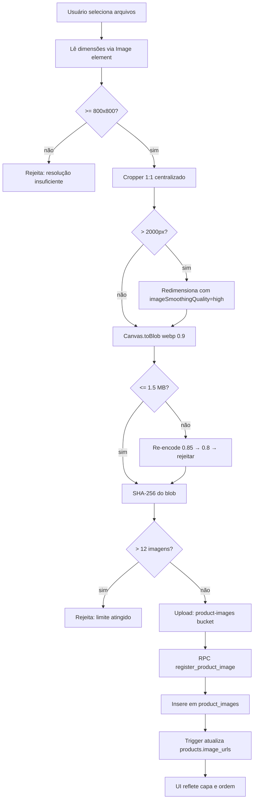

# Pipeline de Imagens de Produtos

> Versão: 1.0 | Criado: 25/04/2026

---

## 1. Objetivo

Fornecer imagens de produto de alta qualidade para anúncios em marketplaces (Mercado Livre, Shopee) sem depender do redimensionamento nativo do Supabase Pro. O processamento é **híbrido**: o frontend processa e comprime, o backend valida e registra.

---

## 2. Regras de qualidade

| Parâmetro | Valor |
|---|---|
| Formato final | `image/webp` |
| Qualidade | `0.9` (90%); retry em `0.85` e `0.8` se ultrapassar limite |
| Aspect ratio | `1:1` exato (corte centralizado) |
| Resolução mínima de entrada | `800 × 800 px` |
| Resolução máxima de saída | `2000 × 2000 px` (downscale se maior; nunca upscale) |
| Tamanho máximo do arquivo final | `1.5 MB` |
| Máximo de imagens por produto | `12` (alinhado com Mercado Livre) |
| Capa obrigatória | Primeira imagem se nenhuma marcada explicitamente |

---

## 3. Fluxo completo



---

## 4. Organização do Storage

### 4.1 Bucket
- Nome: `product-images`
- Tipo: **privado** (não público por padrão)
- Policies: `INSERT + SELECT + UPDATE` para membros da org (necessário para upsert)

### 4.2 Convenção de paths

```
org/{orgId}/products/{productId}/original/{imageId}.webp
org/{orgId}/products/{productId}/thumb/{imageId}.webp      -- futuro
```

- Diretórios em minúsculo, sem espaço
- `imageId` = UUID v4 gerado no upload
- Nome original do usuário **nunca** aparece no path (evita PII e colisões)
- Cache-Control: `public, max-age=31536000, immutable`

### 4.3 Imutabilidade

- Toda troca de imagem cria novo `imageId` (nunca sobrescreve o arquivo existente)
- Atualização de capa: apenas metadado `product_images.is_cover`, arquivo permanece
- URL antiga permanece acessível por até 7 dias para cache/CDN

### 4.4 Ciclo de vida e limpeza

1. **Soft-delete primeiro**: setar `deleted_at` e `deleted_by` em `product_images`
2. **Purge assíncrono**: job diário remove do Storage arquivos com `deleted_at < now() - 7 days`
3. **Órfãos**: job diário detecta arquivos no Storage sem row em `product_images` e agenda remoção
4. **Auditoria**: `created_by`, `deleted_by`, `deleted_at` obrigatórios

---

## 5. Componente `ProductImageUploader`

**Arquivo:** `src/components/products/ProductImageUploader.tsx`

Componente único reutilizado em criação de Único, Variação e Kit, e nas telas de edição.

### 5.1 Props

```typescript
interface ProductImageUploaderProps {
  productId?: string;           // null em criação (salva depois do produto ser criado)
  organizationId: string;
  images: ProductImageSlot[];   // slots: preenchidos e vazios
  onImagesChange: (images: ProductImageSlot[]) => void;
  maxImages?: number;           // default 12
  disabled?: boolean;
}

interface ProductImageSlot {
  id?: string;                  // id em product_images (undefined se ainda não salvo)
  publicUrl: string;            // URL pública ou blob: preview local
  storagePath?: string;
  isCover: boolean;
  position: number;
  localBlob?: Blob;             // presente antes do upload
  status: 'pending' | 'uploading' | 'done' | 'error';
  errorMessage?: string;
}
```

### 5.2 Comportamentos

- **Drag & drop**: reordenar posições
- **Capa**: badge "Capa" na primeira ou na marcada; clique troca capa
- **Corte 1:1**: modal de crop ao adicionar
- **Estados visuais**: vazio (slot tracejado), carregando (spinner), erro (vermelho + mensagem), sucesso
- **Limite**: ao atingir 12, slots de adição somem e exibe mensagem

---

## 6. Serviço `productImages.service.ts`

**Arquivo:** `src/services/productImages.service.ts`

```typescript
// Processa imagem no frontend (canvas) e retorna Blob WebP pronto para upload
export async function processImageForUpload(
  file: File,
  options?: { quality?: number; maxDimension?: number }
): Promise<{ blob: Blob; width: number; height: number; checksum: string }>

// Faz upload do Blob para o Storage e registra via RPC
export async function uploadProductImage(params: {
  blob: Blob;
  productId: string;
  organizationId: string;
  isCover: boolean;
  position: number;
  width: number;
  height: number;
  checksum: string;
  sourceFormat: string;
  sourceSizeBytes: number;
}): Promise<ProductImage>

// Reordena imagens de um produto
export async function reorderProductImages(
  productId: string,
  orderedIds: string[]
): Promise<void>

// Define capa
export async function setProductImageCover(
  productId: string,
  imageId: string
): Promise<void>

// Soft-delete de imagem
export async function deleteProductImage(
  imageId: string
): Promise<void>
```

---

## 7. RPC `register_product_image`

**Arquivo:** `supabase/migrations/20260425_000002_product_images_rpc.sql`

```sql
create or replace function public.register_product_image(
  p_product_id uuid,
  p_storage_path text,
  p_public_url text,
  p_width int,
  p_height int,
  p_size_bytes int,
  p_checksum text,
  p_is_cover boolean,
  p_position int,
  p_source_format text default null,
  p_source_size_bytes int default null
)
returns public.product_images
language plpgsql
security invoker
as $$
declare
  v_org_id uuid;
  v_image product_images;
begin
  -- Valida que o produto pertence à org do usuário autenticado
  select organizations_id into v_org_id
  from public.products
  where id = p_product_id;

  if not public.is_org_member(auth.uid(), v_org_id) then
    raise exception 'Acesso negado ao produto';
  end if;

  -- Remove capa anterior se esta for definida como capa
  if p_is_cover then
    update public.product_images
    set is_cover = false
    where product_id = p_product_id and is_cover and deleted_at is null;
  end if;

  -- Insere nova imagem
  insert into public.product_images (
    organizations_id, product_id, storage_path, public_url,
    width, height, size_bytes, format, is_cover, position,
    checksum, source_format, source_size_bytes, created_by
  )
  values (
    v_org_id, p_product_id, p_storage_path, p_public_url,
    p_width, p_height, p_size_bytes, 'webp', p_is_cover, p_position,
    p_checksum, p_source_format, p_source_size_bytes, auth.uid()
  )
  returning * into v_image;

  return v_image;
end;
$$;
```

---

## 8. Hook `useProductImages`

**Arquivo:** `src/hooks/useProductImages.ts`

```typescript
export function useProductImages(productId: string | null) {
  // React Query com staleTime: 5min
  // Retorna: images, isLoading, upload, reorder, setCover, remove
}
```

Integração com `React Query`: `queryKey = ['product-images', productId]`, invalidado após mutações.

---

## 9. Integração com criação e edição

### Criação
1. Usuário seleciona imagens → `processImageForUpload` → blob local com preview
2. Formulário salva produto → obtém `product_id`
3. `uploadProductImage` é chamado para cada slot em paralelo (Promise.allSettled)
4. Erros de upload não bloqueiam criação do produto — exibem alerta

### Edição
1. Imagens existentes carregadas via `useProductImages(productId)`
2. Novas imagens passam pelo mesmo pipeline de processamento
3. Reordenar = `reorderProductImages(productId, newOrder)`
4. Trocar capa = `setProductImageCover(productId, imageId)`
5. Remover = soft-delete + purge assíncrono

---

## 10. Especificações técnicas de processamento (frontend)

```typescript
async function convertToWebP(file: File, quality = 0.9, maxDim = 2000): Promise<Blob> {
  const img = await loadImage(file);
  // Rejeita se < 800x800
  if (img.naturalWidth < 800 || img.naturalHeight < 800) {
    throw new Error('Resolução mínima de 800×800 pixels não atingida.');
  }
  // Determina dimensão quadrada (crop 1:1 centralizado)
  const side = Math.min(img.naturalWidth, img.naturalHeight);
  const ox = (img.naturalWidth - side) / 2;
  const oy = (img.naturalHeight - side) / 2;
  // Determina tamanho final (sem upscale)
  const outSize = Math.min(side, maxDim);
  const canvas = document.createElement('canvas');
  canvas.width = outSize;
  canvas.height = outSize;
  const ctx = canvas.getContext('2d')!;
  ctx.imageSmoothingEnabled = true;
  ctx.imageSmoothingQuality = 'high';
  ctx.drawImage(img, ox, oy, side, side, 0, 0, outSize, outSize);
  // Encode com retry de qualidade
  for (const q of [quality, 0.85, 0.8]) {
    const blob = await canvasToBlob(canvas, 'image/webp', q);
    if (blob.size <= 1.5 * 1024 * 1024) return blob;
  }
  throw new Error('Não foi possível comprimir a imagem para menos de 1,5 MB.');
}
```
