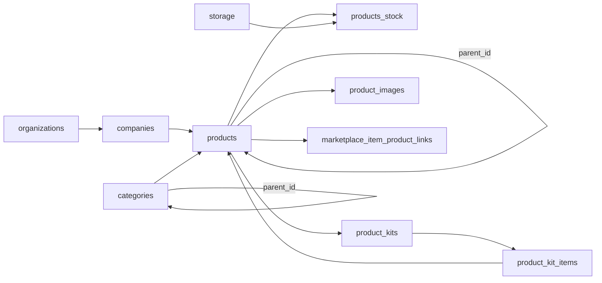

# Módulo de Produtos — Arquitetura Técnica

> Versão: 1.0 | Criado: 25/04/2026 | Status: Ativo

---

## 1. Visão geral

O módulo de Produtos do Novura suporta três tipos de produto:

| Tipo UI | `products.type` DB | Descrição |
|---|---|---|
| Único | `UNICO` | Produto simples, sem variações. |
| Variação | `VARIACAO_PAI` + `VARIACAO_ITEM` | Grupo pai com filhos por `parent_id`. |
| Kit | `KIT` (migrado de `ITEM`) | Conjunto de produtos únicos. |

A divisão em **tabs** no frontend espelha os tipos no banco. Todas as listagens filtram por `type`.

---

## 2. Mapa de arquivos

### Frontend
| Responsabilidade | Arquivo |
|---|---|
| Roteamento de tabs | `src/pages/Products.tsx` |
| Listagem Únicos | `src/components/products/tabs/SingleProducts.tsx` |
| Listagem Variações | `src/components/products/tabs/ProductVariations.tsx` |
| Listagem Kits | `src/components/products/tabs/ProductKits.tsx` |
| Tabela genérica | `src/components/products/ProductTable.tsx` |
| Accordion variações | `src/components/products/VariationsAccordion.tsx` |
| Accordion kits | `src/components/products/KitsAccordion.tsx` |
| Filtros e busca | `src/components/products/ProductFilters.tsx` |
| Filtro por categorias (drawer de filtros) | `src/components/products/CategoryDropdown.tsx` (via `ProductFilters`) |
| Árvore / seleção hierárquica | `src/components/products/CategoryTreeSelect.tsx` (forms e categorização nas abas) |
| Wizard de criação | `src/components/products/create/CreateProductPage.tsx` |
| Form básico | `src/components/products/create/ProductForm.tsx` |
| Form estoque | `src/components/products/create/StockForm.tsx` |
| Form variações | `src/components/products/create/VariationForm.tsx` |
| Detalhes variação | `src/components/products/create/VariationDetailsForm.tsx` |
| Form kits | `src/components/products/create/KitForm.tsx` |
| Upload “novo” pipeline | `src/components/products/ProductImageUploader.tsx` |
| Upload legado / variações | `src/components/products/create/ImageUpload.tsx`, `VariationImageUpload.tsx` |
| Edição produto único | `src/components/products/EditProduct.tsx` |
| Edição variações | `src/components/products/edit/EditVariationWrapper.tsx` |
| Edição kit | `src/components/products/edit/EditKitWrapper.tsx` |

### Hooks de domínio
| Hook | Responsabilidade |
|---|---|
| `useProductForm` | Orquestração do wizard de criação |
| `useProducts` | Listagem de produtos |
| `useVariations` | Listagem de grupos de variação |
| `useKits` | Listagem de kits |
| `useCategories` | CRUD de categorias |
| `useProductImages` | Upload e gestão de imagens (novo — T03) |
| `useProductsList` | Hook React Query (`queryKey` prefixo `products-list`) — implementado em `src/hooks/useProductsList.ts`; **nenhuma tela do módulo importa este hook no estado atual do repo** |

### Serviços
| Serviço | Arquivo |
|---|---|
| Imagens de produto | `src/services/productImages.service.ts` |
| Catálogo para vínculo produto ↔ anúncio | `src/services/productAdLinks.service.ts` (`fetchMarketplaceItemsForAdLinking`) |
| Links genéricos de listagens (módulo Anúncios) | `src/services/listingLinks.service.ts` — usado por `useListingLinks` / `useListings`, não pelo picker de produtos |

**Schemas Zod:** `src/schemas/products/*.ts` existem; wire-up nos forms do módulo deve ser verificado no código (preferir PRD consolidado `PRD-MODULO-PRODUTOS-COMPLETO.md` como fonte do estado atual).

---

## 3. Modelo de dados (estado alvo)



### 3.1 Tabela `products`

Colunas principais (preservando existentes + ajustes de T02):

```sql
-- Discriminador de tipo
type text not null check (type in ('UNICO','VARIACAO_PAI','VARIACAO_ITEM','KIT'))

-- Auto-referência para variações
parent_id uuid null references products(id) on delete cascade

-- Constraints de integridade
check (type <> 'VARIACAO_ITEM' or parent_id is not null)
check (type <> 'UNICO' or parent_id is null)
unique (organizations_id, sku) where deleted_at is null

-- Soft delete
deleted_at timestamptz null

-- Campos fiscais tipados (via T04)
ncm char(8)
cest char(7)
tax_origin_code smallint check (tax_origin_code between 0 and 8)
```

### 3.2 Tabela `products_stock`

Uma linha por `(product_id, storage_id)` — UNIQUE garantido desde a migration `20260424_000003`.

Adições de T02:
```sql
min_stock int not null default 0
max_stock int null
```

Trigger `sync_product_stock_qnt` mantém `products.stock_qnt` como soma de `current` por produto.

### 3.3 Tabela `product_images` (nova — T02)

```sql
create table public.product_images (
  id uuid primary key default gen_random_uuid(),
  organizations_id uuid not null references organizations(id) on delete cascade,
  product_id uuid not null references products(id) on delete cascade,
  storage_path text not null,   -- org/{orgId}/products/{productId}/original/{id}.webp
  public_url text not null,
  width int not null,
  height int not null,
  size_bytes int not null,
  format text not null check (format in ('webp')),
  is_cover boolean not null default false,
  position int not null default 0,
  checksum text not null,       -- sha256 do blob final
  source_format text,           -- formato original enviado pelo usuário
  source_size_bytes int,
  created_by uuid references auth.users(id),
  deleted_at timestamptz null,
  deleted_by uuid references auth.users(id) null,
  created_at timestamptz default now()
);

-- Garante no máximo 1 capa por produto
create unique index uq_product_images_cover
  on product_images(product_id)
  where is_cover and deleted_at is null;

-- Índice de listagem com ordem
create index idx_product_images_product
  on product_images(product_id, position)
  where deleted_at is null;
```

**Convenção de paths no Storage:**
```
org/{orgId}/products/{productId}/original/{imageId}.webp
org/{orgId}/products/{productId}/thumb/{imageId}.webp   -- futuro
org/{orgId}/products/{productId}/cover/{imageId}.webp   -- cópia lógica opcional
```

Regras:
- Bucket: `product-images` (privado)
- Arquivo: sempre UUID v4 + `.webp` (jamais nome original do usuário)
- Substituição: proibida — criar novo arquivo a cada troca
- Purge físico: somente após soft-delete confirmado + job assíncrono diário

### 3.4 Tabela `product_kits`

Adição de T02:
```sql
converted_from_product_id uuid null references products(id)
```

Permite rastrear kits gerados pela conversão assistida (T12).

### 3.5 Tabela `categories`

Adições de T10:
```sql
path text,    -- '/eletronicos/audio/fones' calculado por trigger
level int     -- profundidade na árvore
```

RPC `get_categories_tree(p_org_id uuid)` retorna flat-list ordenada por `path` evitando N+1.

---

## 4. Bugs confirmados (baseline B1–B10)

| ID | Descrição | Arquivo | Prioridade |
|---|---|---|---|
| B1 | Estoque de variações vai zerado na criação | `useProductForm.ts:512` | P0 |
| B2 | Edição de variação apaga imagens (`image_urls: []`) | `EditVariationWrapper.tsx:226` | P0 |
| B3 | Edição de variação zera dimensões/fiscais (map incompleto) | `EditVariationWrapper.tsx:131–152` | P0 |
| B4 | Edição de variação não persiste `products_stock` | `EditVariationWrapper.tsx:214–233` | P0 |
| B5 | Imagens nunca chegam ao Storage (grava apenas `img.name`) | `useProductForm.ts:335` | P0 |
| B6 | Validações fiscais frouxas (sem comprimento/checksum) | `useProductForm.ts:303–313` | P0 |
| B7 | "Selecionar todos" desabilitado, busca client-side | `ProductTable.tsx:57` | P1 |
| B8 | Vínculo de anúncios mockado na criação | `ProductLinkingSection.tsx` | P1 |
| B9 | Schema drift — `products_variantes` legado ainda ativo | migrations | P1 |
| B10 | RLS heterogêneo — policies com `USING (true)` | migrations antigas | P1 |

---

## 5. Depreciação de `products_variantes`

A tabela `products_variantes` foi criada em `20250929090000_create_products_variantes.sql` e nunca teve uso no fluxo de criação ativo (o app usa `parent_id` em `products`).

**Estado da migration `20260425_000006_legacy_variantes_deprecation.sql`:**
1. Policies na tabela `products_variantes` são removidas; RLS desabilitado.
2. Comentário de deprecação na tabela; rename físico **não** aplicado neste arquivo (previsto em migration futura após janela de observação).

---

## 6. RLS por tabela (alvo)

| Tabela | SELECT | INSERT/UPDATE/DELETE |
|---|---|---|
| `products` | `is_org_member` | `has_permission('produtos','create/update/delete')` |
| `products_stock` | `is_org_member` | `has_permission('estoque','update')` |
| `product_images` | `is_org_member` | `has_org_role(['owner','admin','seller'])` |
| `product_kits` | `is_org_member` | `has_org_role(['owner','admin'])` |
| `product_kit_items` | `is_org_member` | `has_org_role(['owner','admin'])` |
| `categories` | `is_org_member` | `has_org_role(['owner','admin'])` |

---

## 7. Princípios de arquitetura

1. **Tabela única `products` com discriminador `type`** como fonte da verdade.
2. **`products_stock` é a fonte do estoque** — `products.stock_qnt` é derivado (trigger).
3. **`product_images` é a fonte de imagens** — `products.image_urls` mantido por trigger para retrocompatibilidade.
4. **RLS em toda tabela exposta** — sem `USING (true)`, sem políticas abertas.
5. **Validações no domínio antes do banco** — Zod no frontend, CHECK no banco como rede.
6. **Multi-tenant by default** — todo registro exige `organizations_id`.
7. **Imutabilidade no Storage** — arquivos nunca sobrescritos; troca = novo UUID.
