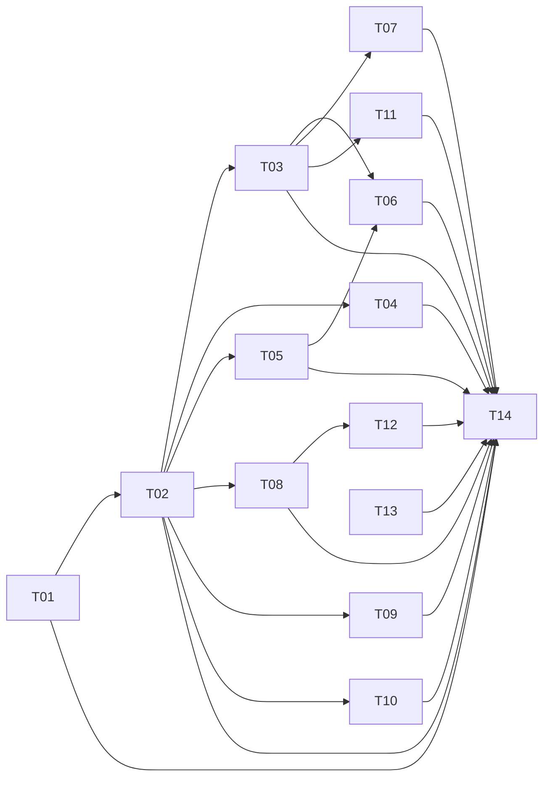

# Módulo de Produtos — UX e Roadmap de Operações

> Versão: 1.0 | Criado: 25/04/2026

---

## 1. Padrões de UX adotados

Todo o módulo segue os padrões já estabelecidos nos módulos de **Anúncios** e **Pedidos**:

| Elemento | Padrão |
|---|---|
| Drawers de vínculo | `LinkPickerDrawer` com filtro por integração |
| Filtros de listagem | Drawer lateral + chips na barra superior |
| Tabelas | Header sticky, checkbox por linha, ações em massa |
| Cards de produto | Capa 1:1, badge de tipo, estoque, status de vínculo |
| Formulários | `grid-cols-1 md:grid-cols-2 lg:grid-cols-3` + labels em pt-BR |
| Navegação interna | `useNavigate()` do React Router — nunca `window.location.href` |
| Feedback de erro | Toast + campo destacado em vermelho com mensagem contextual |
| Loading | Skeleton em tabelas e cards; spinner inline em uploads |

---

## 2. Roadmap T01–T14

### T01 — Diagnóstico e baseline ✅ P0 · S
- **Entregável:** `PRODUCTS-MODULE-ARCHITECTURE.md` com lista de bugs B1–B10.
- **Aceite:** diagrama atual + alvo, arquivos mapeados.

---

### T02 — Modelo de dados alvo + depreciação · P0 · M
- **Migrations a criar:**
  1. `20260425_000001_products_constraints.sql` — constraints e CHECK
  2. `20260425_000002_product_images.sql` — tabela + RLS + Storage bucket + RPC
  3. `20260425_000003_products_stock_columns.sql` — `min_stock`, `max_stock`, trigger `stock_qnt`
  4. `20260425_000004_categories_path.sql` — `path`, `level`, trigger, RPC `get_categories_tree`
  5. `20260425_000005_product_kits_tracking.sql` — `converted_from_product_id`
  6. `20260425_000006_legacy_variantes.sql` — deprecia `products_variantes`
- **Aceite:** `supabase db advisors` sem alertas críticos novos.

**Checklist de validação:**
- [ ] Constraint `check (type in ('UNICO','VARIACAO_PAI','VARIACAO_ITEM','KIT'))` aplicada
- [ ] `UNIQUE(organizations_id, sku) WHERE deleted_at IS NULL` aplicado
- [ ] Tabela `product_images` criada com RLS ON
- [ ] Bucket `product-images` criado com policies INSERT+SELECT+UPDATE
- [ ] Trigger `sync_product_stock_qnt` funcionando
- [ ] `products_variantes` renomeado para `_legacy`

---

### T03 — Pipeline híbrido de imagens · P0 · M

**Arquivos criados/modificados:**
- `src/utils/imageProcessor.ts` — conversão canvas → WebP
- `src/services/productImages.service.ts` — upload + RPC
- `src/hooks/useProductImages.ts` — React Query
- `src/components/products/ProductImageUploader.tsx` — UI

**Checklist:**
- [ ] Imagem `< 800×800` rejeitada com mensagem em pt-BR
- [ ] Saída sempre `image/webp`, `≤ 1,5 MB`, `1:1`
- [ ] Capa e ordem persistem ao recarregar
- [ ] Mesmo componente usado em criação Único, Variação, Kit e edição
- [ ] Paths no Storage seguem convenção `org/{orgId}/products/{productId}/original/{id}.webp`
- [ ] Job de limpeza de órfãos documentado

---

### T04 — Validações fiscais e comerciais · P0 · S

**Arquivos criados:**
- `src/schemas/products/base.schema.ts`
- `src/schemas/products/single.schema.ts`
- `src/schemas/products/variation.schema.ts`
- `src/schemas/products/kit.schema.ts`
- `src/utils/eanChecksum.ts`

**Regras implementadas:**

| Campo | Regra |
|---|---|
| `name` | obrigatório, 3–120 chars |
| `sku` | 3–40, `^[A-Z0-9._-]+$` |
| `barcode` (EAN) | opcional; se informado: 8/12/13/14 dígitos + checksum |
| `ncm` | obrigatório para UNICO/VARIACAO_ITEM; exatamente 8 dígitos |
| `cest` | opcional; 7 dígitos quando informado |
| `tax_origin_code` | 0–8 |
| `cost_price` | `≥ 0`, máximo 12 dígitos com 2 decimais |
| `sell_price` | `≥ cost_price` quando informado |
| `package_*`/`weight` | `> 0` obrigatório para UNICO/VARIACAO_ITEM |
| `category_id` | obrigatório |
| kit items | mínimo 2, quantidade `≥ 1`, sem auto-referência |

**Checklist:**
- [ ] NCM ≠ 8 dígitos bloqueia salvar com mensagem: "NCM deve ter exatamente 8 dígitos"
- [ ] EAN com checksum inválido exibe: "Código de barras inválido"
- [ ] Todos os erros em pt-BR

---

### T05 — Correção de estoque em variações · P0 · S

**Bug B1:** `useProductForm.ts` linha 512 — `childStorageId` não resolve quando variação vem do formulário interno (campo `armazem` no Português interno do `VariationDetailsForm`).

**Fix aplicado em `src/hooks/useProductForm.ts`:**
- Normalizar: `(v as any).storage || (v as any).armazem || (v as any).storageId || formData.warehouse || defaultStorageId`
- Inserir em `products_stock` **mesmo com quantidade 0** (garante a linha existir)
- Log: `console.info('[stock] variation %s → storage %s qty %d', child.id, storageId, quantity)`

**Checklist:**
- [ ] Criar produto com 3 variações → 3 linhas em `products_stock`
- [ ] Criar com estoque 0 → linha existe com `current = 0`
- [ ] Criar sem armazém → usa `defaultStorageId` como fallback

---

### T06 — Edição de variações sem perda de dados · P0 · M

**Bugs B2, B3, B4 corrigidos em `src/components/products/edit/EditVariationWrapper.tsx`:**

**B2 fix:** `image_urls` na edição passa a vir de `product_images` via hook; campo não é mais sobrescrito com `[]`

**B3 fix:** `transformedVariations` mapeia todos os campos:
```typescript
height: v.package_height?.toString() || "",
width: v.package_width?.toString() || "",
length: v.package_length?.toString() || "",
weight: v.weight?.toString() || "",
ncm: v.ncm?.toString() || "",
cest: v.cest?.toString() || "",
barcode: v.barcode?.toString() || "",
origin: v.tax_origin_code?.toString() || "",
unit: v.weight_type || "",
```

**B4 fix:** `handleSalvar` faz upsert em `products_stock` por `(product_id, storage_id)` para cada variação editada

**Checklist:**
- [ ] Salvar sem alterar nada é idempotente (sem diff no banco)
- [ ] Imagens não são apagadas
- [ ] Estoque por armazém é salvo corretamente

---

### T07 — UI de edição de produto único · P1 · S

**Arquivo:** `src/components/products/EditProduct.tsx`

**Reorganização de seções:**
1. Identificação (nome, SKU, categoria, marca, descrição)
2. Imagens (`ProductImageUploader`)
3. Comercial (preço de custo, preço de venda)
4. Estoque (armazém, quantidade, min, max)
5. Dimensões (altura, largura, comprimento, peso, unidade)
6. Fiscal (EAN, NCM, CEST, origem)
7. Vínculos de anúncios (drawer `LinkPickerDrawer`)

**Toolbar fixa no topo:** `Voltar` | `Duplicar` | `Salvar Alterações`

**Checklist:**
- [ ] Layout responsivo `grid-cols-1 md:grid-cols-2`
- [ ] Loading skeleton durante fetch
- [ ] Toast em sucesso e erro
- [ ] Toolbar sticky em scroll

---

### T08 — Listagens server-side e ações em massa · P1 · M

**Hook novo:** `src/hooks/useProductsList.ts`

```typescript
function useProductsList(params: {
  type: 'UNICO' | 'VARIACAO_PAI' | 'KIT';
  search?: string;
  categoryIds?: string[];
  page?: number;
  pageSize?: number;
  orderBy?: string;
  orderDir?: 'asc' | 'desc';
})
```

Usa paginação via `.range(from, to)` e `.ilike('name', '%term%')` do Supabase.

**Melhorias em `ProductTable`:**
- `Selecionar todos` habilitado (seleciona página ou todos)
- Navegação via `useNavigate` (não mais `window.location.href`)
- URL reflete filtros e página via `useSearchParams`

**Ações em massa:**
| Ação | Tipos disponíveis |
|---|---|
| Categorizar | Único, Variação, Kit |
| Excluir | Único, Variação, Kit |
| Duplicar | Único, Kit |
| Transformar em Kit | Único |

**Checklist:**
- [ ] 10k produtos carregam com paginação (pageSize 20)
- [ ] Busca funciona server-side
- [ ] "Selecionar todos" funciona na página atual
- [ ] URL tem `?page=2&search=camiseta`

---

### T09 — Vínculo de anúncios via LinkPickerDrawer · P1 · S

**Substituir `ProductLinkingSection`** pelo `LinkPickerDrawer` existente (visão inversa).

**Mudanças:**
- Em criação: botão "Vincular Anúncios" abre drawer com filtro por integração
- Em edição: mantém a lógica já implementada em `EditProduct.tsx`
- Drawer exibe: integração, título do anúncio, SKU, status de vínculo atual

**Checklist:**
- [ ] Vincular funciona em criação pós-salvar produto
- [ ] Desvincular funciona em edição
- [ ] Filtro por integração (Mercado Livre / Shopee) funcional

---

### T10 — Árvore de categorias otimizada · P1 · M

**Migration:** `20260425_000004_categories_path.sql`
```sql
alter table public.categories add column if not exists path text;
alter table public.categories add column if not exists level int default 0;
-- Trigger: on insert/update recalcula path e level recursivamente
```

**RPC:** `get_categories_tree(p_org_id)` → flat-list `[{id, name, parent_id, path, level}]`

**Componente novo:** `src/components/products/CategoryTreeSelect.tsx`
- Lazy loading por nível
- Busca textual debounced
- Breadcrumb da seleção atual
- Criação inline de subcategoria
- Seleção múltipla em filtros, single em cadastro

**Checklist:**
- [ ] Árvore com 1k nós abre em < 100ms
- [ ] Busca destaca caminho completo
- [ ] Criação inline não fecha o dropdown

---

### T11 — Duplicar produto · P2 · S

**RPC:** `duplicate_product(p_product_id, p_with_images boolean)`
- Copia: nome (sufixo " — Cópia"), categoria, descrição, dimensões, fiscais, atributos
- Gera novo SKU com sufixo aleatório
- Não copia: estoque, vínculos a anúncios
- Com `p_with_images = true`: duplica rows em `product_images` (mesmo `storage_path`)

**UI:**
- Botão "Duplicar" em dropdown de linha na tabela
- Após duplicar: navega para edição do produto duplicado com toast

**Checklist:**
- [ ] Duplicar produto único → cria com SKU novo
- [ ] Duplicar sem imagens (default)
- [ ] Duplicar com imagens (opt-in via modal de confirmação)

---

### T12 — Conversão de Únicos em Kit · P2 · M

**Pré-condições:**
- 2+ produtos `UNICO` selecionados na aba Únicos
- Ação aparece em "Ações em Massa"

**Drawer "Transformar em Kit":**
1. Nome do kit (obrigatório)
2. SKU do kit (gerado automaticamente, editável)
3. Quantidade de cada item (default 1)
4. Preço de venda do kit (opcional)
5. Botão "Criar Kit"

**RPC:** `convert_products_to_kit(p_product_ids uuid[], p_kit jsonb)`

**Checklist:**
- [ ] Kit criado com itens e quantidades corretas
- [ ] Redireciona para edição do kit
- [ ] Mínimo 2 produtos requerido — erro claro se < 2

---

### T13 — Responsividade global · P1 · S

**Arquivos auditados:**
- `create/ProductForm.tsx`: `grid grid-cols-1 md:grid-cols-2`
- `create/StockForm.tsx`: `grid grid-cols-1 md:grid-cols-2`
- `create/VariationDetailsForm.tsx`: `grid grid-cols-1 md:grid-cols-2`
- `ProductTable.tsx`: scroll horizontal em mobile
- `VariationsAccordion.tsx`: cards em coluna em `< md`
- `KitsAccordion.tsx`: cards em coluna em `< md`

**Checklist:**
- [ ] Nenhum overflow horizontal em `≥ 360px`
- [ ] Touch targets `≥ 40px`
- [ ] Formulários legíveis em tablet (768px)

---

### T14 — Critérios de aceite e testes · P1 · S

**Testes Vitest:**
- `src/utils/imageProcessor.test.ts` — rejeição de resolução, WebP saída, retry de qualidade
- `src/utils/eanChecksum.test.ts` — EAN-8, EAN-13, GTIN-14 válidos e inválidos
- `src/schemas/products/single.schema.test.ts` — validação NCM, SKU, preços
- `src/hooks/useProductForm.test.ts` — estoque de variações sempre criado

**Métricas de sucesso:**

| Métrica | Meta |
|---|---|
| Variações criadas sem `products_stock` | 0 |
| Imagens novas em formato WebP | 100% |
| Tempo de criação de produto (Wizard) | ≤ 90s |
| Latência de listagem com filtros (p95) | ≤ 400ms |
| Regressões de RLS em advisors | 0 |

---

## 3. Matriz de dependências



**P0 (crítico):** T01, T02, T03, T04, T05, T06
**P1 (próximo ciclo):** T07, T08, T09, T10, T13, T14
**P2 (produtividade):** T11, T12
