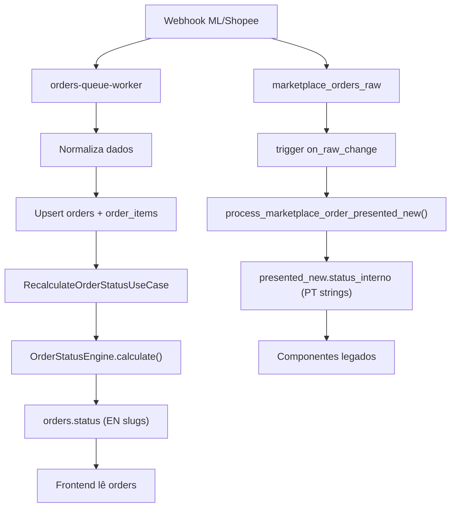
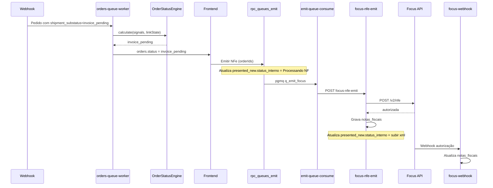
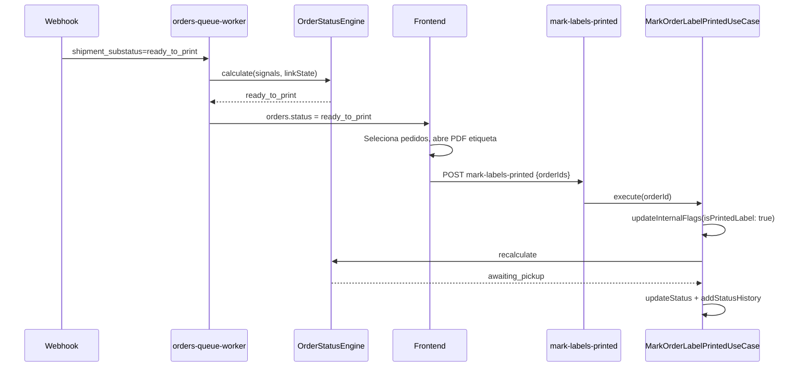
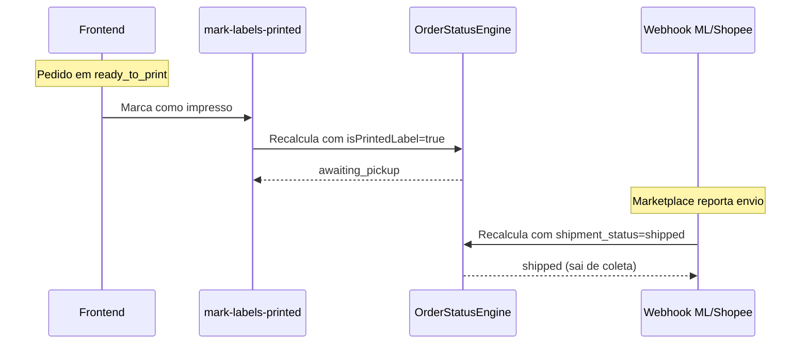
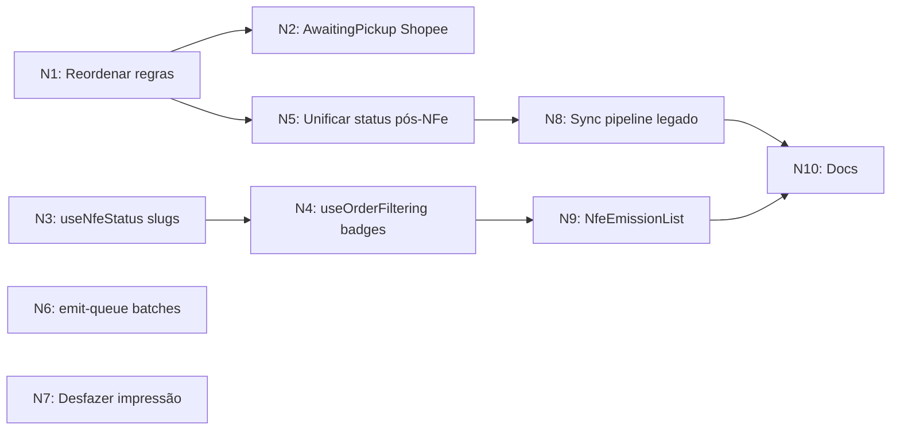

# STATUS-ENGINE-T11 — Fluxos de Emissão NFe, Impressão e Coleta

**Ciclo:** Correções e melhorias de status operacionais (NFe, impressão, coleta)

**Status:** Planejamento

**Depende de:** STATUS-ENGINE T1–T4 (implementados), T6 (implementado)

**Bloqueia:** Operação diária estável e features do Cycle 1 que dependem desses fluxos

**Relacionado:** [STATUS-ENGINE-README.md](./STATUS-ENGINE-README.md) (T1–T10)

---

## 1. Contexto e diagnóstico

O sistema está em transição do pipeline legado (`marketplace_orders_presented_new` + triggers SQL) para o novo motor de status (`orders` + `OrderStatusEngine`). Os três fluxos operacionais críticos — **Emissão NFe**, **Impressão** e **Coleta** — possuem bugs, inconsistências e condições de corrida que impactam a operação diária.

### Arquitetura atual (dual pipeline)



### Ordem das regras no motor (Chain of Responsibility)

```
1. CancelledRule       → cancelled
2. ReturnedRule        → returned
3. FulfillmentRule     → shipped (Full)
4. UnlinkedRule        → unlinked
5. ShippedRule         → shipped
6. AwaitingPickupRule  → awaiting_pickup
7. ReadyToPrintRule    → ready_to_print
8. InvoicePendingRule  → invoice_pending
9. PendingRule         → pending (fallback)
```

**Problema crítico de prioridade:** `ShippedRule` está acima de `AwaitingPickupRule` e `ReadyToPrintRule`. Se o marketplace reportar `shipped` antes do sistema processar a impressão, o pedido pode ir direto para `shipped` sem passar por coleta. A `InvoicePendingRule` está abaixo de `ReadyToPrintRule`, o que pode fazer um pedido ir para "Impressão" mesmo com NF pendente se os sinais forem ambíguos.

---

## 2. Fluxo atual: Emissão NFe

### Caminho feliz



### Bugs identificados

| ID | Bug | Impacto | Arquivo(s) |
| --- | --- | --- | --- |
| NFE-B1 | `useNfeStatus.ts` filtra por `internalStatus` em português (`emissao nf`, `subir xml`, `falha na emissao`) mas `orders.status` retorna slugs EN (`invoice_pending`) — o hook pode não encontrar pedidos no pipeline novo | Crítico — badges NFe zerados | `src/hooks/useNfeStatus.ts` |
| NFE-B2 | `useOrderFiltering.ts` calcula `nfeOrdersAll` filtrando por `emissao_nf`, `falha_na_emissao`, `subir_xml` — não inclui `invoice_pending` | Alto — contagens de badges incorretas | `src/hooks/useOrderFiltering.ts` |
| NFE-B3 | `focus-nfe-emit` grava em `notas_fiscais` e `marketplace_orders_presented_new` mas não atualiza `orders.status` nem `invoices` | Crítico — duas fontes de verdade divergem | `supabase/functions/focus-nfe-emit/index.ts` |
| NFE-B4 | `focus-nfe-emit` polling usa URL de produção mesmo em modo homologação | Médio — homologação quebrada | `supabase/functions/focus-nfe-emit/index.ts` |
| NFE-B5 | `emit-queue-consume` agrega batches com `orgForBatch`/`companyForBatch` do primeiro item — mistura organizações se a fila tiver mensagens de orgs diferentes | Alto — risco operacional | `supabase/functions/emit-queue-consume/index.ts` |
| NFE-B6 | Sucesso parcial no batch remove mensagens de pedidos que falharam | Médio — pedidos falhos perdem reprocessamento | `supabase/functions/emit-queue-consume/index.ts` |
| NFE-B7 | `catch { }` vazio em `useNfeStatus.ts` — erros de rede silenciados | Baixo — UX sem feedback | `src/hooks/useNfeStatus.ts` |
| NFE-B8 | `NfeEmissionList.tsx` consulta `orders.status` com valores em PT (`Emissao NF`) — pode retornar zero linhas | Crítico — componente quebrado | `src/components/orders/NfeEmissionList.tsx` |

---

## 3. Fluxo atual: Impressão

### Caminho feliz



### Bugs identificados

| ID | Bug | Impacto | Arquivo(s) |
| --- | --- | --- | --- |
| PRINT-B1 | `mark-labels-printed` atualiza `orders.is_printed_label` mas não atualiza `marketplace_orders_presented_new` — tabela legada dessincronizada | Alto | `supabase/functions/mark-labels-printed/index.ts` |
| PRINT-B2 | `ReadyToPrintRule` aceita `substatus=pending` e `substatus=buffered` além de `ready_to_print` — falso positivo possível | Médio | `supabase/functions/_shared/domain/orders/rules/ReadyToPrintRule.ts` |
| PRINT-B3 | `AwaitingPickupRule` verifica apenas `isPrintedLabel` — regra frágil (depende da posição na cadeia) | Baixo | `supabase/functions/_shared/domain/orders/rules/AwaitingPickupRule.ts` |
| PRINT-B4 | `fetchAllOrders` pode não trazer dados completos de etiqueta — UI sem PDF para impressão | Alto | `src/services/orders.service.ts` |
| PRINT-B5 | `InvoicePendingRule` está abaixo de `ReadyToPrintRule` no engine — Shopee sem invoice pode ir para "Impressão" antes da NF | Alto | `supabase/functions/_shared/application/orders/OrderStatusEngine.ts` |

---

## 4. Fluxo atual: Aguardando coleta

### Caminho feliz



### Bugs identificados

| ID | Bug | Impacto | Arquivo(s) |
| --- | --- | --- | --- |
| COLETA-B1 | Não há mecanismo para desfazer impressão — usuário não volta para `ready_to_print` | Médio | `MarkOrderLabelPrintedUseCase.ts` |
| COLETA-B2 | Shopee `retry_ship` deveria mapear para `awaiting_pickup` mas a regra só checa `isPrintedLabel` | Alto | `AwaitingPickupRule.ts` |
| COLETA-B3 | `updateOrdersInternalStatus` no frontend pode sobrescrever status calculado pelo engine | Médio | `src/services/orders.service.ts` |
| COLETA-B4 | Documentação ainda referencia `rpc_marketplace_order_print_label` como caminho ativo | Baixo | `docs/FLUXO_AGUARDANDO_COLETA.md` |

---

## 5. Plano de correções: tasks (N1–N10)

Seguindo o padrão STATUS-ENGINE, cada task foca em uma camada.

### Task N1: Corrigir prioridade das regras no engine

**Camada:** Domínio / aplicação — `OrderStatusEngine.ts`

**Problema:** `InvoicePendingRule` está abaixo de `ReadyToPrintRule`.

**Solução:** Reordenar para: … `ShippedRule` → `AwaitingPickupRule` → `InvoicePendingRule` → `ReadyToPrintRule` → `PendingRule`.

**Justificativa:** NF pendente é mais bloqueante que "pronto para imprimir".

---

### Task N2: Enriquecer AwaitingPickupRule com sinais Shopee

**Camada:** Domínio — `AwaitingPickupRule.ts`

Incluir `marketplace === "shopee"` e `marketplaceStatus === "retry_ship"` além de `isPrintedLabel`.

---

### Task N3: Alinhar `useNfeStatus` com slugs EN

**Camada:** Frontend — `useNfeStatus.ts`

Incluir PT e EN no conjunto de status NFe; tratar erros (sem `catch` vazio).

---

### Task N4: Alinhar contagens de badges em `useOrderFiltering`

**Camada:** Frontend — `useOrderFiltering.ts`

Incluir `invoice_pending` e equivalentes nos filtros de `nfeOrdersAll` e badges.

---

### Task N5: Unificar atualização de status após emissão NFe

**Camada:** Edge — `focus-nfe-emit`, `emit-queue-consume`

Após autorização: atualizar `orders` / recalcular; alinhar `invoices`; corrigir URL de polling em homologação.

---

### Task N6: Corrigir agregação de batches em `emit-queue-consume`

Agrupar por `(organization_id, company_id, environment)`; dequeue mais seguro; dead-letter para `payload_incompleto` após N tentativas.

---

### Task N7: Use case e edge para desfazer impressão

Novo `UnmarkOrderLabelPrintedUseCase` + edge `unmark-labels-printed` + UI opcional na aba Coleta.

---

### Task N8: Sincronizar pipeline legado com `orders`

Bridge: após `mark-labels-printed` e `focus-nfe-emit`, manter `marketplace_orders_presented_new` alinhada onde ainda necessário; documentar remoção futura.

---

### Task N9: Corrigir `NfeEmissionList` com slugs EN

Queries e filtros compatíveis com `invoice_pending` e legado PT.

---

### Task N10: Atualizar documentação dos três fluxos

`FLUXO_EMISSAO_NF.md`, `FLUXO_IMPRESSAO.md`, `FLUXO_AGUARDANDO_COLETA.md` — pipeline novo vs legado, diagramas, referência aos PRDs STATUS-ENGINE.

---

## 6. Ordem de execução e dependências



- **Fase 1 (crítica):** N1, N3, N4, N9
- **Fase 2 (alta):** N5, N6, N8
- **Fase 3 (média):** N2, N7
- **Fase 4 (baixa):** N10

---

## 7. Definition of Done (por task)

- Testes unitários (Deno) para regras e use cases alterados
- Testes de integração para edge functions alteradas
- Verificação manual: pedido ML e Shopee no fluxo completo
- `orders.status` e `marketplace_orders_presented_new.status_interno` convergem onde aplicável
- Badges no frontend refletem contagens corretas
- Nenhum `catch {}` vazio adicionado sem tratamento
- JSDoc em inglês em funções novas ou alteradas no backend

---

## 8. Checklist de tasks

| ID | Descrição |
| --- | --- |
| N1 | Reordenar regras no `OrderStatusEngine` (`InvoicePending` antes de `ReadyToPrint`) |
| N2 | Enriquecer `AwaitingPickupRule` com sinais Shopee (`retry_ship`) |
| N3 | Alinhar `useNfeStatus.ts` com slugs EN do pipeline novo |
| N4 | Corrigir contagens de badges NFe em `useOrderFiltering.ts` |
| N5 | Unificar atualização de status após emissão NFe (`focus-nfe-emit` → `orders`) |
| N6 | Corrigir agregação de batches no `emit-queue-consume` |
| N7 | Criar use case e edge function para desfazer impressão |
| N8 | Sincronizar pipeline legado com tabela `orders` (bridge bidirecional) |
| N9 | Corrigir `NfeEmissionList.tsx` com slugs EN |
| N10 | Atualizar documentação dos três fluxos |
