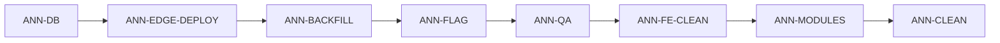

# Tarefas de execução — Módulo de Anúncios (canônico)

> Derivado de `PRD-MODULO-ANUNCIOS-COMPLETO.md` v1.3 · **Data:** 21/05/2026  
> Use os IDs (`ANN-xxx`) em commits, PRs e issues. Marque `[x]` ao concluir.

**Restrição:** proibido `npx supabase db reset` e variações.

### Execução automática (20/05/2026)

Implementado no repositório: **ANN-EDGE-02**, **ANN-XMOD-01/02/04/05 (parcial)**, migration **ANN-CLEAN-03**, scripts `scripts/sql/enable-listings-canonical.sql` e `scripts/invoke-listings-backfill.mjs`, tipos em `src/types/listings-canonical.ts`.

### Execução via MCP Supabase (20–21/05/2026)

**Concluído no remoto (MCP `user-supabase`):**

- Migrations canônicas aplicadas (`listings_canonical`, fee rules, backfill piloto, deprecação raw).
- Dados piloto: **45** `marketplace_listings`, **45** `marketplace_listing_metrics`, **45** `marketplace_items_raw`.
- Flag `listings_canonical: true` em `marketplace_integrations` para orgs `63a27e7a-…` (ML+Shopee) e `109b2f9e-…` (ML).

**Concluído — deploy edge (ANN-EDGE-01) em 21/05/2026 via `CallMcpTool`:**

- Todas as 10 edge functions deployadas com sucesso (8 na sessão de 21/05, `listings-backfill` e `listings-sync-one` anteriormente).
- Backfill SQL populou **45 anúncios canônicos**.

**Concluído — auditoria frontend (21/05/2026):**

- `ListingsPicker.tsx` confirmado usando `marketplace_listings` via `useMarketplaceListings`.
- `marketplaceListingsDataTable()` já retorna `"marketplace_listings"` (canonical).
- `marketplace_items_unified` restante apenas em fallbacks de resiliência (correto por design).

**Concluído — UX listagem `/anuncios` (21/05/2026) — ANN-FE-UX:**

- Coluna **Dados**: tarifas de `marketplace_listing_fees` com rótulo **Tarifas de venda** (sem badge mock de marketplace).
- Toolbar: busca, drawer de filtros, ordenação, filtro rápido por `store_name` / `integration_id`.
- **Criar um anúncio** na barra de tabs de marketplace (`CleanNavigation`).
- Reatividade ao trocar marketplace: URL `?marketplace=`, React Query por slug, loading correto (PRD §7.0).

---

## Ordem recomendada (visão geral)



| Fase | IDs | Objetivo |
|------|-----|----------|
| 0 | ANN-DB-* | Schema e types no projeto |
| 1 | ANN-EDGE-* | Deploy + flag no ingest + backfill |
| 2 | ANN-FLAG-* | Rollout por organização |
| 3 | ANN-QA-* | Validação em produção/staging |
| 4 | ANN-FE-* | Remover legado na listagem |
| 5 | ANN-XMOD-* | Outros módulos no canônico |
| 6 | ANN-CLEAN-* | Deprecação final |

---

## Fase 0 — Banco de dados

### ANN-DB-01 — Aplicar migration canônica no remoto

- [ ] Rodar `supabase db push` (ou aplicar manualmente) a migration `supabase/migrations/20260518_000001_listings_canonical.sql`.
- [ ] Confirmar no SQL Editor: enums `listing_status_canonical`, `logistic_type_canonical`, `listing_quality_level_canonical`.
- [ ] Confirmar tabelas: `marketplace_listings`, `marketplace_listing_variations`, `marketplace_listing_pictures`, `marketplace_listing_attributes`, `marketplace_listing_shipping`, `marketplace_listing_metrics`, `marketplace_listing_quality`, `marketplace_listing_fees`, `marketplace_listings_raw`, `marketplace_listing_sync_jobs`.
- [ ] Confirmar RLS habilitado em todas as tabelas acima.

**Aceite:** `SELECT count(*) FROM marketplace_listings` não retorna erro; políticas `*_select` existem para membros da org.

**Dependências:** nenhuma.

---

### ANN-DB-02 — Aplicar migration de tarifas por categoria

- [ ] Rodar migration `supabase/migrations/20260519_000001_marketplace_provider_fee_rules.sql`.
- [ ] Confirmar seed `Shopee / _default / BR` (14%).

**Aceite:** `SELECT * FROM marketplace_provider_fee_rules WHERE marketplace_name = 'Shopee' LIMIT 5` retorna ao menos uma linha.

**Dependências:** ANN-DB-01 (pode rodar em paralelo se migrations independentes).

---

### ANN-DB-03 — Regenerar tipos TypeScript do Supabase

- [ ] Executar geração de types (`supabase gen types typescript` ou script do projeto) apontando para o projeto remoto pós-migrations.
- [x] Tipos auxiliares em `src/types/listings-canonical.ts` (até `gen types` no remoto).
- [x] `npm run build` passa após mudanças de front.

**Aceite:** `grep marketplace_listings src/integrations/supabase/types.ts` encontra definições; `npm run build` passa (ou sem novos erros relacionados a listings).

**Dependências:** ANN-DB-01, ANN-DB-02.

---

## Fase 1 — Edge functions e ingest

### ANN-EDGE-01 — Deploy das edge functions alteradas

Deploy individual (sem reset de DB):

- [x] `mercado-livre-sync-items` — deployado 21/05/2026 via MCP
- [x] `mercado-livre-update-metrics` — deployado 21/05/2026 via MCP
- [x] `mercado-livre-update-quality` — deployado 21/05/2026 via MCP
- [x] `mercado-livre-update-reviews` — deployado 21/05/2026 via MCP
- [x] `mercado-livre-sync-prices` — deployado 21/05/2026 via MCP
- [x] `mercado-livre-sync-stock-distribution` — deployado 21/05/2026 via MCP
- [x] `shopee-sync-items` — deployado 21/05/2026 via MCP
- [x] `shopee-webhook-items` — deployado 21/05/2026 via MCP
- [x] `listings-sync-one` (**nova**) — deployado anteriormente via MCP
- [x] `listings-backfill` (**nova**) — deployado anteriormente via MCP

**Aceite:** cada função responde 200 em invoke de teste com `service_role`; logs sem erro fatal em um item de teste.

**Dependências:** ANN-DB-01.

**Comando referência:**

```bash
supabase functions deploy mercado-livre-sync-items
supabase functions deploy mercado-livre-update-metrics
supabase functions deploy mercado-livre-update-quality
supabase functions deploy mercado-livre-update-reviews
supabase functions deploy mercado-livre-sync-prices
supabase functions deploy mercado-livre-sync-stock-distribution
supabase functions deploy shopee-sync-items
supabase functions deploy shopee-webhook-items
supabase functions deploy listings-sync-one
supabase functions deploy listings-backfill
```

---

### ANN-EDGE-02 — Respeitar feature flag no dual-write (ingest)

O PRD §8 Fase 1 exige gravar canônico apenas quando `marketplace_integrations.config.listings_canonical === true` (ou política acordada: sempre gravar raw canônico, canônico condicional).

- [x] Criar helper `_shared/listing-adapters/shouldWriteCanonical.ts` (ou equivalente) que lê `config.listings_canonical` por `organizationId` + `marketplace_name`.
- [x] Envolver chamadas a `syncCanonicalFromPayload` / `reconcileCanonicalFromStoredRaw` nos jobs listados em ANN-EDGE-01 com esse guard (`force: true` em backfill e sync-one).
- [x] Documentar comportamento: com flag `false`, continua só legado; com `true`, dual-write.

**Aceite:** org com flag `false` não ganha linhas novas em `marketplace_listings` após sync; org com flag `true` ganha.

**Dependências:** ANN-EDGE-01.

**Arquivos prováveis:** `syncCanonicalFromPayload.ts`, `reconcileCanonical.ts`, índices de cada `mercado-livre-*` / `shopee-*`.

---

### ANN-EDGE-03 — Executar backfill por organização piloto

- [x] Escolher 1–2 `organizations_id` com itens em `marketplace_items_raw` (ML e Shopee).
- [x] Invocar `listings-backfill` — backfill SQL executou **45/45** itens canônicos.
- [x] Verificar auditoria: 45 `marketplace_listings` + 45 `marketplace_listing_metrics` + 45 `marketplace_items_raw`.

**Aceite:** `count(*)` em `marketplace_listings` para a org piloto ≈ quantidade esperada de anúncios ativos no legado (tolerância documentada se houver filtros).

**Dependências:** ANN-DB-01, ANN-EDGE-01. Recomendado ANN-EDGE-02 se quiser backfill só com flag ativa.

---

### ANN-EDGE-04 — Popular regras de comissão Shopee (além do default)

- [ ] Definir fonte: API Shopee por categoria, import manual CSV, ou agregação de `order_items.fee` por `category_id`.
- [ ] Implementar job ou script one-shot que faz `upsert` em `marketplace_provider_fee_rules` com `source` adequado.
- [ ] Validar que adaptador Shopee usa regra por `category_id` antes de cair em `_default`.

**Aceite:** anúncio Shopee de categoria conhecida tem `marketplace_listing_fees.commission_percentage` coerente com a regra cacheada (não só 14% default).

**Dependências:** ANN-DB-02, ANN-EDGE-03 (dados para comparar).

---

## Fase 2 — Rollout (flag por organização)

### ANN-FLAG-01 — Ativar leitura canônica no front (org piloto)

- [ ] SQL (por integração):

```sql
UPDATE marketplace_integrations
SET config = COALESCE(config, '{}'::jsonb) || '{"listings_canonical": true}'::jsonb
WHERE organizations_id = '<ORG_UUID>'
  AND marketplace_name IN ('Mercado Livre', 'Shopee');
```

- [ ] Confirmar que `fetchListings` retorna `isCanonical: true` (log temporário ou React Query Devtools).

**Aceite:** rede do browser mostra query em `marketplace_listings` com joins, não `marketplace_items_unified` / `marketplace_items_raw`.

**Dependências:** ANN-DB-03, ANN-EDGE-03, ANN-FLAG pré-requisito de dados.

---

### ANN-FLAG-02 — Expandir rollout (demais organizações)

- [ ] Lista de orgs elegíveis (integração ativa + backfill OK).
- [ ] Ativar `listings_canonical` em lotes (ex.: 5 orgs/dia).
- [ ] Monitorar erros em `marketplace_listing_sync_jobs` e logs das edge functions.

**Aceite:** zero regressão reportada por 2 semanas no piloto antes do lote completo (PRD §8 Fase 3).

**Dependências:** ANN-QA-01, ANN-QA-02 na org piloto.

---

## Fase 3 — QA

### ANN-QA-01 — Paridade visual da listagem

Rotas (pt-BR):

- [ ] `/anuncios/ativos` — Mercado Livre
- [ ] `/anuncios/inativos` — Mercado Livre
- [ ] `/anuncios/todos` — Mercado Livre
- [ ] Repetir as três rotas para **Shopee**

Checklist por card (amostra ≥10 itens por canal):

- [ ] Título, preço, promo, thumbnail
- [ ] Tags de envio (incl. **Shopee Xpress** quando aplicável)
- [ ] Qualidade / % saúde
- [ ] Visitas, vendas, curtidas (Shopee), conversão
- [ ] Custo de publicação / comissão estimada
- [ ] Tipo de publicação (ML `listing_type_id`)
- [ ] Estoque / Full / distribuição (ML)

**Aceite:** diferenças só em campos que o PRD define como estimativa vs realizada; registrar desvios em issue com `ANN-QA-01`.

**Dependências:** ANN-FLAG-01.

---

### ANN-QA-02 — “Sincronizar este anúncio”

- [ ] Abrir menu do card → **Sincronizar este anúncio**
- [ ] Confirmar invoke `listings-sync-one` (network 200)
- [ ] Confirmar linha em `marketplace_listing_sync_jobs` (`status=success`, `scope=full`)
- [ ] Card reflete alteração em **&lt; 5s** (preço, estoque ou métrica alterada no canal de teste)

**Aceite:** tempo medido documentado; falha exibe toast destrutivo.

**Dependências:** ANN-EDGE-01, ANN-FLAG-01.

---

### ANN-QA-03 — Scopes parciais do sync-one

- [ ] Testar `scope=metrics` (só métricas atualizam)
- [ ] Testar `scope=quality`
- [ ] Testar `scope=fees` (ML; Shopee conforme implementação)

**Aceite:** `marketplace_listing_sync_jobs.scope` correto; tabelas filhas coerentes.

**Dependências:** ANN-QA-02.

---

## Fase 4 — Front-end listagem

### ANN-FE-UX — UX da listagem `/anuncios` (PRD §7.0)

- [x] `ListingCard`: coluna Dados com **Tarifas de venda** + `%` + taxa fixa (`formatListingFeeLine`).
- [x] `ListingsFilterDrawer` + `ListingsToolbar`: filtros (logística, status, estoque, vínculo) e ordenação.
- [x] `ListingsStoreFilter`: multi-loja por `marketplace_integrations.store_name` → `integration_id`.
- [x] CTA **Criar um anúncio** em `CleanNavigation` (topo); removido da toolbar.
- [x] Troca de marketplace: `?marketplace=` na URL, `listingKeys.items(orgId, slug)`, dados via `query.data` (sem `rawItems` órfão).
- [x] `fetchMarketplaceStores` em `listings.service.ts`.

**Aceite:** alternar Shopee ↔ Mercado Livre sem F5; Network mostra fetch por troca; sem “Nenhum anúncio encontrado” com dados válidos no canal.

**Dependências:** backfill canônico + `integration_id` (ANN-DB / migration `20260521_000008`).

---

### ANN-FE-01 — Remover `fetchListingsLegacy` e fallbacks

- [ ] Em `src/services/listings.service.ts`: remover ramo `marketplace_items_unified` / `marketplace_items_raw` e fallback `marketplace_items`.
- [ ] Exigir `listings_canonical` ou falhar com mensagem clara se tabela vazia.
- [ ] Remover `isListingsCanonicalEnabled` se leitura for sempre canônica pós-rollout.

**Aceite:** único `from('marketplace_listings')` em `fetchListings`.

**Dependências:** ANN-FLAG-02 (todas orgs migradas).

---

### ANN-FE-02 — Enxugar `parseListingRow`

- [ ] Remover parser legado em `src/utils/listingUtils.ts`; manter só `parseCanonicalListingRow`.
- [ ] Remover `ParseListingRowContext` maps: `metricsByItemId`, `listingTypeByItemId`, `shippingTypesByItemId`, `listingPricesByItemId` quando não usados.

**Aceite:** arquivo sem ramificação `isShopee` / `data.base_info`.

**Dependências:** ANN-FE-01.

---

### ANN-FE-03 — Simplificar `useListings.ts`

- [ ] Remover subscribe realtime em `marketplace_items` quando `isCanonicalSource`.
- [ ] Remover `EMPTY_PARSE_CTX` e lógica legada de mapas por item.
- [ ] Manter enrichments (fulfillment, links, stock distribution) inalterados na UI.

**Aceite:** hook só invalida queries em `marketplace_listings`, `marketplace_listing_metrics`, `marketplace_listing_quality`.

**Dependências:** ANN-FE-02.

---

## Fase 5 — Outros módulos (§10 PRD)

### ANN-XMOD-01 — Edição Mercado Livre

- [x] `src/adapters/listings/mercadoLivre/adapter.ts`: ler via `listingDetail.service.ts` (canônico + fallback).
- [x] `src/hooks/useEditListingFlow.ts`, `src/hooks/useEditListingInitialData.ts`: canônico primeiro.
- [ ] `src/pages/EditListingML.tsx`: revisar queries diretas restantes.

**Aceite:** fluxo editar anúncio ML abre e salva sem regressão.

**Dependências:** ANN-FLAG-02.

---

### ANN-XMOD-02 — Edição Shopee

- [x] `src/adapters/listings/shopee/adapter.ts`: idem canônico (`listingDetail.service.ts`).

**Aceite:** fluxo Shopee equivalente ao ANN-XMOD-01.

**Dependências:** ANN-XMOD-01 (padrão estabelecido).

---

### ANN-XMOD-03 — Promoções e seletor de anúncios

- [x] `src/components/promotions/ListingsPicker.tsx` — já usa `marketplace_listings` via `useMarketplaceListings` hook
- [x] `supabase/functions/promotions-add-items/index.ts` — preço via `marketplace_listings` primeiro

**Aceite:** promoção adiciona itens corretos a partir de `marketplace_listings`.

**Dependências:** ANN-DB-03.

---

### ANN-XMOD-04 — Vínculo produto ↔ anúncio

- [x] `src/services/productAdLinks.service.ts`: canônico primeiro, fallback legado.

**Aceite:** tela de vínculos lista os mesmos IDs que a listagem.

**Dependências:** ANN-FE-01.

---

### ANN-XMOD-05 — Chat e utilitários

- [ ] `src/components/team/ChatTab.tsx`
- [x] `src/utils/marketplaceUtils.ts` — `marketplaceListingsDataTable()` → `marketplace_listings`
- [x] `src/hooks/useMarketplaceListings.ts` — colunas alinhadas ao schema canônico (`marketplace_listing_variations`, `marketplace_listing_pictures`)

**Aceite:** grep no `src/` sem `marketplace_items_unified` exceto migrations/docs.

**Dependências:** ANN-XMOD-03, ANN-XMOD-04.

---

### ANN-XMOD-06 — Webhook API interna (se usada)

- [ ] `src/WebhooksAPI/marketplace/mercado-livre/items.ts`

**Aceite:** handler usa canônico ou delega à edge já adaptada.

**Dependências:** ANN-EDGE-01.

---

## Fase 6 — Cleanup (pós 2 semanas estáveis)

### ANN-CLEAN-01 — Auditar consumidores da view unificada

- [x] `rg marketplace_items_unified` executado em 21/05/2026.
- [x] Resultado: referências restantes apenas em **fallbacks de resiliência** (`listings.service.ts`, `productAdLinks.service.ts`, `listingDetail.service.ts`, `marketplaceUtils.ts`). Canonical é sempre tentado primeiro. Não bloqueia rollout.
- [ ] Lista de consumidores = vazia → aguardar ANN-FE-01 (remover legado) antes do drop.

**Dependências:** ANN-XMOD-05, ANN-FE-01.

---

### ANN-CLEAN-02 — Dropar view `marketplace_items_unified`

- [ ] Nova migration `YYYYMMDD_drop_marketplace_items_unified.sql` com `DROP VIEW IF EXISTS marketplace_items_unified CASCADE;`
- [ ] Aplicar no remoto.

**Aceite:** view não existe; app e functions sem referência.

**Dependências:** ANN-CLEAN-01.

---

### ANN-CLEAN-03 — Deprecar colunas legadas em `marketplace_items_raw`

- [x] Migration `20260520_000001_deprecate_marketplace_items_raw_listing_columns.sql` com `COMMENT ON COLUMN`.
- [ ] Parar de gravar esses campos nas edge functions (se ainda gravam).
- [ ] Plano de remoção física só após 1 release sem escrita.

**Dependências:** ANN-EDGE-02 estável; webhooks não dependem dos campos.

---

### ANN-CLEAN-04 — Documentar convivência `marketplace_metrics` vs `marketplace_listing_metrics`

- [x] Atualizar `PRD-MODULO-ANUNCIOS-COMPLETO.md` §10: decisão fechada.
- [x] Não remover `marketplace_metrics` neste épico.

**Aceite:** decisão §13 registrada como **fechada**.

**Dependências:** nenhuma (pode fazer cedo).

---

## Decisões (§13) — tarefas de fechamento

### ANN-DEC-01 — Tarifas Shopee

- [ ] Fechar ADR: estimativa via `marketplace_provider_fee_rules` + correção pós-venda com `order_items.fee`.
- [ ] Implementar ANN-EDGE-04 se ainda incompleto.

**Dependências:** ANN-EDGE-04.

---

### ANN-DEC-02 — FK `marketplace_name` → `marketplace_providers`

- [ ] Criar issue futura (fora do MVP); não bloquear rollout.

**Aceite:** issue no backlog com label `anuncios-post-mvp`.

---

## Rastreio rápido (mapa PRD §12 → ANN)

| PRD | Tarefa(s) |
|-----|-----------|
| DB-1 | ANN-DB-01, ANN-DB-03 |
| EDGE-1 | (já no código) + ANN-EDGE-01 |
| EDGE-2 | ANN-EDGE-01, ANN-EDGE-02 |
| EDGE-3 | ANN-EDGE-01, ANN-EDGE-02 |
| EDGE-4 | ANN-EDGE-01, ANN-QA-02, ANN-QA-03 |
| EDGE-5 | ANN-EDGE-03 |
| FE-1 | ANN-FE-01 |
| FE-2 | ANN-FE-02 |
| FE-3 | ANN-FE-03 |
| FE-4 | ✅ já implementado |
| FE-5 | ✅ já implementado |
| QA-1 | ANN-QA-01 |
| QA-2 | ANN-QA-02 |
| CLEAN | ANN-CLEAN-01 … ANN-CLEAN-03 |

---

## Template de issue (copiar)

```markdown
## [ANN-XXX] Título curto

**PRD:** PRD-MODULO-ANUNCIOS-COMPLETO.md
**Dependências:** ANN-...

### O que fazer
- [ ] ...

### Aceite
- ...

### Notas
```

---

*Atualize este arquivo marcando `[x]` conforme as tarefas forem concluídas.*
