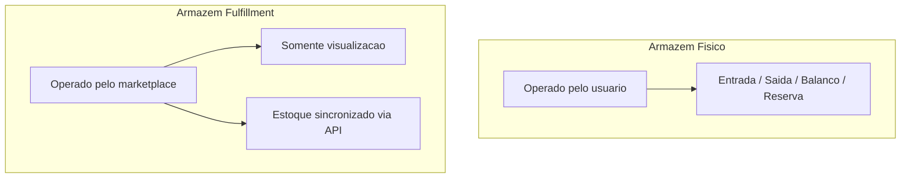
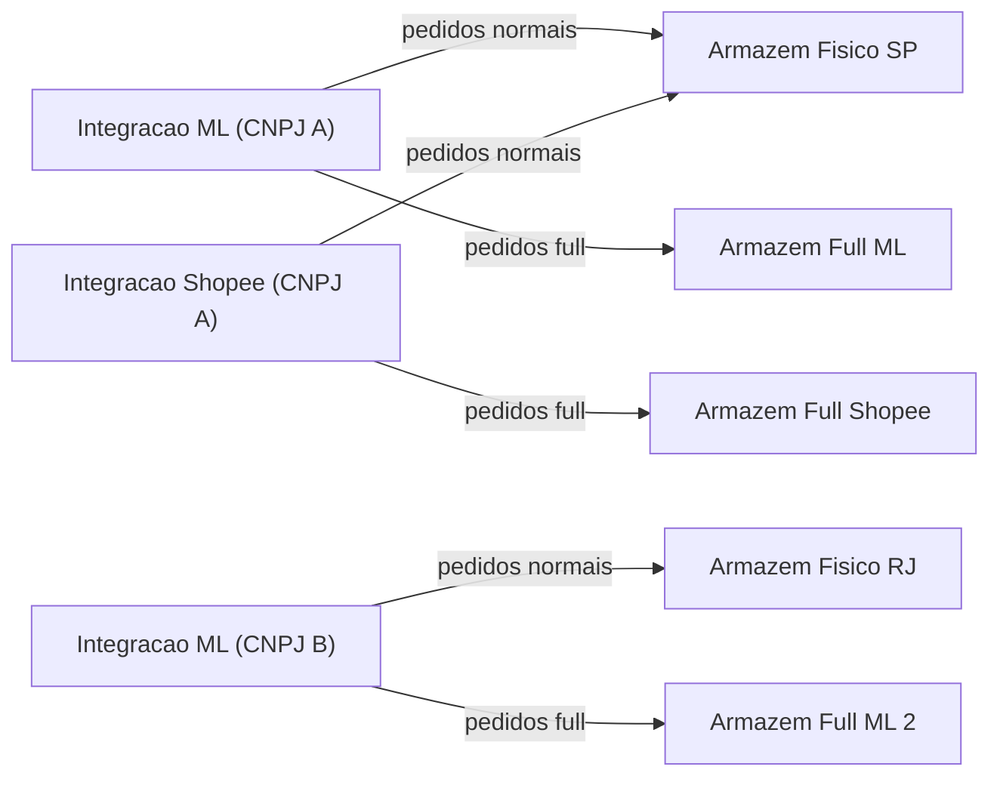
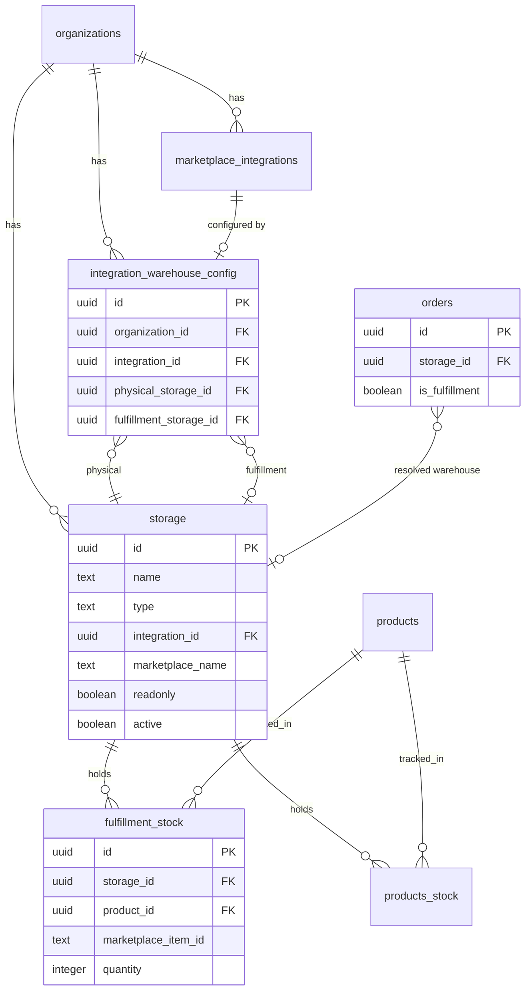
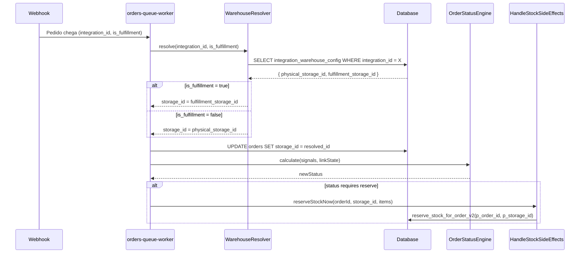
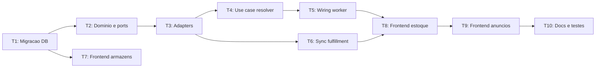

# PRD — Arquitetura de Armazens (Warehouse System)

**Ciclo:** WAREHOUSE (Armazens e Resolucao de Estoque)

**Status:** Implementado

**Depende de:** STATUS-ENGINE T1-T4, T6 (motor de status), Cycle 0 (tabelas `orders`, `order_items`, `products_stock`, `storage`)

**Bloqueia:** Acuracia de estoque multi-armazem, controle fulfillment, margem por pedido

---

## 1. Problema e motivacao

Hoje o sistema trata estoque como se existisse **um unico deposito** por organizacao. O campo `storage_id` em `products_stock` existe, mas:

- Nao ha distincao de **tipo** de armazem (fisico vs fulfillment)
- Nao ha vinculo entre **integracao de marketplace** e armazem
- Pedidos fulfillment (ML Full, Shopee Full) vao direto para `shipped` (`FulfillmentRule`) sem nenhuma movimentacao de estoque no ERP
- A RPC `reserve_stock_for_order_v2` recebe um `p_storage_id` fixo (vindo do `default_storage_id` do usuario), ignorando de onde o pedido realmente saiu
- A `FulfillmentTab.tsx` e um placeholder com dados hardcoded
- Nao ha como o usuario saber quanto estoque tem em cada armazem fulfillment por produto/anuncio

**Resultado:** O vendedor que opera com ML Full + Shopee Full + estoque proprio nao consegue ter visibilidade real de onde esta seu estoque, e o sistema reserva/consome do armazem errado.

---

## 2. Conceitos fundamentais

### Dois tipos de armazem




- **Fisico (`physical`):** O usuario faz todas as operacoes (entrada, saida, balanco, reserva, consumo, estorno). Pedidos normais (envios, flex, correios) deduzem daqui.
- **Fulfillment (`fulfillment`):** Gerenciado pelo marketplace. O usuario envia produtos, o marketplace opera. **Sem** entrada/saida/balanco manual. Estoque sincronizado pela API do marketplace. Pedidos fulfillment deduzem daqui.

### Vinculo integracao → armazem




Cada integracao ativa (`marketplace_integrations`) aponta para:

- Um armazem fisico (de onde saem pedidos nao-fulfillment)
- Um armazem fulfillment (opcional, de onde saem pedidos fulfillment, criado automaticamente ou pelo usuario)

### Estoque fulfillment por anuncio

Um mesmo **produto** pode estar em varios anuncios e em diferentes armazens fulfillment:

```
Produto "iPhone 15 Pro" (product_id = abc)
├── Armazem Fisico SP:          current=5, reserved=2, available=3
├── Armazem Full ML (CNPJ A):
│   ├── Anuncio MLB-001:        qty=10
│   ├── Anuncio MLB-002:        qty=3
│   └── Anuncio MLB-003:        qty=0
└── Armazem Full Shopee:
    ├── Anuncio SHP-501:        qty=8
    └── Anuncio SHP-502:        qty=2
```

Essa informacao vem da **API do marketplace** (ex: `marketplace_stock_distribution` para ML, `stock_info_v2` para Shopee) e e vinculada ao `marketplace_item_id` que ja tem link com `product_id` via `marketplace_item_product_links`.

---

## 3. Arquitetura de dados

### 3.1 Evolucao da tabela `storage`

Novas colunas na tabela existente [supabase/migrations/](supabase/migrations/):

```sql
ALTER TABLE public.storage
  ADD COLUMN IF NOT EXISTS type text NOT NULL DEFAULT 'physical'
    CHECK (type IN ('physical', 'fulfillment')),
  ADD COLUMN IF NOT EXISTS integration_id uuid
    REFERENCES public.marketplace_integrations(id) ON DELETE SET NULL,
  ADD COLUMN IF NOT EXISTS marketplace_name text,
  ADD COLUMN IF NOT EXISTS is_auto_created boolean NOT NULL DEFAULT false,
  ADD COLUMN IF NOT EXISTS readonly boolean NOT NULL DEFAULT false;
```

- `type`: `'physical'` ou `'fulfillment'`
- `integration_id`: FK para a integracao dona (somente fulfillment)
- `marketplace_name`: `'mercado_livre'`, `'shopee'`, etc. (redundante para queries rapidas)
- `is_auto_created`: `true` se criado automaticamente ao conectar integracao
- `readonly`: `true` para fulfillment (impede operacoes manuais)

### 3.2 Nova tabela `integration_warehouse_config`

Mapeia cada integracao ao(s) armazem(ns) que deve usar:

```sql
CREATE TABLE public.integration_warehouse_config (
  id uuid PRIMARY KEY DEFAULT gen_random_uuid(),
  organization_id uuid NOT NULL REFERENCES public.organizations(id) ON DELETE CASCADE,
  integration_id uuid NOT NULL REFERENCES public.marketplace_integrations(id) ON DELETE CASCADE,
  physical_storage_id uuid NOT NULL REFERENCES public.storage(id) ON DELETE RESTRICT,
  fulfillment_storage_id uuid REFERENCES public.storage(id) ON DELETE SET NULL,
  created_at timestamptz DEFAULT now(),
  updated_at timestamptz DEFAULT now(),
  UNIQUE (organization_id, integration_id)
);
```

- `physical_storage_id`: armazem para pedidos normais dessa integracao
- `fulfillment_storage_id`: armazem para pedidos fulfillment (null se integracao nao tem full)

### 3.3 Nova tabela `fulfillment_stock`

Estoque fulfillment por produto e anuncio, sincronizado via API:

```sql
CREATE TABLE public.fulfillment_stock (
  id uuid PRIMARY KEY DEFAULT gen_random_uuid(),
  organization_id uuid NOT NULL REFERENCES public.organizations(id) ON DELETE CASCADE,
  storage_id uuid NOT NULL REFERENCES public.storage(id) ON DELETE CASCADE,
  product_id uuid NOT NULL REFERENCES public.products(id) ON DELETE CASCADE,
  marketplace_item_id text NOT NULL,
  variation_id text DEFAULT '',
  quantity integer NOT NULL DEFAULT 0,
  last_synced_at timestamptz DEFAULT now(),
  UNIQUE (storage_id, product_id, marketplace_item_id, variation_id)
);
```

Essa tabela consolida o que hoje esta espalhado em `marketplace_stock_distribution` (que guarda IDs do ML, nao do ERP). O link `marketplace_item_id` → `product_id` ja existe via `marketplace_item_product_links`.

### 3.4 Coluna `storage_id` em `orders`

Para saber de qual armazem o pedido reservou/consumiu:

```sql
ALTER TABLE public.orders
  ADD COLUMN IF NOT EXISTS storage_id uuid
    REFERENCES public.storage(id) ON DELETE SET NULL;
```

### 3.5 Diagrama ER das novas relacoes




---

## 4. Fluxo de resolucao de armazem para pedidos




**Regra:** Se nao houver `integration_warehouse_config` para a integracao, usa `default_storage_id` do usuario (fallback atual).

---

## 5. Restricoes de operacoes por tipo de armazem


| Operacao                     | Fisico | Fulfillment           |
| ---------------------------- | ------ | --------------------- |
| Entrada manual               | Sim    | Nao                   |
| Saida manual                 | Sim    | Nao                   |
| Balanco / ajuste             | Sim    | Nao                   |
| Reserva (pedido normal)      | Sim    | Nao                   |
| Consumo (pedido enviado)     | Sim    | Nao                   |
| Estorno (pedido cancelado)   | Sim    | Nao                   |
| Reserva (pedido fulfillment) | Nao    | Sim (via sync API)    |
| Visualizacao de estoque      | Sim    | Sim (somente leitura) |


---

## 6. Tasks do projeto

### WAREHOUSE-T1: Migracao de banco de dados

**Objetivo:** Criar estrutura de tabelas e colunas necessarias.

**Arquivos:**

- Nova migracao SQL: `ALTER storage` + `CREATE integration_warehouse_config` + `CREATE fulfillment_stock` + `ALTER orders`
- Indices e RLS

**Entregaveis:**

- `storage.type`, `storage.integration_id`, `storage.marketplace_name`, `storage.is_auto_created`, `storage.readonly`
- Tabela `integration_warehouse_config` com UNIQUE constraint
- Tabela `fulfillment_stock` com UNIQUE constraint
- `orders.storage_id`
- Backfill: armazens existentes recebem `type = 'physical'`
- RLS para multi-tenant em todas as tabelas novas

---

### WAREHOUSE-T2: Dominio e ports

**Objetivo:** Definir tipos de armazem, port de resolucao e port de estoque fulfillment no dominio.

**Arquivos novos em `supabase/functions/_shared/domain/warehouse/`:**

- `WarehouseType.ts`: enum `physical | fulfillment`
- `WarehouseConfig.ts`: value object para config integracao-armazem

**Arquivos novos em `supabase/functions/_shared/domain/orders/ports/`:**

- `IWarehouseResolverPort.ts`: `resolveForOrder(integrationId, isFulfillment): Promise<string | null>` (retorna `storage_id`)

**Alteracao em [IInventoryPort.ts](supabase/functions/_shared/domain/orders/ports/IInventoryPort.ts):**

- `reserveStockNow` passa a receber `storageId` como parametro
- `enqueueConsumeStock` e `enqueueRefundStock` passam `storageId`

---

### WAREHOUSE-T3: Adapters Supabase

**Objetivo:** Implementar ports com queries reais.

**Arquivos novos em `supabase/functions/_shared/adapters/warehouse/`:**

- `SupabaseWarehouseResolver.ts`: query `integration_warehouse_config` + fallback para `default_storage_id`
- `SupabaseFulfillmentStockAdapter.ts`: CRUD `fulfillment_stock`

**Alteracao em [SupabaseInventoryAdapter.ts](supabase/functions/_shared/adapters/orders/SupabaseInventoryAdapter.ts):**

- `reserveStockNow` repassa `storageId` para a RPC `reserve_stock_for_order_v2`

**Alteracao na RPC `reserve_stock_for_order_v2`:**

- Ja recebe `p_storage_id` -- verificar que `consume_stock_for_order_v2` e `refund_stock_for_order_v2` tambem usam o storage correto (lido de `orders.storage_id`)

---

### WAREHOUSE-T4: Use case — resolver armazem do pedido

**Objetivo:** Criar `ResolveOrderWarehouseUseCase` que determina de onde o estoque sera movimentado.

**Novo arquivo:** `supabase/functions/_shared/application/orders/ResolveOrderWarehouseUseCase.ts`

**Logica:**

1. Recebe `integrationId` e `isFulfillment` do pedido
2. Busca `integration_warehouse_config` via port
3. Se fulfillment → retorna `fulfillment_storage_id`
4. Se normal → retorna `physical_storage_id`
5. Fallback: `default_storage_id` do usuario ou primeiro storage ativo da org

**Alteracao em [HandleStockSideEffectsUseCase.ts](supabase/functions/_shared/application/orders/HandleStockSideEffectsUseCase.ts):**

- `reserveIfNeeded` passa `storageId` vindo do pedido (`order.storageId`) para `inventoryPort.reserveStockNow`

---

### WAREHOUSE-T5: Wiring no orders-queue-worker

**Objetivo:** Integrar resolucao de armazem no pipeline de processamento de pedidos.

**Alteracao em [orders-queue-worker/index.ts](supabase/functions/orders-queue-worker/index.ts):**

- Apos normalizar o pedido e antes do upsert: chamar `ResolveOrderWarehouseUseCase`
- Gravar `storage_id` no registro do pedido (`orders.storage_id`)
- Passar `storage_id` para o adapter de inventario nas operacoes de estoque

**Alteracao em `RecalculateOrderStatusUseCase`:**

- `OrderRecord` ganha campo `storageId`
- `HandleStockSideEffectsUseCase` usa `order.storageId` em vez de storage fixo

**Tratamento de pedidos fulfillment:**

- Pedidos com `is_fulfillment = true` continuam indo para `shipped` via `FulfillmentRule`
- Porem agora gravam `storage_id` do armazem fulfillment para rastreio de estoque

---

### WAREHOUSE-T6: Sync de estoque fulfillment

**Objetivo:** Popular `fulfillment_stock` com dados reais dos marketplaces.

**Alteracao em [mercado-livre-sync-stock-distribution/index.ts](supabase/functions/mercado-livre-sync-stock-distribution/index.ts):**

- Alem de gravar em `marketplace_stock_distribution`, upsert em `fulfillment_stock` cruzando `warehouse_id` ML com o `storage.id` interno (via `integration_id`)
- Agrupar por `product_id` (resolving via `marketplace_item_product_links`)

**Nova edge function (ou extensao):** `shopee-sync-fulfillment-stock`

- Busca estoque dos itens fulfillment da Shopee
- Popula `fulfillment_stock` para o armazem fulfillment Shopee

**Scheduler:** Cron job periodico (ex: a cada 30 min) para manter `fulfillment_stock` atualizado.

---

### WAREHOUSE-T7: Frontend — gestao de armazens

**Objetivo:** Reformular a aba "Armazem" em `Inventory.tsx` para suportar tipos e vinculacao.

**Alteracoes em [Inventory.tsx](src/pages/Inventory.tsx):**

- Separar armazens por tipo: secao "Fisicos" e secao "Fulfillment"
- Armazens fulfillment mostram badge do marketplace (icone ML/Shopee) e indicacao "somente leitura"
- Botao "Novo Armazem" cria armazem fisico
- Armazens fulfillment sao criados automaticamente (ou manualmente com tipo selecionado)

**Alteracoes em [StorageManagementDrawer.tsx](src/components/inventory/StorageManagementDrawer.tsx):**

- Novo campo: tipo (fisico/fulfillment)
- Se fulfillment: campo de selecao de integracao (`marketplace_integrations`)
- Se fulfillment: toggle "readonly" pre-marcado e desabilitado
- Botao "Vincular integracao" que popula `integration_warehouse_config`

**Novo componente:** `IntegrationWarehouseCard.tsx`

- Card por integracao mostrando: nome, marketplace, armazem fisico vinculado, armazem fulfillment vinculado
- Acao rapida para trocar o armazem fisico de destino

---

### WAREHOUSE-T8: Frontend — visualizacao multi-armazem no controle de estoque

**Objetivo:** Mostrar estoque por armazem (fisico + fulfillment) na lista de produtos.

**Alteracoes em [StockTab.tsx](src/components/inventory/tabs/StockTab.tsx):**

- Cada linha de produto expande para mostrar:
  - Estoque fisico: `products_stock` por armazem fisico
  - Estoque fulfillment por marketplace: agregado de `fulfillment_stock`
- Formato:

```
  iPhone 15 Pro
    Fisico (SP):     5 disponivel
    Full ML:         13 (3 anuncios)
    Full Shopee:     10 (2 anuncios)
  

```

**Alteracoes em [inventory.service.ts](src/services/inventory.service.ts):**

- `fetchProductsWithDetailedStock` traz tambem `fulfillment_stock` agrupado por `storage_id`
- Novo tipo `FulfillmentStockSummary` com `storageName`, `marketplace`, `totalQty`, `listings: { marketplaceItemId, qty }[]`

**Reformular [FulfillmentTab.tsx](src/components/inventory/tabs/FulfillmentTab.tsx):**

- Substituir dados hardcoded por dados reais de `fulfillment_stock`
- Cards por armazem fulfillment com totais
- Tabela detalhada: produto, marketplace, anuncios, qtd por anuncio
- Drill-down por produto mostra IDs dos anuncios vinculados (de `marketplace_item_product_links`)

---

### WAREHOUSE-T9: Frontend — armazens no modulo de anuncios

**Objetivo:** No modulo de anuncios (`/anuncios`), mostrar de qual armazem fulfillment o anuncio puxa estoque.

**Alteracoes em [Listings.tsx](src/pages/Listings.tsx) e componentes de anuncios:**

- Badge por anuncio indicando tipo logistico (Full, Flex, Envios, Correios)
- Para anuncios Full: exibir qtd fulfillment sincronizada de `fulfillment_stock`
- Para anuncios normais: exibir link para o armazem fisico da integracao

**Alteracoes em [listings.service.ts](src/services/listings.service.ts):**

- Enriquecer dados de anuncio com informacao de `fulfillment_stock` quando `shipping_type = 'full'`

---

### WAREHOUSE-T10: Documentacao e testes

**Objetivo:** Documentar a arquitetura e garantir cobertura de testes.

**Novos arquivos:**

- `docs/WAREHOUSE_ARCHITECTURE.md`: visao geral, diagramas, decisoes
- `docs/prds/WAREHOUSE-README.md`: indice dos PRDs W-T1 a W-T10

**Testes:**

- Unitarios: `WarehouseResolver`, regras de tipo, restricoes de operacao
- Integracao: RPCs de estoque com `storage_id`, sync fulfillment
- Frontend: componentes de armazem, visualizacao multi-armazem

---

## 7. Ordem de execucao e dependencias




- **Fase 1 (fundacao):** T1, T2 — schema e dominio
- **Fase 2 (backend):** T3, T4, T5 — adapters, resolver e wiring
- **Fase 3 (dados):** T6 — sync fulfillment stock
- **Fase 4 (frontend):** T7, T8, T9 — UI de armazens, estoque e anuncios
- **Fase 5 (qualidade):** T10 — docs e testes

---

## 8. O que muda nos fluxos existentes


| Fluxo                | Antes                                     | Depois                                                          |
| -------------------- | ----------------------------------------- | --------------------------------------------------------------- |
| Reserva de estoque   | Usa `default_storage_id` fixo             | Usa `storage_id` resolvido da integracao do pedido              |
| Pedido fulfillment   | Vai direto p/ `shipped`, sem movimentacao | Registra `storage_id` fulfillment; deduz do armazem fulfillment |
| Criacao de armazem   | Nome + ativo (generico)                   | Nome + tipo + integracao (se fulfillment)                       |
| Visao de estoque     | Total unico por produto                   | Breakdown: fisico + fulfillment por marketplace                 |
| Anuncios             | Sem info de armazem                       | Badge logistico + qtd fulfillment                               |
| Entrada/saida manual | Qualquer armazem                          | Apenas armazens fisicos (fulfillment bloqueado)                 |


---

## 9. Definition of Done (por task)

Cada task deve:

- Testes unitarios para logica de dominio/use cases
- Testes de integracao para adapters e RPCs
- RLS aplicado em todas as tabelas novas (`organization_id`)
- Backfill nao-destrutivo para dados existentes
- UI em portugues (pt-BR), labels acessiveis
- JSDoc em ingles em funcoes backend novas
- Nenhuma query direta a Supabase em componentes (via services/hooks)

